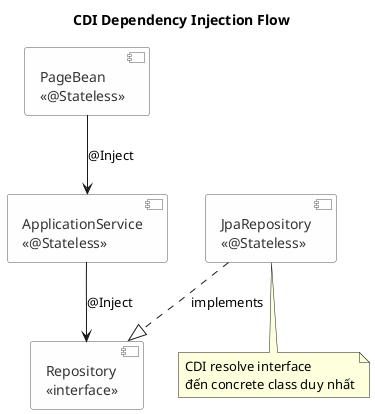
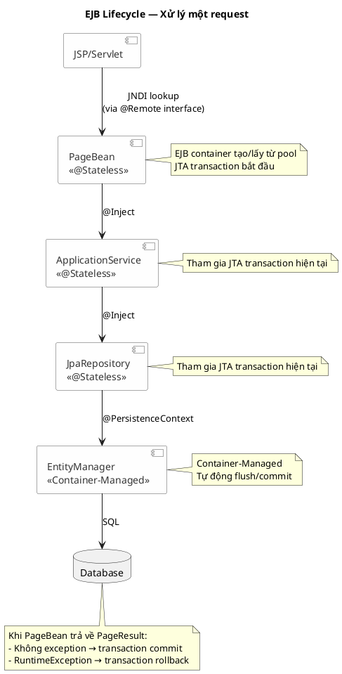

# Purchase Bounded Context — Component Architecture

## Component Diagram

```plantuml
@startuml
title Purchase Bounded Context - Component Diagram

skinparam component {
    BackgroundColor #FEFEFE
    BorderColor #555555
    FontColor #333333
}
skinparam package {
    BackgroundColor #F5F5F5
    BorderColor #888888
}

' ══════════════════════════════════════════════════════════════
'  PURCHASE BOUNDED CONTEXT
' ══════════════════════════════════════════════════════════════

package "purchase" {

    package "interfaces/web" as interfaces_web {
        component [CartPage\nCartPageBean] as cartPage
        component [CheckoutPage\nCheckoutPageBean] as checkoutPage
        component [AccountHomePage\nAccountHomePageBean] as accountHomePage
        component [OrderHistoryPage\nOrderHistoryPageBean] as orderHistoryPage
        component [OrderDetailPage\nOrderDetailPageBean] as orderDetailPage
    }

    package "application/service" as app_service {
        component [CartApplicationService] as cartAppSvc
        component [CheckoutApplicationService] as checkoutAppSvc
        component [AccountCatalogApplicationService] as catalogAppSvc
        component [OrderQueryApplicationService] as orderQuerySvc
        component [CartViewAssembler] as cartAssembler
    }

    package "domain/model" as domain_model {
        component [Cart\nCartItem] as cartModel
        component [Order\nOrderItem] as orderModel
    }

    package "domain/repository" as domain_repo {
        component [<<interface>>\nCartRepository] as cartRepo
        component [<<interface>>\nOrderRepository] as orderRepo
    }

    package "domain/valueobject" as domain_vo {
        component [OrderStatus] as orderStatus
    }

    package "infrastructure/persistence" as infra {
        component [CartJpaRepository] as cartJpaRepo
        component [OrderJpaRepository] as orderJpaRepo
        component [CartEntityMapper\nOrderEntityMapper] as mappers
        component [CartEntity\nCartItemEntity\nOrderEntity\nOrderItemEntity] as entities
    }
}

' ══════════════════════════════════════════════════════════════
'  EXTERNAL BOUNDED CONTEXTS
' ══════════════════════════════════════════════════════════════

package "book" as book_bc #E8F5E9 {
    component [BookRepository] as bookRepo
    component [BookTitle, Isbn] as bookVo
    component [BookEntity] as bookEntity
}

package "auth" as auth_bc #E3F2FD {
    component [AddressRepository] as addressRepo
    component [CustomerEntity] as customerEntity
}

package "shared" as shared_bc #FFF3E0 {
    component [Value Objects\n(CartId, OrderId, BookId,\nCustomerId, Money, ...)] as sharedVo
    component [Validation\n(Require, FieldValidation...)] as sharedValidation
    component [AuditableEntity] as auditableEntity
}

' ══════════════════════════════════════════════════════════════
'  INTERFACES -> APPLICATION
' ══════════════════════════════════════════════════════════════

cartPage --> cartAppSvc
checkoutPage --> checkoutAppSvc
accountHomePage --> catalogAppSvc
orderHistoryPage --> orderQuerySvc
orderDetailPage --> orderQuerySvc

' ══════════════════════════════════════════════════════════════
'  APPLICATION -> DOMAIN
' ══════════════════════════════════════════════════════════════

cartAppSvc --> cartRepo
cartAppSvc --> cartModel
checkoutAppSvc --> cartRepo
checkoutAppSvc --> orderRepo
checkoutAppSvc --> cartModel
checkoutAppSvc --> orderModel
catalogAppSvc ..> cartAppSvc : delegates
orderQuerySvc --> orderRepo
cartAssembler --> cartModel

' ══════════════════════════════════════════════════════════════
'  DOMAIN MODEL -> DOMAIN VALUE OBJECT
' ══════════════════════════════════════════════════════════════

orderModel --> orderStatus

' ══════════════════════════════════════════════════════════════
'  INFRASTRUCTURE IMPLEMENTS DOMAIN
' ══════════════════════════════════════════════════════════════

cartJpaRepo ..|> cartRepo : implements
orderJpaRepo ..|> orderRepo : implements
cartJpaRepo --> mappers
orderJpaRepo --> mappers
mappers --> entities
mappers --> cartModel
mappers --> orderModel

' ══════════════════════════════════════════════════════════════
'  CROSS-BOUNDED-CONTEXT DEPENDENCIES
' ══════════════════════════════════════════════════════════════

cartAppSvc --> bookRepo : <<cross-BC>>
checkoutAppSvc --> bookRepo : <<cross-BC>>
checkoutAppSvc --> addressRepo : <<cross-BC>>
catalogAppSvc --> bookRepo : <<cross-BC>>
cartAssembler --> bookRepo : <<cross-BC>>

orderModel ..> bookVo : <<cross-BC>>

mappers --> bookEntity : <<cross-BC>>
entities --> customerEntity : <<cross-BC>>
entities --> auditableEntity : extends

' ══════════════════════════════════════════════════════════════
'  SHARED KERNEL
' ══════════════════════════════════════════════════════════════

domain_model --> sharedVo
domain_repo --> sharedVo
domain_model --> sharedValidation
app_service --> sharedVo
infra --> sharedVo

@enduml
```



## Mô tả các layer

### 1. Interfaces Layer (`interfaces/web`)

Layer ngoài cùng, tiếp nhận request từ bên ngoài (JSP/Servlet) và trả về
response. Mỗi use case tương ứng với một cặp interface/bean:

| Interface (`@Remote`) | Bean (`@Stateless`)    | Chức năng                                                      |
| --------------------- | ---------------------- | -------------------------------------------------------------- |
| `AccountHomePage`     | `AccountHomePageBean`  | Trang chủ tài khoản — hiển thị catalog sách, thêm sách vào giỏ |
| `CartPage`            | `CartPageBean`         | Quản lý giỏ hàng — xem, cập nhật số lượng, xoá sách            |
| `CheckoutPage`        | `CheckoutPageBean`     | Thanh toán — xem checkout, đặt hàng                            |
| `OrderHistoryPage`    | `OrderHistoryPageBean` | Lịch sử đơn hàng — danh sách đơn hàng có phân trang            |
| `OrderDetailPage`     | `OrderDetailPageBean`  | Chi tiết đơn hàng — xem thông tin 1 đơn hàng cụ thể            |

Mỗi bean xử lý:

- Phân biệt GET/POST (thông qua `request.method()`)
- Parse và validate input từ request
- Gọi xuống application service
- Tạo PageModel và trả về PageResult (chứa `PageAction.RENDER` hoặc
  `PageAction.REDIRECT`)

Ngoài ra layer này còn chứa:

- `PurchasePaths` — hằng số đường dẫn JSP (`/account/cart.jsp`,
  `/account/checkout.jsp`, ...)
- `AddressFormData` — DTO chứa dữ liệu form địa chỉ giao hàng
- Các record `*PageRequest`, `*PageResult`, `*PageModel` — request/response
  object cho từng trang

### 2. Application Layer (`application/service`)

Layer điều phối logic nghiệp vụ, không chứa business rule mà phối hợp các domain
object và repository:

| Service                            | Chức năng                                                                                | Dependency                                                                                       |
| ---------------------------------- | ---------------------------------------------------------------------------------------- | ------------------------------------------------------------------------------------------------ |
| `CartApplicationService`           | Thêm sách, cập nhật số lượng, xoá sách trong giỏ hàng                                    | `CartRepository`, `BookRepository` (cross-BC)                                                    |
| `CheckoutApplicationService`       | Tạo đơn hàng từ giỏ hàng, xử lý địa chỉ giao hàng, trừ tồn kho                           | `CartRepository`, `OrderRepository`, `BookRepository` (cross-BC), `AddressRepository` (cross-BC) |
| `AccountCatalogApplicationService` | Lấy danh sách sách đang bán, delegate thêm vào giỏ                                       | `BookRepository` (cross-BC), `CartApplicationService`                                            |
| `OrderQueryApplicationService`     | Truy vấn lịch sử đơn hàng, xem chi tiết đơn hàng                                         | `OrderRepository`                                                                                |
| `CartViewAssembler`                | Chuyển đổi `Cart` domain model sang `CartView` DTO, làm giàu dữ liệu từ `BookRepository` | `BookRepository` (cross-BC)                                                                      |

Layer này còn chứa các DTO/View:

- `CartView`, `CartLineView` — hiển thị giỏ hàng
- `CheckoutView`, `CheckoutAddressInput` — dữ liệu checkout
- `CatalogBookView` — hiển thị sách trong catalog
- `OrderSummaryView`, `OrderDetailView`, `OrderAddressView`,
  `OrderItemDetailView` — hiển thị đơn hàng
- `CartActionResult`, `CheckoutResult`, `OrderLookupResult` — kết quả thao tác

### 3. Domain Layer (`domain`)

Lõi của bounded context, chứa domain model, repository interface và value
object:

**domain/model:**

- `Cart` — giỏ hàng của khách hàng, chứa danh sách `CartItem`. Immutable record
  với validation qua `Require`.
- `CartItem` — một dòng trong giỏ hàng: `bookId`, `quantity`,
  `unitPriceSnapshot`.
- `Order` — đơn hàng đã đặt: `customerId`, `status`, `totalAmount`,
  `shippingAddress`, danh sách `OrderItem`.
- `OrderItem` — một dòng trong đơn hàng: `bookId`, `bookTitleSnapshot`,
  `bookIsbnSnapshot`, `unitPriceSnapshot`, `quantity`, `lineTotal`. Lưu ý
  OrderItem snapshot thông tin sách tại thời điểm đặt hàng (title, ISBN, giá) để
  đảm bảo dữ liệu lịch sử không bị ảnh hưởng khi sách thay đổi.

**domain/repository:**

- `CartRepository` (interface) — `findById`, `findByCustomerId`, `save`
- `OrderRepository` (interface) — `findById`, `findByCustomerIdAndId`,
  `findByCustomerId`, `save`

**domain/valueobject:**

- `OrderStatus` — enum với 3 trạng thái: `PENDING`, `PLACED`, `CANCELLED`

Domain layer phụ thuộc vào `shared` kernel cho các value object dùng chung
(`CartId`, `OrderId`, `BookId`, `CustomerId`, `Money`, `Quantity`,
`AddressDetails`, ...) và validation utilities (`Require`,
`FieldValidationException`). Domain model `OrderItem` cũng phụ thuộc vào `book`
bounded context cho `BookTitle` và `Isbn` — đây là cross-BC dependency ở tầng
domain.

### 4. Infrastructure Layer (`infrastructure/persistence`)

Implement các repository interface của domain bằng JPA/Jakarta Persistence:

**infrastructure/persistence/repository:**

- `CartJpaRepository` — implement `CartRepository`, sử dụng `EntityManager` với
  JPQL query
- `OrderJpaRepository` — implement `OrderRepository`, sử dụng `EntityManager`
  với JPQL query

**infrastructure/persistence/entity:**

- `CartEntity`, `CartItemEntity` — JPA entity cho bảng `carts` và `cart_items`
- `OrderEntity`, `OrderItemEntity` — JPA entity cho bảng `orders` và
  `order_items`
- Tất cả entity kế thừa `AuditableEntity` từ shared (cung cấp `version`,
  `createdAt`, `updatedAt`)

**infrastructure/persistence/mapper:**

- `CartEntityMapper` — chuyển đổi hai chiều giữa `Cart` (domain) và `CartEntity`
  (JPA)
- `OrderEntityMapper` — chuyển đổi hai chiều giữa `Order` (domain) và
  `OrderEntity` (JPA)

Infrastructure layer phụ thuộc cross-BC vào:

- `auth.infrastructure.persistence.entity.CustomerEntity` — `CartEntity` và
  `OrderEntity` tham chiếu đến `CustomerEntity` qua JPA relationship
  (`@OneToOne`, `@ManyToOne`)
- `book.infrastructure.persistence.entity.BookEntity` — các mapper tham chiếu
  `BookEntity` để thiết lập foreign key cho `CartItemEntity` và
  `OrderItemEntity`

## Cross-Bounded-Context Dependencies

Purchase bounded context phụ thuộc vào 3 bounded context khác:

### book (Bounded Context)

| Layer trong Purchase                | Phụ thuộc vào                                       | Mục đích                                                                                        |
| ----------------------------------- | --------------------------------------------------- | ----------------------------------------------------------------------------------------------- |
| `application/service`               | `book.domain.repository.BookRepository`             | Truy vấn thông tin sách (giá, tồn kho, trạng thái) khi thêm vào giỏ, checkout, hiển thị catalog |
| `domain/model`                      | `book.domain.valueobject.BookTitle`, `Isbn`         | `OrderItem` lưu snapshot tiêu đề và ISBN sách tại thời điểm đặt hàng                            |
| `infrastructure/persistence/mapper` | `book.infrastructure.persistence.entity.BookEntity` | Mapper cần `BookEntity` để thiết lập foreign key khi chuyển domain model sang JPA entity        |

### auth (Bounded Context)

| Layer trong Purchase                | Phụ thuộc vào                                           | Mục đích                                                                           |
| ----------------------------------- | ------------------------------------------------------- | ---------------------------------------------------------------------------------- |
| `application/service`               | `auth.domain.repository.AddressRepository`              | `CheckoutApplicationService` truy vấn địa chỉ mặc định của khách hàng khi checkout |
| `infrastructure/persistence/entity` | `auth.infrastructure.persistence.entity.CustomerEntity` | `CartEntity` và `OrderEntity` tham chiếu `CustomerEntity` qua JPA relationship     |

### shared (Shared Kernel)

| Layer trong Purchase                | Phụ thuộc vào                                                  | Mục đích                                                                                                          |
| ----------------------------------- | -------------------------------------------------------------- | ----------------------------------------------------------------------------------------------------------------- |
| `domain/model`, `domain/repository` | `shared.domain.valueobject.*`                                  | Value objects dùng chung: `CartId`, `OrderId`, `BookId`, `CustomerId`, `Money`, `Quantity`, `AddressDetails`, ... |
| `domain/model`                      | `shared.domain.validation.Require`, `FieldValidationException` | Validation utilities cho domain model                                                                             |
| `application/service`               | `shared.domain.valueobject.*`                                  | Application service sử dụng các value object làm tham số và kết quả                                               |
| `infrastructure/persistence/entity` | `shared.infrastructure.persistence.entity.AuditableEntity`     | Base entity cung cấp `version`, `createdAt`, `updatedAt` với `@Version` và auditing                               |

## Enterprise JavaBeans (EJB) trong Purchase Context

Purchase bounded context sử dụng Jakarta EJB (Enterprise JavaBeans) làm
framework quản lý lifecycle, transaction và dependency injection cho các
component. Dưới đây là cách EJB được áp dụng trong từng layer:

### @Stateless (Stateless Session Bean)

Tất cả các bean trong purchase context đều là **Stateless Session Bean** — không
lưu trạng thái giữa các lần gọi method. EJB container quản lý pool các instance
và tái sử dụng chúng giữa các request.

**Các class sử dụng `@Stateless`:**

| Layer                      | Class                                                                                                                      |
| -------------------------- | -------------------------------------------------------------------------------------------------------------------------- |
| interfaces/web             | `CartPageBean`, `CheckoutPageBean`, `AccountHomePageBean`, `OrderHistoryPageBean`, `OrderDetailPageBean`                   |
| application/service        | `CartApplicationService`, `CheckoutApplicationService`, `AccountCatalogApplicationService`, `OrderQueryApplicationService` |
| infrastructure/persistence | `CartJpaRepository`, `OrderJpaRepository`                                                                                  |

**Lý do chọn `@Stateless`:**

- Mỗi request xử lý độc lập, không cần lưu state giữa các request
- EJB container tự động quản lý transaction boundary — mỗi method call được bọc
  trong một JTA transaction (Container-Managed Transaction — CMT). Nếu method
  throw exception, transaction tự động rollback
- EJB container quản lý pool instance, cho phép xử lý nhiều request đồng thời mà
  không cần developer tự quản lý thread safety
- Cho phép sử dụng `@Inject` để inject dependency thông qua CDI (Contexts and
  Dependency Injection)

### @Remote (Remote Interface)

Các interface trong `interfaces/web` sử dụng `@Remote` để expose EJB qua remote
protocol. Điều này cho phép:

- JSP/Servlet (deploy trong WAR riêng) gọi EJB thông qua JNDI lookup
- Tách biệt rõ ràng giữa web tier (presentation) và business tier (EJB)
- Khả năng deploy web tier và business tier trên các JVM/server khác nhau (nếu
  cần)

**Các interface sử dụng `@Remote`:**

- `CartPage`, `CheckoutPage`, `AccountHomePage`, `OrderHistoryPage`,
  `OrderDetailPage`

Mỗi interface định nghĩa một method `handle(XxxPageRequest): XxxPageResult` —
pattern thống nhất cho tất cả các trang, nhận request object và trả về result
object.

### @Inject (CDI Dependency Injection)

EJB kết hợp với CDI (Contexts and Dependency Injection) thông qua `@Inject` trên
constructor:



EJB container và CDI container phối hợp:

- CDI resolve interface `CartRepository` đến concrete class `CartJpaRepository`
  (vì `CartJpaRepository` là `@Stateless` bean duy nhất implement
  `CartRepository`)
- Inject được thực hiện qua constructor (constructor injection), mỗi class giữ
  một no-arg constructor mặc định để EJB container có thể tạo instance trước khi
  inject

### @PersistenceContext (JPA EntityManager Injection)

Chỉ sử dụng trong infrastructure layer:

```java
@PersistenceContext(unitName = "bookstore")
private EntityManager entityManager;
```

- `CartJpaRepository` và `OrderJpaRepository` sử dụng `@PersistenceContext` để
  inject `EntityManager`
- `unitName = "bookstore"` tham chiếu đến persistence unit định nghĩa trong
  `persistence.xml`
- `EntityManager` được quản lý bởi container (Container-Managed EntityManager),
  tự động tham gia vào JTA transaction hiện tại của EJB

### Tổng hợp EJB Lifecycle trong một request



Điểm đáng chú ý:

- **Không sử dụng `@Stateful`** — không có use case cần lưu trạng thái giữa các
  lần gọi
- **Không sử dụng `@Singleton`** — không có shared state global
- **Không sử dụng `@MessageDriven`** — không có xử lý bất đồng bộ/message queue
- **Không sử dụng `@Local`** — tất cả interface đều là `@Remote`, phù hợp với
  kiến trúc tách web tier và business tier
