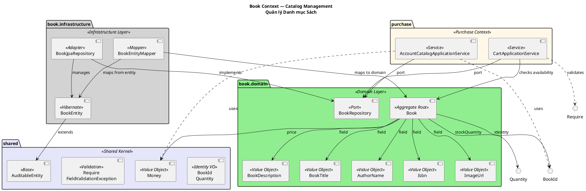
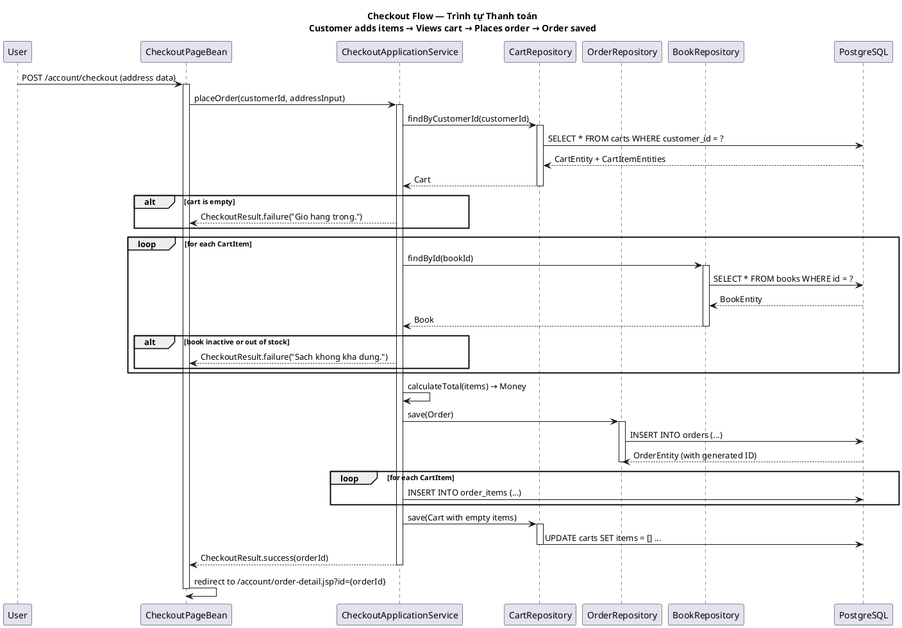

# Bookstore — Architecture Documentation
# Sách: Tài liệu Kiến trúc Bookstore

> **Language / Ngôn ngữ**: Vietnamese + English (song ngữ)
> **Diagram type / Loại diagram**: Standard PlantUML Component Diagram
> **Last updated / Cập nhật lần cuối**: 2026-03-30

---

## 1. Technology Stack / Công nghệ sử dụng

| Layer / Tầng | Technology / Công nghệ | Version |
|---|---|---|
| Ngôn ngữ | Java | 21 |
| Nền tảng | Jakarta EE | 10.0.0 |
| Application Server | WildFly | 39.0.1 |
| Database | PostgreSQL | 17-alpine |
| Database Migration | Flyway | 11.10.5 |
| Password Hashing | jBCrypt | 0.4 |
| ORM | Jakarta Persistence (Hibernate) | — |
| Dependency Injection | CDI (EJB @Stateless) | — |
| Transaction | JTA | — |
| Packaging | WAR (ROOT.war) | — |
| Testing | JUnit Jupiter | 5.9.3 |
| Build Tool | Gradle (Kotlin DSL) | — |
| Container | Docker + Docker Compose | — |

---

## 2. Architecture Overview / Tổng quan kiến trúc

The application follows **Clean Architecture** (a.k.a. Hexagonal / Ports & Adapters) with **3 Bounded Contexts** and a **Shared Kernel**.

Ứng dụng tuân theo **Clean Architecture** (còn gọi là Hexagonal / Ports & Adapters) với **3 Bounded Context** và một **Shared Kernel**.

```
┌─────────────────────────────────────────────────────────────────────┐
│                    BOOKSTORE APPLICATION                             │
├─────────────────────────────────────────────────────────────────────┤
│                                                                      │
│  ┌───────────────┐  ┌───────────────┐  ┌───────────────┐          │
│  │  Auth Context  │  │  Book Context │  │ Purchase Ctx │          │
│  │                │  │               │  │              │          │
│  │ AuthAppService │  │ BookRepository│  │CartAppSvc    │          │
│  │ LoginBean      │  │ Book          │  │CheckoutSvc    │          │
│  │ RegisterBean   │  │ Isbn VO       │  │OrderQuerySvc │          │
│  │ Customer       │  │ Title VO      │  │ Cart         │          │
│  │ BCrypt         │  │ Author VO     │  │ Order        │          │
│  └───────┬───────┘  └───────┬───────┘  └───────┬───────┘          │
│          │                  │                  │                    │
│          └──────────────────┼──────────────────┘                    │
│                             ▼                                        │
│                   ┌─────────────────┐                               │
│                   │  Shared Kernel  │  ← All contexts depend on     │
│                   │ CustomerId VO   │    shared value objects       │
│                   │ Email VO        │    and validation utilities   │
│                   │ Require/Exception│                                │
│                   └────────┬────────┘                               │
│                            ▼                                         │
│                   ┌─────────────────┐                               │
│                   │ Infrastructure  │                               │
│                   │ JPA Repositories│                               │
│                   │ Hibernate Entity│                               │
│                   │ DemoMode Config │                               │
│                   └────────┬────────┘                               │
│                            │                                         │
│          ┌─────────────────┴─────────────────┐                     │
│          ▼                                   ▼                     │
│  ┌───────────────────┐          ┌───────────────────┐            │
│  │    WildFly 39     │          │   PostgreSQL 17    │            │
│  │ CDI · JTA · JPA   │          │  Flyway migrations │            │
│  └───────────────────┘          └───────────────────┘            │
└─────────────────────────────────────────────────────────────────────┘
```

---

## 3. Bounded Context Map — Component Diagram / Sơ đồ Component

```plantuml
@startuml BoundedContextMap
!include https://raw.githubusercontent.com/plantuml-stdlib/C4-PlantUML/master/C4_Context.puml

skinparam component {
    BackgroundColor #FEFEFE
    BorderColor #2C3E50
    FontColor #2C3E50
    ArrowColor #7F8C8D
    ComponentStyle uml2
    StereotypeFontColor #2C3E50
    StereotypeFontSize 9
}

title Architecture Overview — Bounded Context Map\nBookstore Application

' === EXTERNAL CLIENT ===
actor "Người dùng / User" as user

' === BOUNDED CONTEXTS ===
package "auth" <<Bounded Context>> #E8F4FD {
    component "AuthApplicationService" <<Service>> as auth_svc
    component "LoginPageBean\nRegisterPageBean" <<Interface Layer>>
    component "Customer\nAddress" <<Domain Model>>
    component "CustomerRepository\nAddressRepository" <<Port>>
}

package "book" <<Bounded Context>> #E8F8E8 {
    component "BookRepository" <<Port>>
    component "Book" <<Domain Model>>
    component "BookTitle\nIsbn\nAuthorName\nBookDescription\nImageUrl" <<Value Object>>
}

package "purchase" <<Bounded Context>> #FFF8E8 {
    component "CartApplicationService\nCheckoutApplicationService\nOrderQueryApplicationService" <<Service>>
    component "CartPageBean\nCheckoutPageBean\nOrderHistoryPageBean" <<Interface Layer>>
    component "Cart\nOrder\nCartItem\nOrderItem" <<Domain Model>>
    component "CartRepository\nOrderRepository" <<Port>>
}

' === SHARED KERNEL ===
package "shared" <<Shared Kernel>> #F5E6FA {
    component "CustomerId\nBookId\nOrderId\nCartId\nCartItemId\nOrderItemId" <<Identity VO>>
    component "Email\nMoney\nPhoneNumber\nFullName\nAddressDetails..." <<Value Object>>
    component "Require\nFieldValidationException" <<Validation>>
    component "AuditableEntity" <<Base Entity>>
}

' === INFRASTRUCTURE ===
package "Infrastructure" <<Layer>> #F0F0F0 {
    component "CustomerJpaRepository\nBookJpaRepository\nCartJpaRepository\nOrderJpaRepository" <<JPA Adapter>>
    component "CustomerEntity\nBookEntity\nCartEntity\nOrderEntity\nCartItemEntity\nOrderItemEntity\nAddressEntity" <<Hibernate Entity>>
    component "CustomerEntityMapper\nBookEntityMapper\nCartEntityMapper\nOrderEntityMapper\nAddressEntityMapper" <<Entity Mapper>>
    component "BCryptPasswordHasher" <<Security Adapter>>
    component "DemoModeConfig" <<Configuration>>
}

' === EXTERNAL INFRASTRUCTURE ===
node "WildFly 39" <<Application Server>> #ECF0F1 {
    component "CDI Container" as cdi
    component "JTA Transaction Manager" as jta
    component "Jakarta Persistence" as jpa
}

database "PostgreSQL 17" <<Database Server>> #D4EDDA {
    database "customers"
    database "addresses"
    database "books"
    database "carts"
    database "cart_items"
    database "orders"
    database "order_items"
}

' === RELATIONSHIPS ===

' User → Interface Layer
user --> LoginPageBean : "HTTP POST\n/login"
user --> RegisterPageBean : "HTTP POST\n/register"
user --> CartPageBean : "HTTP GET\n/account/cart"
user --> CheckoutPageBean : "HTTP POST\n/account/checkout"
user --> OrderHistoryPageBean : "HTTP GET\n/account/orders"

' Interface → Service
LoginPageBean --> auth_svc : "calls"
RegisterPageBean --> auth_svc : "calls"
CartPageBean --> CartApplicationService : "calls"
CheckoutPageBean --> CheckoutApplicationService : "calls"
OrderHistoryPageBean --> OrderQueryApplicationService : "calls"

' Service → Domain Model
auth_svc --> Customer : "uses"
auth_svc --> CustomerRepository : "port/interface"
CartApplicationService --> Cart : "uses"
CartApplicationService --> CartRepository : "port/interface"
CartApplicationService --> BookRepository : "port/interface"
CheckoutApplicationService --> OrderRepository : "port/interface"
OrderQueryApplicationService --> OrderRepository : "port/interface"

' Book Context
BookRepository --> Book : "manages"
BookRepository --> BookId : "uses"

' === SHARED KERNEL DEPENDENCIES ===
Customer ..> Email : "value object"
Customer ..> CustomerId : "value object"
Book ..> BookId : "value object"
Book ..> Money : "value object"
Cart ..> CartId : "value object"
Order ..> OrderId : "value object"
Order ..> Money : "value object"

auth_svc ..> Require : "validation"
CartApplicationService ..> Require : "validation"
CheckoutApplicationService ..> Require : "validation"

' === INFRASTRUCTURE ===
CustomerJpaRepository --> CustomerEntity : "persists"
BookJpaRepository --> BookEntity : "persists"
CartJpaRepository --> CartEntity : "persists"
OrderJpaRepository --> OrderEntity : "persists"

CustomerEntity ..> AuditableEntity : "extends"
BookEntity ..> AuditableEntity : "extends"
CartEntity ..> AuditableEntity : "extends"
OrderEntity ..> AuditableEntity : "extends"

BCryptPasswordHasher --> "password hashing"

' === SERVER / DATABASE ===
cdi --> AuthApplicationService : "injects"
cdi --> CartApplicationService : "injects"
cdi --> CheckoutApplicationService : "injects"
cdi --> CustomerJpaRepository : "injects"
cdi --> BookJpaRepository : "injects"

jpa --> CustomerJpaRepository : "uses"
jpa --> BookJpaRepository : "uses"
jpa --> CartJpaRepository : "uses"
jpa --> OrderJpaRepository : "uses"

CustomerJpaRepository --> customers : "reads/writes"
BookJpaRepository --> books : "reads/writes"
CartJpaRepository --> carts : "reads/writes"
CartJpaRepository --> cart_items : "reads/writes"
OrderJpaRepository --> orders : "reads/writes"
OrderJpaRepository --> order_items : "reads/writes"

@enduml
```
<!-- docs/images/arch/arch-01.svg -->


**Legend / Chú thích:**

| Color / Màu | Bounded Context |
|---|---|
| 🔵 Light blue / Xanh nhạt | Auth Context |
| 🟢 Light green / Xanh lục nhạt | Book Context |
| 🟡 Light yellow / Vàng nhạt | Purchase Context |
| 🟣 Light purple / Tím nhạt | Shared Kernel |
| ⚪ Light gray / Xám nhạt | Infrastructure Layer |

---

## 4. Auth Context — Chi tiết

```plantuml
@startuml AuthContext
skinparam componentStyle uml2
skinparam defaultTextAlignment center
skinparam wrapWidth 200

title Auth Context — Package Structure & Dependency Flow\nXác thực & Quản lý Khách hàng

' --- LAYERS ---

package "auth.interfaces.web" <<Interface Layer>> #FFE4B5 {
    component "LoginPageBean" <<Controller>>
    component "RegisterPageBean" <<Controller>>
    component "LogoutPageBean" <<Controller>>
    component "AuthSession" <<Session Facade>>
    component "AuthGuardBean" <<Security Guard>>
    component "AuthPaths" <<Path Constants>>
    component "HtmlEscaper" <<Utility>>
}

package "auth.application" <<Application Layer>> #ADD8E6 {
    component "AuthApplicationService" <<Service>> as auth_svc
    component "PasswordHasher" <<Port (Interface)>>
    component "BCryptPasswordHasher" <<Adapter>>
    component "LoginResult\nRegisterResult" <<Result DTO>>
    component "DemoModeSettings" <<Config>>
}

package "auth.domain" <<Domain Layer>> #90EE90 {
    component "Customer" <<Entity>>
    component "Address" <<Entity>>
    component "CustomerStatus" <<Value Object>>
    component "CustomerRepository" <<Port>>
    component "AddressRepository" <<Port>>
}

package "auth.infrastructure" <<Infrastructure Layer>> #D3D3D3 {
    component "CustomerJpaRepository" <<Adapter>>
    component "AddressJpaRepository" <<Adapter>>
    component "CustomerEntity" <<Hibernate>>
    component "AddressEntity" <<Hibernate>>
    component "CustomerEntityMapper" <<Mapper>>
    component "AddressEntityMapper" <<Mapper>>
    component "DemoModeConfig" <<Config>>
}

package "shared" <<Shared Kernel>> #E6E6FA {
    component "Email\nPasswordHash\nPhoneNumber\nFullName\nCustomerId\nAddressId\nAddressDetails..." <<VO>>
    component "Require\nFieldValidationException" <<Validation>>
    component "AuditableEntity" <<Base>>
}

' --- RELATIONSHIPS ---

' Interfaces → Application
LoginPageBean --> auth_svc : "login()"
RegisterPageBean --> auth_svc : "register()"
LogoutPageBean --> AuthSession : "invalidate()"
AuthGuardBean --> AuthSession : "check session"

' Application → Domain
auth_svc --> Customer : "creates/validates"
auth_svc --> CustomerRepository : "port"
auth_svc --> PasswordHasher : "port"
auth_svc --> CustomerStatus : "status check"
auth_svc ..> Require : "validates input"
auth_svc ..> Email : "normalizes email"
auth_svc ..> CustomerId : "generates identity"

' Domain → Shared Kernel
Customer --> Email : "field"
Customer --> PasswordHash : "field"
Customer --> CustomerId : "field"
Customer --> CustomerStatus : "field"
Address --> AddressId : "field"
Address ..> AddressDetails : "uses"

' Application → Infrastructure
BCryptPasswordHasher --> PasswordHasher : "implements"
CustomerJpaRepository --> CustomerRepository : "implements"
AddressJpaRepository --> AddressRepository : "implements"

' Infrastructure → Entity/Mapper
CustomerJpaRepository --> CustomerEntity : "manages"
AddressJpaRepository --> AddressEntity : "manages"
CustomerEntityMapper --> Customer : "maps to domain"
CustomerEntityMapper --> CustomerEntity : "maps from entity"
AddressEntityMapper --> Address : "maps to domain"
AddressEntityMapper --> AddressEntity : "maps from entity"

' Entity → Shared Kernel
CustomerEntity --> AuditableEntity : "extends"
AddressEntity --> AuditableEntity : "extends"

' DemoMode
DemoModeConfig --> DemoModeSettings : "provides demo account"
DemoModeSettings --> Email : "default email"
DemoModeSettings --> PasswordHash : "default hash"

@enduml
```


<!-- docs/images/arch/arch-02.svg -->


### 4.1 Auth — User Registration Flow

```
┌─────────┐    POST /auth/register     ┌──────────────────┐
│  User   │ ─────────────────────────▶ │ RegisterPageBean │
└─────────┘                            └────────┬─────────┘
                                                │ validate()
                                                ▼
                                       ┌──────────────────┐
                                       │AuthApplicationSvc │
                                       └────────┬─────────┘
                                                │ 1. check email exists
                                                ▼
                                       ┌──────────────────┐
                                       │CustomerRepository│
                                       │  (CustomerJpa)  │
                                       └────────┬─────────┘
                                                │ 2. hash password
                                                ▼
                                       ┌──────────────────┐
                                       │BCryptPassword    │
                                       │Hasher            │
                                       └────────┬─────────┘
                                                │ 3. save customer
                                                ▼
                                       ┌──────────────────┐
                                       │CustomerRepository│
                                       │  (CustomerJpa)  │
                                       └────────┬─────────┘
                                                │ 4. create result
                                                ▼
                                       ┌──────────────────┐
                                       │ RegisterResult   │
                                       └────────┬─────────┘
                                                │ redirect
                                                ▼
                                       ┌──────────────────┐
                                       │ login.jsp        │
                                       └──────────────────┘
```

---

## 5. Book Context — Chi tiết


<!-- docs/images/arch/arch-03.svg -->


---

## 6. Purchase Context — Chi tiết

```plantuml
@startuml PurchaseContext
skinparam componentStyle uml2
skinparam defaultTextAlignment center

title Purchase Context — Cart, Checkout & Orders\nGiỏ hàng, Thanh toán & Đơn hàng

package "purchase.interfaces.web" <<Interface Layer>> #FFE4B5 {
    component "CartPageBean" <<Controller>>
    component "CheckoutPageBean" <<Controller>>
    component "OrderHistoryPageBean" <<Controller>>
    component "OrderDetailPageBean" <<Controller>>
    component "CartPageModel\nCheckoutPageModel\nOrderHistoryPageModel..." <<Page Model>>
    component "AddressFormData" <<Form DTO>>
    component "PurchasePaths" <<Path Constants>>
}

package "purchase.application" <<Application Layer>> #ADD8E6 {
    component "CartApplicationService" <<Service>> as cart_svc
    component "CheckoutApplicationService" <<Service>> as checkout_svc
    component "OrderQueryApplicationService" <<Service>> as order_q_svc
    component "AccountCatalogApplicationService" <<Service>>
    component "CartViewAssembler" <<Assembler>>
    component "CartView\nCheckoutView\nOrderSummaryView\nOrderDetailView..." <<View DTO>>
    component "CartActionResult\nCheckoutResult\nOrderLookupResult" <<Result DTO>>
}

package "purchase.domain" <<Domain Layer>> #90EE90 {
    component "Cart" <<Aggregate Root>>
    component "CartItem" <<Entity>>
    component "Order" <<Aggregate Root>>
    component "OrderItem" <<Entity>>
    component "OrderStatus" <<Value Object>>
    component "CartRepository" <<Port>>
    component "OrderRepository" <<Port>>
}

package "purchase.infrastructure" <<Infrastructure Layer>> #D3D3D3 {
    component "CartJpaRepository" <<Adapter>>
    component "OrderJpaRepository" <<Adapter>>
    component "CartEntity" <<Hibernate>>
    component "OrderEntity" <<Hibernate>>
    component "CartItemEntity" <<Hibernate>>
    component "OrderItemEntity" <<Hibernate>>
    component "CartEntityMapper" <<Mapper>>
    component "OrderEntityMapper" <<Mapper>>
}

package "shared" <<Shared Kernel>> #E6E6FA {
    component "CartId\nOrderId\nCartItemId\nOrderItemId\nBookId\nCustomerId\nMoney\nQuantity..." <<VO>>
    component "AddressDetails\nRecipientName\nPhoneNumber..." <<Address VO>>
    component "Require\nFieldValidationException" <<Validation>>
    component "AuditableEntity" <<Base>>
}

package "book" <<Book Context>> #E8F8E8 {
    component "Book" <<Domain Model>>
    component "BookRepository" <<Port>>
}

' --- RELATIONSHIPS ---

' Interface → Application
CartPageBean --> cart_svc : "getCart()\naddBook()\nupdateQuantity()\nremoveBook()"
CheckoutPageBean --> checkout_svc : "placeOrder()\ngetCheckoutView()"
OrderHistoryPageBean --> order_q_svc : "getOrders()"
OrderDetailPageBean --> order_q_svc : "getOrderDetail()"
CartPageBean --> AccountCatalogApplicationService : "getCatalogBooks()"

' Application → Domain
cart_svc --> Cart : "creates/updates"
cart_svc --> CartItem : "creates/updates"
cart_svc --> CartRepository : "port"
cart_svc ..> Require : "validates"
cart_svc ..> BookId : "uses"
cart_svc ..> Quantity : "uses"

checkout_svc --> Order : "creates"
checkout_svc --> Cart : "reads cart"
checkout_svc --> CartRepository : "port"
checkout_svc --> OrderRepository : "port"
checkout_svc ..> Require : "validates"
checkout_svc ..> AddressDetails : "shipping address"
checkout_svc ..> Money : "calculates total"

order_q_svc --> Order : "queries"
order_q_svc --> OrderRepository : "port"
order_q_svc ..> OrderId : "uses"
order_q_svc ..> CustomerId : "filters by customer"

' Domain → Shared Kernel
Cart --> CartId : "identity"
Cart --> CustomerId : "owner"
CartItem --> CartItemId : "identity"
CartItem --> BookId : "book reference"
CartItem --> Money : "unit price snapshot"
Order --> OrderId : "identity"
Order --> CustomerId : "customer"
Order --> Money : "totalAmount"
Order --> OrderStatus : "status"
OrderItem --> OrderItemId : "identity"
OrderItem --> Money : "line total"

' Application → Book Context
cart_svc --> BookRepository : "port"
cart_svc --> Book : "validates stock"
AccountCatalogApplicationService --> BookRepository : "port"
AccountCatalogApplicationService --> Book : "returns catalog"

' Infrastructure
CartJpaRepository --> CartRepository : "implements"
OrderJpaRepository --> OrderRepository : "implements"
CartEntityMapper --> Cart : "maps to domain"
CartEntityMapper --> CartEntity : "maps from entity"
OrderEntityMapper --> Order : "maps to domain"
OrderEntityMapper --> OrderEntity : "maps from entity"

CartJpaRepository --> CartEntity : "manages"
CartJpaRepository --> CartItemEntity : "manages"
OrderJpaRepository --> OrderEntity : "manages"
OrderJpaRepository --> OrderItemEntity : "manages"

CartEntity --> AuditableEntity : "extends"
OrderEntity --> AuditableEntity : "extends"

@enduml
```


<!-- docs/images/arch/arch-04.svg -->


### 6.1 Purchase — Checkout Flow (Sequence Diagram)


<!-- docs/images/arch/arch-05.svg -->


---

## 7. Shared Kernel — Chi tiết

```plantuml
@startuml SharedKernel
skinparam componentStyle uml2
skinparam defaultTextAlignment center

title Shared Kernel — Common Primitives\nCác đối tượng giá trị dùng chung

package "shared.domain.valueobject" <<Package>> #F5E6FA {
    component "Identity Value Objects" <<Identity>> #FFFACD {
        component "CustomerId" <<>>
        component "BookId" <<>>
        component "OrderId" <<>>
        component "CartId" <<>>
        component "CartItemId" <<>>
        component "OrderItemId" <<>>
        component "AddressId" <<>>
    }

    component "Person & Contact VO" <<Person>> #E0F7FA {
        component "Email" <<>>
        component "PhoneNumber" <<>>
        component "FullName" <<>>
        component "RecipientName" <<>>
    }

    component "Address VO" <<Address>> #FCE4EC {
        component "AddressLine" <<>>
        component "Ward\nDistrict\nProvince\nPostalCode\nCity" <<>>
        component "AddressDetails" <<Composition>>
    }

    component "Money & Quantity" <<Numeric>> #E8F5E9 {
        component "Money" <<>>
        component "Quantity" <<>>
    }

    component "Password" <<Security>> #FFF3E0 {
        component "PasswordHash" <<>>
    }
}

package "shared.domain.validation" <<Validation>> #FFEBEE {
    component "Require" <<Validation Utils>>
    component "FieldValidationException" <<Exception>>
}

package "shared.infrastructure" <<Infra>> #F5F5F5 {
    component "AuditableEntity" <<Base Entity>>
}

' AuditableEntity provides timestamp fields for all entities
AuditableEntity -[hidden]right- "Identity Value Objects"

note bottom of Require
  Provides: notNull(), notBlank(),
  positive(), nonNegative(),
  Validates domain invariants at construction.
end note

note bottom of AuditableEntity
  Fields: version (optimistic lock),
  createdAt, updatedAt (TIMESTAMPTZ)
  Used by all JPA entities as @MappedSuperclass.
end note

note bottom of Money
  Backed by BigDecimal.
  Immutable record.
end note

note bottom of AddressDetails
  Composition of all address fields:
  line1, line2, ward, district,
  city, province, postalCode.
  Used in both Address (auth) and Order (purchase).
end note

@enduml
```
<!-- docs/images/arch/arch-06.svg -->


---

## 8. Infrastructure Layer — Chi tiết

```plantuml
@startuml Infrastructure
skinparam componentStyle uml2
skinparam defaultTextAlignment center

title Infrastructure Layer — Persistence Adapters\nTầng Infrastructure — Các Adapter lưu trữ

package "auth.infrastructure" <<Auth>> #E8F4FD {
    component "CustomerJpaRepository" as cust_jpa
    component "AddressJpaRepository" as addr_jpa
    component "CustomerEntity" as cust_ent
    component "AddressEntity" as addr_ent
    component "CustomerEntityMapper" as cust_map
    component "AddressEntityMapper" as addr_map
    component "DemoModeConfig" as demo_cfg
}

package "book.infrastructure" <<Book>> #E8F8E8 {
    component "BookJpaRepository" as book_jpa
    component "BookEntity" as book_ent
    component "BookEntityMapper" as book_map
}

package "purchase.infrastructure" <<Purchase>> #FFF8E8 {
    component "CartJpaRepository" as cart_jpa
    component "OrderJpaRepository" as order_jpa
    component "CartEntity" as cart_ent
    component "CartItemEntity" as cart_item_ent
    component "OrderEntity" as order_ent
    component "OrderItemEntity" as order_item_ent
    component "CartEntityMapper" as cart_map
    component "OrderEntityMapper" as order_map
}

package "shared.infrastructure" <<Shared>> #F5E6FA {
    component "AuditableEntity" as audit_ent
}

package "auth.application" <<Security>> #FFE4B5 {
    component "BCryptPasswordHasher" as bcrypt
}

database "PostgreSQL 17" <<Database>> #D4EDDA {
    database "customers"
    database "addresses"
    database "books"
    database "carts"
    database "cart_items"
    database "orders"
    database "order_items"
}

' JPA Repositories → Entities
cust_jpa --> cust_ent
addr_jpa --> addr_ent
book_jpa --> book_ent
cart_jpa --> cart_ent
cart_jpa --> cart_item_ent
order_jpa --> order_ent
order_jpa --> order_item_ent

' Entities → AuditableEntity (extends)
cust_ent --> audit_ent
addr_ent --> audit_ent
book_ent --> audit_ent
cart_ent --> audit_ent
order_ent --> audit_ent

' Entity Mappers
cust_map --> cust_ent
cust_map --> Customer
addr_map --> addr_ent
addr_map --> Address
book_map --> book_ent
book_map --> Book
cart_map --> cart_ent
cart_map --> Cart
order_map --> order_ent
order_map --> Order

' JPA Repositories → Database
cust_jpa --> customers
addr_jpa --> addresses
book_jpa --> books
cart_jpa --> carts
cart_jpa --> cart_items
order_jpa --> orders
order_jpa --> order_items

' BCrypt
bcrypt --> "password hashing"

' Demo Mode
demo_cfg --> "demo-mode.env"
demo_cfg --> customers : "seeds demo account\nvia Flyway placeholder"

note bottom of BCryptPasswordHasher
  Uses jBCrypt library.
  Hash cost factor: configurable.
  Methods: hash(), matches()
end note

note bottom of DemoModeConfig
  Reads from docker/wildfly/demo-mode.env.
  Injects demo email/password hash via
  Flyway placeholder substitution at startup.
end note

note bottom of AuditableEntity
  @MappedSuperclass — not an entity itself.
  Provides: version (JPA @Version),
  createdAt, updatedAt (TIMESTAMPTZ).
  Enables optimistic locking across all entities.
end note

@enduml
```
<!-- docs/images/arch/arch-07.svg -->


---

## 9. Package Structure / Cấu trúc Package

```
src/main/java/io/github/phunguy65/bookstore/
│
├── auth/                                 ← Bounded Context: Xác thực & Khách hàng
│   ├── domain/
│   │   ├── model/
│   │   │   ├── Customer.java             ← Customer entity (Aggregate Root)
│   │   │   └── Address.java              ← Address entity
│   │   ├── valueobject/
│   │   │   └── CustomerStatus.java       ← ACTIVE | INACTIVE
│   │   └── repository/
│   │       ├── CustomerRepository.java   ← Port interface
│   │       └── AddressRepository.java    ← Port interface
│   ├── application/
│   │   └── service/
│   │       ├── AuthApplicationService.java  ← Login, Register
│   │       ├── PasswordHasher.java        ← Port interface
│   │       ├── BCryptPasswordHasher.java  ← Adapter
│   │       ├── LoginResult.java           ← Result DTO
│   │       ├── RegisterResult.java        ← Result DTO
│   │       └── DemoModeSettings.java      ← Config
│   ├── infrastructure/
│   │   ├── config/
│   │   │   └── DemoModeConfig.java        ← CDI producer for demo account
│   │   └── persistence/
│   │       ├── entity/
│   │       │   ├── CustomerEntity.java    ← JPA entity
│   │       │   └── AddressEntity.java     ← JPA entity
│   │       ├── mapper/
│   │       │   ├── CustomerEntityMapper.java
│   │       │   └── AddressEntityMapper.java
│   │       └── repository/
│   │           ├── CustomerJpaRepository.java  ← Adapter (extends JpaRepository)
│   │           └── AddressJpaRepository.java   ← Adapter (extends JpaRepository)
│   └── interfaces/
│       └── web/
│           ├── LoginPageBean.java         ← Controller (HttpServlet → POJO)
│           ├── RegisterPageBean.java       ← Controller
│           ├── LogoutPageBean.java         ← Controller
│           ├── AuthSession.java           ← Session facade
│           ├── AuthGuardBean.java         ← Security check
│           ├── AuthPaths.java             ← Path constants
│           └── HtmlEscaper.java           ← XSS protection
│
├── book/                                 ← Bounded Context: Danh mục Sách
│   ├── domain/
│   │   ├── model/
│   │   │   └── Book.java                 ← Aggregate Root (catalog item)
│   │   ├── valueobject/
│   │   │   ├── BookTitle.java
│   │   │   ├── AuthorName.java
│   │   │   ├── Isbn.java
│   │   │   ├── BookDescription.java
│   │   │   └── ImageUrl.java
│   │   └── repository/
│   │       └── BookRepository.java       ← Port interface
│   └── infrastructure/
│       └── persistence/
│           ├── entity/
│           │   └── BookEntity.java       ← JPA entity
│           ├── mapper/
│           │   └── BookEntityMapper.java
│           └── repository/
│               └── BookJpaRepository.java ← Adapter
│
├── purchase/                             ← Bounded Context: Giỏ hàng & Đặt hàng
│   ├── domain/
│   │   ├── model/
│   │   │   ├── Cart.java                 ← Aggregate Root (1 per customer)
│   │   │   ├── CartItem.java             ← Line item
│   │   │   ├── Order.java                ← Aggregate Root
│   │   │   └── OrderItem.java            ← Line item
│   │   ├── valueobject/
│   │   │   └── OrderStatus.java         ← PENDING | PLACED | CANCELLED
│   │   └── repository/
│   │       ├── CartRepository.java       ← Port interface
│   │       └── OrderRepository.java       ← Port interface
│   ├── application/
│   │   └── service/
│   │       ├── CartApplicationService.java   ← Add/Update/Remove cart items
│   │       ├── CheckoutApplicationService.java← Place order from cart
│   │       ├── OrderQueryApplicationService.java ← Query order history
│   │       ├── AccountCatalogApplicationService.java ← Book catalog for account
│   │       ├── CartViewAssembler.java         ← Domain → View DTO
│   │       └── (Result DTOs & View DTOs)
│   ├── infrastructure/
│   │   └── persistence/
│   │       ├── entity/
│   │       │   ├── CartEntity.java
│   │       │   ├── CartItemEntity.java
│   │       │   ├── OrderEntity.java
│   │       │   └── OrderItemEntity.java
│   │       ├── mapper/
│   │       │   ├── CartEntityMapper.java
│   │       │   └── OrderEntityMapper.java
│   │       └── repository/
│   │           ├── CartJpaRepository.java ← Adapter
│   │           └── OrderJpaRepository.java ← Adapter
│   └── interfaces/
│       └── web/
│           ├── CartPageBean.java          ← Controller
│           ├── CheckoutPageBean.java      ← Controller
│           ├── OrderHistoryPageBean.java  ← Controller
│           ├── OrderDetailPageBean.java   ← Controller
│           ├── (Page Models & Form DTOs)
│           └── PurchasePaths.java         ← Path constants
│
└── shared/                               ← Shared Kernel
    ├── domain/
    │   ├── valueobject/                   ← All cross-context VOs
    │   │   ├── Identity:  CustomerId, BookId, OrderId, CartId, …
    │   │   ├── Person:     Email, PhoneNumber, FullName, RecipientName
    │   │   ├── Address:    AddressLine, Ward, District, Province, City,
    │   │   │               PostalCode, AddressDetails
    │   │   ├── Numeric:    Money, Quantity
    │   │   └── Security:   PasswordHash
    │   └── validation/
    │       ├── Require.java                ← Validation utilities (notNull, etc.)
    │       └── FieldValidationException.java
    └── infrastructure/
        └── persistence/
            └── AuditableEntity.java        ← @MappedSuperclass: version, timestamps
```

---

## 10. Architecture Decisions / Các Quyết định Kiến trúc

| # | Decision / Quyết định | Reason / Lý do |
|---|---|---|
| 1 | **Clean Architecture + Hexagonal** | Tách rõ domain logic khỏi infrastructure, dễ test, dễ thay đổi adapter |
| 2 | **3 Bounded Contexts** | Auth, Book, Purchase có ngữ cảnh nghiệp vụ riêng biệt, giảm coupling |
| 3 | **Shared Kernel** | Tránh trùng lặp value objects (Email, Money, CustomerId…) giữa các context |
| 4 | **JPA Entity Mapper pattern** | Entity (Hibernate) ≠ Domain Model. Mapper ở infrastructure giữ domain "sạch" |
| 5 | **Stateful session auth** | Dùng Jakarta HttpSession, phù hợp traditional web app (JSP, page-bean) |
| 6 | **Price snapshot in CartItem/OrderItem** | Chống thay đổi giá sau khi đặt hàng (event sourcing light) |
| 7 | **Optimistic locking** | JPA `@Version` trên tất cả aggregate, tránh lost update trong concurrent requests |
| 8 | **Demo Mode qua Flyway placeholder** | Inject demo account hash vào migration script, không cần code config |
| 9 | **CDI + `@Stateless` EJB** | Jakarta EE standard DI, EJB quản lý transaction/JTA tự động |
| 10 | **WAR → WildFly deployment** | Traditional Java EE deployment model, tận dụng WildFly managed services |

---

## 11. Glossary / Bảng thuật ngữ

| Term / Thuật ngữ | Description / Mô tả |
|---|---|
| **Bounded Context** | Ranh giới nghiệp vụ rõ ràng, trong đó một domain model được định nghĩa duy nhất |
| **Shared Kernel** | Code dùng chung giữa các context, phải nhất quán và simple (Fowler) |
| **Port / Interface** | Abstract interface mà domain định nghĩa, infrastructure implement |
| **Adapter** | Implement cụ thể của Port (ví dụ: JPA adapter, BCrypt adapter) |
| **Aggregate Root** | Entity duy nhất bên ngoài được phép truy cập aggregate (Cart, Order, Book, Customer) |
| **Entity Mapper** | Chuyển đổi giữa Domain Model và JPA Entity, giữ domain không phụ thuộc persistence |
| **AuditableEntity** | `@MappedSuperclass` cung cấp `version`, `createdAt`, `updatedAt` cho tất cả entity |
| **Page Bean** | Controller nhận HTTP request, gọi application service, set page model cho JSP |
| **Demo Mode** | Chế độ phát triển với tài khoản demo pre-seeded, hash từ Flyway placeholder |
| **JTA** | Jakarta Transaction API — quản lý transaction bất đồng bộ qua container |
