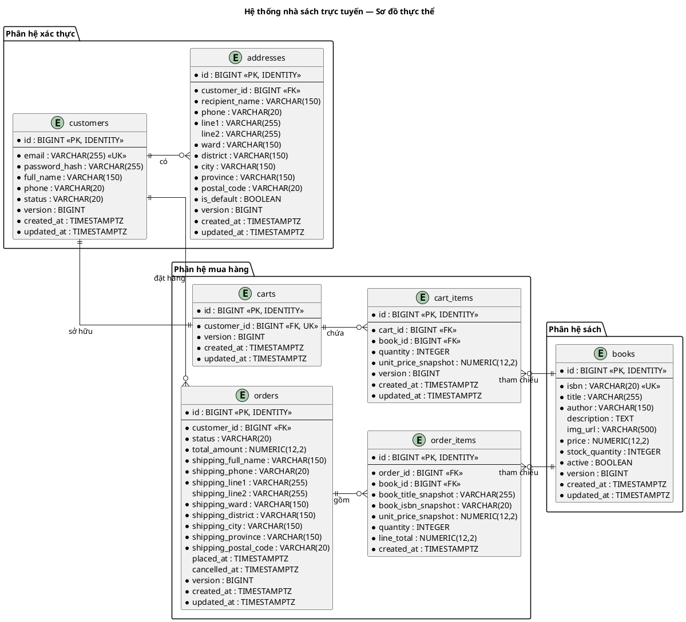
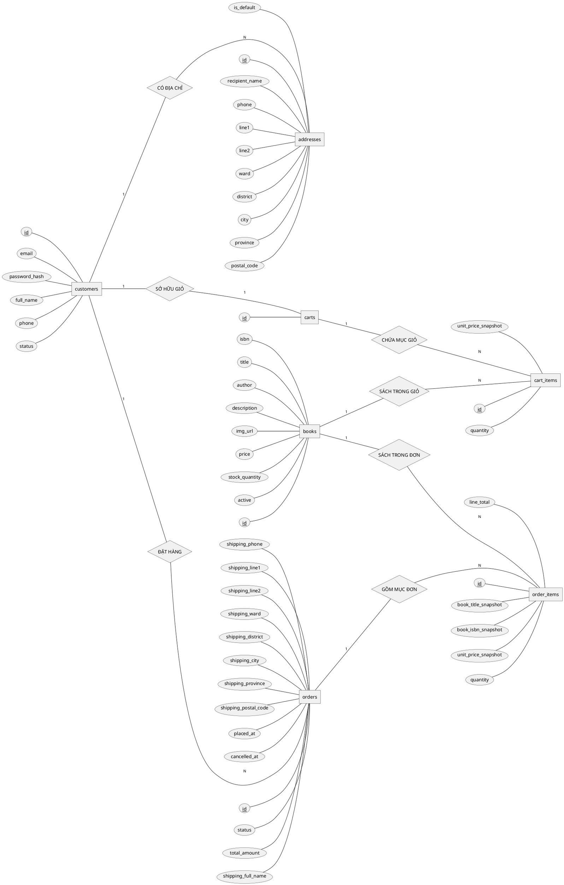

# Lược đồ cơ sở dữ liệu — Hệ thống nhà sách trực tuyến

## 1. Tổng quan

Hệ thống nhà sách trực tuyến sử dụng **PostgreSQL** làm cơ sở dữ liệu quan hệ.
Schema được quản lý bằng **Flyway** migration
(`src/main/resources/db/migration`).

---

## 2. ERD / Lược đồ thực thể

### 2.1 Sơ đồ thực thể — Class Entity Diagram

---

### 2.2 Sơ đồ quan hệ — Chen Notation ER Diagram

Sơ đồ Chen dưới đây là góc nhìn ý niệm: chỉ giữ các thuộc tính nghiệp vụ cốt
lõi, lược bỏ kiểu dữ liệu và các cột khóa ngoại đã được thể hiện bằng quan hệ.
Các trường audit như `created_at`, `updated_at` và `version` cũng được lược bỏ.
Chi tiết physical schema xem ở mục 3.

---

## 3. Bảng chi tiết (3NF)

### 3.1 Auth Module

#### `customers`

Khách hàng hệ thống. Mỗi tài khoản định danh bằng email duy nhất.

| Cột             | Kiểu dữ liệu   | Cho phép `NULL` | Mặc định            | Mô tả                            |
| --------------- | -------------- | --------------- | ------------------- | -------------------------------- |
| `id`            | `BIGINT`       | NOT NULL        | `IDENTITY`          | Khóa chính (auto-increment)      |
| `email`         | `VARCHAR(255)` | NOT NULL        | —                   | Địa chỉ email (duy nhất)         |
| `password_hash` | `VARCHAR(255)` | NOT NULL        | —                   | Mật khẩu đã băm                  |
| `full_name`     | `VARCHAR(150)` | NOT NULL        | —                   | Họ và tên                        |
| `phone`         | `VARCHAR(20)`  | NOT NULL        | —                   | Số điện thoại                    |
| `status`        | `VARCHAR(20)`  | NOT NULL        | —                   | Trạng thái: `ACTIVE`, `INACTIVE` |
| `version`       | `BIGINT`       | NOT NULL        | `0`                 | Optimistic locking               |
| `created_at`    | `TIMESTAMPTZ`  | NOT NULL        | `CURRENT_TIMESTAMP` | Thời điểm tạo (UTC)              |
| `updated_at`    | `TIMESTAMPTZ`  | NOT NULL        | `CURRENT_TIMESTAMP` | Thời điểm cập nhật cuối (UTC)    |

**Ràng buộc:**

| Tên                    | Loại        | Mô tả                              |
| ---------------------- | ----------- | ---------------------------------- |
| `customers_pkey`       | PRIMARY KEY | `id`                               |
| `customers_email_key`  | UNIQUE      | `email`                            |
| `chk_customers_status` | CHECK       | `status IN ('ACTIVE', 'INACTIVE')` |

---

#### `addresses`

Địa chỉ giao hàng của khách hàng. Mỗi khách hàng có thể có nhiều địa chỉ nhưng
chỉ một địa chỉ mặc định (đảm bảo bởi partial unique index).

| Cột              | Kiểu dữ liệu   | Cho phép `NULL` | Mặc định            | Mô tả                         |
| ---------------- | -------------- | --------------- | ------------------- | ----------------------------- |
| `id`             | `BIGINT`       | NOT NULL        | `IDENTITY`          | Khóa chính (auto-increment)   |
| `customer_id`    | `BIGINT`       | NOT NULL        | —                   | Khách hàng sở hữu địa chỉ     |
| `recipient_name` | `VARCHAR(150)` | NOT NULL        | —                   | Tên người nhận                |
| `phone`          | `VARCHAR(20)`  | NOT NULL        | —                   | Số điện thoại người nhận      |
| `line1`          | `VARCHAR(255)` | NOT NULL        | —                   | Địa chỉ dòng 1                |
| `line2`          | `VARCHAR(255)` | NULL            | —                   | Địa chỉ dòng 2 (tùy chọn)     |
| `ward`           | `VARCHAR(150)` | NOT NULL        | —                   | Phường/xã                     |
| `district`       | `VARCHAR(150)` | NOT NULL        | —                   | Quận/huyện                    |
| `city`           | `VARCHAR(150)` | NOT NULL        | —                   | Thành phố                     |
| `province`       | `VARCHAR(150)` | NOT NULL        | —                   | Tỉnh/thành                    |
| `postal_code`    | `VARCHAR(20)`  | NOT NULL        | —                   | Mã bưu chính                  |
| `is_default`     | `BOOLEAN`      | NOT NULL        | `FALSE`             | Địa chỉ mặc định              |
| `version`        | `BIGINT`       | NOT NULL        | `0`                 | Optimistic locking            |
| `created_at`     | `TIMESTAMPTZ`  | NOT NULL        | `CURRENT_TIMESTAMP` | Thời điểm tạo (UTC)           |
| `updated_at`     | `TIMESTAMPTZ`  | NOT NULL        | `CURRENT_TIMESTAMP` | Thời điểm cập nhật cuối (UTC) |

**Ràng buộc:**

| Tên                                 | Loại             | Mô tả                                                                      |
| ----------------------------------- | ---------------- | -------------------------------------------------------------------------- |
| `addresses_pkey`                    | PRIMARY KEY      | `id`                                                                       |
| `fk_addresses_customer`             | FOREIGN KEY      | `customer_id` → `customers(id)`                                            |
| `uq_addresses_default_per_customer` | UNIQUE (partial) | `customer_id` với điều kiện `is_default = TRUE` — mỗi khách chỉ 1 mặc định |

---

### 3.2 Book Module

#### `books`

Sách trong hệ thống. Hỗ trợ ẩn sách (`active = FALSE`) thay vì xóa vật lý.

| Cột              | Kiểu dữ liệu     | Cho phép `NULL` | Mặc định            | Mô tả                         |
| ---------------- | ---------------- | --------------- | ------------------- | ----------------------------- |
| `id`             | `BIGINT`         | NOT NULL        | `IDENTITY`          | Khóa chính (auto-increment)   |
| `isbn`           | `VARCHAR(20)`    | NOT NULL        | —                   | Mã ISBN (duy nhất)            |
| `title`          | `VARCHAR(255)`   | NOT NULL        | —                   | Tên sách                      |
| `author`         | `VARCHAR(150)`   | NOT NULL        | —                   | Tác giả                       |
| `description`    | `TEXT`           | NULL            | —                   | Mô tả sách                    |
| `img_url`        | `VARCHAR(500)`   | NULL            | —                   | URL ảnh bìa                   |
| `price`          | `NUMERIC(12, 2)` | NOT NULL        | —                   | Giá bán                       |
| `stock_quantity` | `INTEGER`        | NOT NULL        | —                   | Số lượng tồn kho              |
| `active`         | `BOOLEAN`        | NOT NULL        | `TRUE`              | Sách đang hiển thị            |
| `version`        | `BIGINT`         | NOT NULL        | `0`                 | Optimistic locking            |
| `created_at`     | `TIMESTAMPTZ`    | NOT NULL        | `CURRENT_TIMESTAMP` | Thời điểm tạo (UTC)           |
| `updated_at`     | `TIMESTAMPTZ`    | NOT NULL        | `CURRENT_TIMESTAMP` | Thời điểm cập nhật cuối (UTC) |

**Ràng buộc:**

| Tên               | Loại        | Mô tả                 |
| ----------------- | ----------- | --------------------- |
| `books_pkey`      | PRIMARY KEY | `id`                  |
| `books_isbn_key`  | UNIQUE      | `isbn`                |
| `chk_books_price` | CHECK       | `price >= 0`          |
| `chk_books_stock` | CHECK       | `stock_quantity >= 0` |

---

### 3.3 Purchase Module

#### `carts`

Giỏ hàng — mỗi khách hàng có đúng một giỏ hàng (quan hệ 1:1).

| Cột           | Kiểu dữ liệu  | Cho phép `NULL` | Mặc định            | Mô tả                            |
| ------------- | ------------- | --------------- | ------------------- | -------------------------------- |
| `id`          | `BIGINT`      | NOT NULL        | `IDENTITY`          | Khóa chính (auto-increment)      |
| `customer_id` | `BIGINT`      | NOT NULL        | —                   | Khách hàng sở hữu giỏ (duy nhất) |
| `version`     | `BIGINT`      | NOT NULL        | `0`                 | Optimistic locking               |
| `created_at`  | `TIMESTAMPTZ` | NOT NULL        | `CURRENT_TIMESTAMP` | Thời điểm tạo (UTC)              |
| `updated_at`  | `TIMESTAMPTZ` | NOT NULL        | `CURRENT_TIMESTAMP` | Thời điểm cập nhật cuối (UTC)    |

**Ràng buộc:**

| Tên                     | Loại        | Mô tả                                    |
| ----------------------- | ----------- | ---------------------------------------- |
| `carts_pkey`            | PRIMARY KEY | `id`                                     |
| `carts_customer_id_key` | UNIQUE      | `customer_id` — mỗi khách chỉ 1 giỏ hàng |
| `fk_carts_customer`     | FOREIGN KEY | `customer_id` → `customers(id)`          |

---

#### `cart_items`

Mục trong giỏ hàng. Mỗi sách chỉ xuất hiện một lần trong giỏ (tăng quantity thay
vì thêm bản ghi). Cột `unit_price_snapshot` lưu giá tại thời điểm thêm vào giỏ.

| Cột                   | Kiểu dữ liệu     | Cho phép `NULL` | Mặc định            | Mô tả                               |
| --------------------- | ---------------- | --------------- | ------------------- | ----------------------------------- |
| `id`                  | `BIGINT`         | NOT NULL        | `IDENTITY`          | Khóa chính (auto-increment)         |
| `cart_id`             | `BIGINT`         | NOT NULL        | —                   | Giỏ hàng chứa mục này               |
| `book_id`             | `BIGINT`         | NOT NULL        | —                   | Sách được thêm vào giỏ              |
| `quantity`            | `INTEGER`        | NOT NULL        | —                   | Số lượng                            |
| `unit_price_snapshot` | `NUMERIC(12, 2)` | NOT NULL        | —                   | Bản chụp đơn giá tại thời điểm thêm |
| `version`             | `BIGINT`         | NOT NULL        | `0`                 | Optimistic locking                  |
| `created_at`          | `TIMESTAMPTZ`    | NOT NULL        | `CURRENT_TIMESTAMP` | Thời điểm tạo (UTC)                 |
| `updated_at`          | `TIMESTAMPTZ`    | NOT NULL        | `CURRENT_TIMESTAMP` | Thời điểm cập nhật cuối (UTC)       |

**Ràng buộc:**

| Tên                       | Loại        | Mô tả                                       |
| ------------------------- | ----------- | ------------------------------------------- |
| `cart_items_pkey`         | PRIMARY KEY | `id`                                        |
| `fk_cart_items_cart`      | FOREIGN KEY | `cart_id` → `carts(id)` `ON DELETE CASCADE` |
| `fk_cart_items_book`      | FOREIGN KEY | `book_id` → `books(id)`                     |
| `uq_cart_items_cart_book` | UNIQUE      | `(cart_id, book_id)` — mỗi sách 1 lần/giỏ   |
| `chk_cart_items_quantity` | CHECK       | `quantity > 0`                              |
| `chk_cart_items_price`    | CHECK       | `unit_price_snapshot >= 0`                  |

---

#### `orders`

Đơn hàng. Thông tin giao hàng được nhúng trực tiếp (embedded shipping address)
thay vì tham chiếu bảng `addresses`, đảm bảo dữ liệu giao hàng không thay đổi
khi khách sửa địa chỉ sau này.

| Cột                    | Kiểu dữ liệu     | Cho phép `NULL` | Mặc định            | Mô tả                         |
| ---------------------- | ---------------- | --------------- | ------------------- | ----------------------------- |
| `id`                   | `BIGINT`         | NOT NULL        | `IDENTITY`          | Khóa chính (auto-increment)   |
| `customer_id`          | `BIGINT`         | NOT NULL        | —                   | Khách hàng đặt đơn            |
| `status`               | `VARCHAR(20)`    | NOT NULL        | —                   | Trạng thái đơn hàng           |
| `total_amount`         | `NUMERIC(12, 2)` | NOT NULL        | —                   | Tổng giá trị đơn hàng         |
| `shipping_full_name`   | `VARCHAR(150)`   | NOT NULL        | —                   | Họ tên người nhận             |
| `shipping_phone`       | `VARCHAR(20)`    | NOT NULL        | —                   | SĐT người nhận                |
| `shipping_line1`       | `VARCHAR(255)`   | NOT NULL        | —                   | Địa chỉ giao hàng dòng 1      |
| `shipping_line2`       | `VARCHAR(255)`   | NULL            | —                   | Địa chỉ giao hàng dòng 2      |
| `shipping_ward`        | `VARCHAR(150)`   | NOT NULL        | —                   | Phường/xã giao hàng           |
| `shipping_district`    | `VARCHAR(150)`   | NOT NULL        | —                   | Quận/huyện giao hàng          |
| `shipping_city`        | `VARCHAR(150)`   | NOT NULL        | —                   | Thành phố giao hàng           |
| `shipping_province`    | `VARCHAR(150)`   | NOT NULL        | —                   | Tỉnh/thành giao hàng          |
| `shipping_postal_code` | `VARCHAR(20)`    | NOT NULL        | —                   | Mã bưu chính giao hàng        |
| `placed_at`            | `TIMESTAMPTZ`    | NULL            | —                   | Thời điểm đặt hàng (UTC)      |
| `cancelled_at`         | `TIMESTAMPTZ`    | NULL            | —                   | Thời điểm hủy đơn (UTC)       |
| `version`              | `BIGINT`         | NOT NULL        | `0`                 | Optimistic locking            |
| `created_at`           | `TIMESTAMPTZ`    | NOT NULL        | `CURRENT_TIMESTAMP` | Thời điểm tạo (UTC)           |
| `updated_at`           | `TIMESTAMPTZ`    | NOT NULL        | `CURRENT_TIMESTAMP` | Thời điểm cập nhật cuối (UTC) |

**Ràng buộc:**

| Tên                  | Loại        | Mô tả                                          |
| -------------------- | ----------- | ---------------------------------------------- |
| `orders_pkey`        | PRIMARY KEY | `id`                                           |
| `fk_orders_customer` | FOREIGN KEY | `customer_id` → `customers(id)`                |
| `chk_orders_status`  | CHECK       | `status IN ('PENDING', 'PLACED', 'CANCELLED')` |
| `chk_orders_total`   | CHECK       | `total_amount >= 0`                            |

---

#### `order_items`

Mục trong đơn hàng. Lưu bản chụp (snapshot) tiêu đề, ISBN và đơn giá sách tại
thời điểm đặt hàng để đảm bảo tính bất biến của đơn hàng đã đặt.

> **Lưu ý:** Bảng này **không** có `version` và `updated_at` — dữ liệu mục đơn
> hàng là bất biến sau khi tạo.

| Cột                   | Kiểu dữ liệu     | Cho phép `NULL` | Mặc định            | Mô tả                                |
| --------------------- | ---------------- | --------------- | ------------------- | ------------------------------------ |
| `id`                  | `BIGINT`         | NOT NULL        | `IDENTITY`          | Khóa chính (auto-increment)          |
| `order_id`            | `BIGINT`         | NOT NULL        | —                   | Đơn hàng chứa mục này                |
| `book_id`             | `BIGINT`         | NOT NULL        | —                   | Sách được đặt                        |
| `book_title_snapshot` | `VARCHAR(255)`   | NOT NULL        | —                   | Bản chụp tiêu đề sách                |
| `book_isbn_snapshot`  | `VARCHAR(20)`    | NOT NULL        | —                   | Bản chụp ISBN sách                   |
| `unit_price_snapshot` | `NUMERIC(12, 2)` | NOT NULL        | —                   | Bản chụp đơn giá                     |
| `quantity`            | `INTEGER`        | NOT NULL        | —                   | Số lượng                             |
| `line_total`          | `NUMERIC(12, 2)` | NOT NULL        | —                   | Thành tiền (`quantity * unit_price`) |
| `created_at`          | `TIMESTAMPTZ`    | NOT NULL        | `CURRENT_TIMESTAMP` | Thời điểm tạo (UTC)                  |

**Ràng buộc:**

| Tên                        | Loại        | Mô tả                                         |
| -------------------------- | ----------- | --------------------------------------------- |
| `order_items_pkey`         | PRIMARY KEY | `id`                                          |
| `fk_order_items_order`     | FOREIGN KEY | `order_id` → `orders(id)` `ON DELETE CASCADE` |
| `fk_order_items_book`      | FOREIGN KEY | `book_id` → `books(id)`                       |
| `chk_order_items_quantity` | CHECK       | `quantity > 0`                                |
| `chk_order_items_price`    | CHECK       | `unit_price_snapshot >= 0`                    |
| `chk_order_items_total`    | CHECK       | `line_total >= 0`                             |

---

## 4. Giá trị enum / CHECK constraint

| Bảng          | Cột                   | Giá trị hợp lệ                   | Mô tả                |
| ------------- | --------------------- | -------------------------------- | -------------------- |
| `customers`   | `status`              | `ACTIVE`, `INACTIVE`             | Trạng thái tài khoản |
| `orders`      | `status`              | `PENDING`, `PLACED`, `CANCELLED` | Trạng thái đơn hàng  |
| `books`       | `price`               | `>= 0`                           | Giá không âm         |
| `books`       | `stock_quantity`      | `>= 0`                           | Tồn kho không âm     |
| `cart_items`  | `quantity`            | `> 0`                            | Số lượng dương       |
| `cart_items`  | `unit_price_snapshot` | `>= 0`                           | Đơn giá không âm     |
| `orders`      | `total_amount`        | `>= 0`                           | Tổng tiền không âm   |
| `order_items` | `quantity`            | `> 0`                            | Số lượng dương       |
| `order_items` | `unit_price_snapshot` | `>= 0`                           | Đơn giá không âm     |
| `order_items` | `line_total`          | `>= 0`                           | Thành tiền không âm  |

---

## 5. Bảng tham chiếu

### 5.1 Khóa ngoại (Foreign Keys)

| Tên                     | Bảng nguồn    | Cột           | Bảng đích   | Cột đích | ON DELETE  |
| ----------------------- | ------------- | ------------- | ----------- | -------- | ---------- |
| `fk_addresses_customer` | `addresses`   | `customer_id` | `customers` | `id`     | (mặc định) |
| `fk_carts_customer`     | `carts`       | `customer_id` | `customers` | `id`     | (mặc định) |
| `fk_cart_items_cart`    | `cart_items`  | `cart_id`     | `carts`     | `id`     | `CASCADE`  |
| `fk_cart_items_book`    | `cart_items`  | `book_id`     | `books`     | `id`     | (mặc định) |
| `fk_orders_customer`    | `orders`      | `customer_id` | `customers` | `id`     | (mặc định) |
| `fk_order_items_order`  | `order_items` | `order_id`    | `orders`    | `id`     | `CASCADE`  |
| `fk_order_items_book`   | `order_items` | `book_id`     | `books`     | `id`     | (mặc định) |

### 5.2 Chỉ mục (Indexes)

| Tên                                 | Bảng          | Cột / Biểu thức                  | Loại              | Mô tả                                       |
| ----------------------------------- | ------------- | -------------------------------- | ----------------- | ------------------------------------------- |
| `idx_addresses_customer_id`         | `addresses`   | `customer_id`                    | B-tree            | Tìm địa chỉ theo khách hàng                 |
| `uq_addresses_default_per_customer` | `addresses`   | `customer_id` WHERE `is_default` | UNIQUE (partial)  | Mỗi khách chỉ 1 địa chỉ mặc định            |
| `idx_books_title`                   | `books`       | `title`                          | B-tree            | Tìm kiếm sách theo tiêu đề                  |
| `idx_carts_customer_id`             | `carts`       | `customer_id`                    | B-tree            | Tìm giỏ hàng theo khách hàng                |
| `idx_cart_items_cart_id`            | `cart_items`  | `cart_id`                        | B-tree            | Tìm mục theo giỏ hàng                       |
| `idx_cart_items_book_id`            | `cart_items`  | `book_id`                        | B-tree            | Tìm giỏ hàng chứa sách cụ thể               |
| `idx_orders_customer_created_at`    | `orders`      | `(customer_id, created_at DESC)` | B-tree (compound) | Lịch sử đơn hàng theo khách, mới nhất trước |
| `idx_order_items_order_id`          | `order_items` | `order_id`                       | B-tree            | Tìm mục theo đơn hàng                       |
