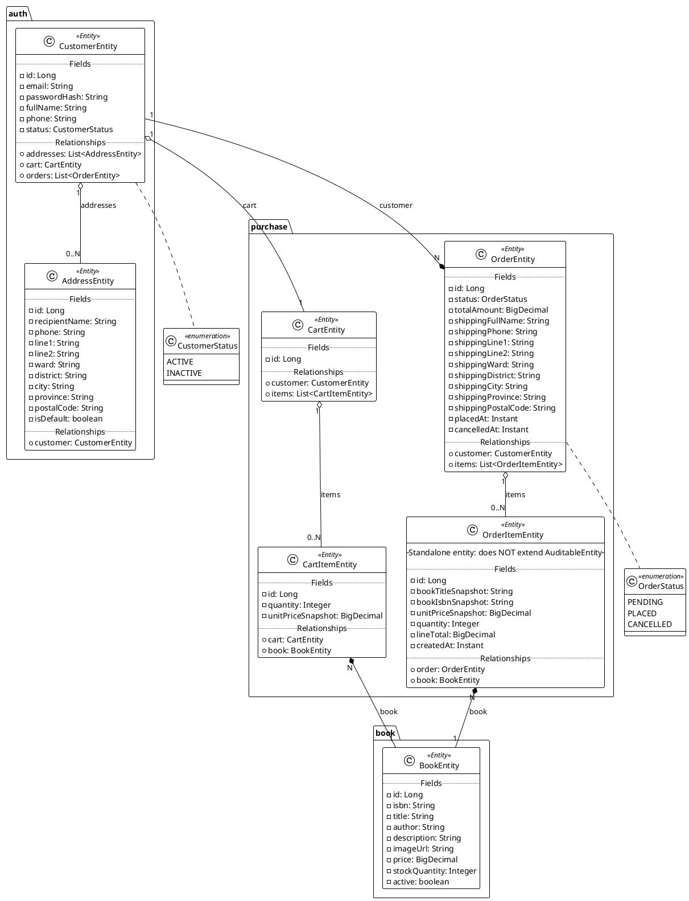

# Database Documentation / Tài liệu Cơ sở Dữ liệu

> **Bilingual**: English (primary) / Tiếng Việt (phụ)
>
> This document describes the physical database schema of the Bookstore application.
> Hồ sơ này mô tả lược đồ vật lý của ứng dụng Bookstore.

---

## 1. Entity Class Diagram (PlantUML)

> Shows JPA entity classes with their fields, types, and relationships.


<!-- docs/images/db/db-01.svg -->


### Giải thích / Explanation

```
CustomerEntity
  ├── addresses (1:N via AddressEntity.customer) ───→ AddressEntity
  ├── cart      (1:1 via CartEntity.customer_id) ─────→ CartEntity
  └── orders   (1:N via OrderEntity.customer) ─────────→ OrderEntity

AddressEntity
  └── customer (N:1) ─────────────────────────────────→ CustomerEntity

CartEntity
  ├── customer (1:1) ─────────────────────────────────→ CustomerEntity
  └── items    (1:N via CartItemEntity.cart) ─────────→ CartItemEntity

CartItemEntity
  ├── cart (N:1) ──────────────────────────────────────→ CartEntity
  └── book (N:1) ──────────────────────────────────────→ BookEntity

OrderEntity
  ├── customer (N:1) ──────────────────────────────────→ CustomerEntity
  └── items    (1:N via OrderItemEntity.order) ────────→ OrderItemEntity

OrderItemEntity
  ├── order (N:1) ─────────────────────────────────────→ OrderEntity
  └── book  (N:1) ──────────────────────────────────────→ BookEntity
```

---

## 2. ER Diagram — Chen Notation (PlantUML)

> Entity-Relationship diagram theo ký hiệu Chen. Mỗi bảng được biểu diễn dưới dạng **矩形 (rectangle)** với **ovals** cho các thuộc tính, **kim cương (diamonds)** cho quan hệ.

```plantuml
@startuml Bookstore_ER_Chen
!theme plain

' ─── ENTITIES ────────────────────────────────────────────────────

entity "<b>customers</b>\n\n{PK} id\n\n" as customers <<ENTITY>> #F5F5F5 {
    **id** : BIGINT
    email : VARCHAR(255)  {UQ}
    password_hash : VARCHAR(255)
    full_name : VARCHAR(150)
    phone : VARCHAR(20)
    status : VARCHAR(20)
    version : BIGINT
    created_at : TIMESTAMPTZ
    updated_at : TIMESTAMPTZ
}

entity "<b>addresses</b>\n\n{PK} id\n\n" as addresses <<ENTITY>> #F5F5F5 {
    **id** : BIGINT
    {FK} customer_id : BIGINT
    recipient_name : VARCHAR(150)
    phone : VARCHAR(20)
    line1 : VARCHAR(255)
    line2 : VARCHAR(255)
    ward : VARCHAR(150)
    district : VARCHAR(150)
    city : VARCHAR(150)
    province : VARCHAR(150)
    postal_code : VARCHAR(20)
    is_default : BOOLEAN
    version : BIGINT
    created_at : TIMESTAMPTZ
    updated_at : TIMESTAMPTZ
}

entity "<b>books</b>\n\n{PK} id\n\n" as books <<ENTITY>> #F5F5F5 {
    **id** : BIGINT
    isbn : VARCHAR(20)  {UQ}
    title : VARCHAR(255)
    author : VARCHAR(150)
    description : TEXT
    img_url : VARCHAR(500)
    price : NUMERIC(12,2)
    stock_quantity : INTEGER
    active : BOOLEAN
    version : BIGINT
    created_at : TIMESTAMPTZ
    updated_at : TIMESTAMPTZ
}

entity "<b>carts</b>\n\n{PK} id\n\n" as carts <<ENTITY>> #F5F5F5 {
    **id** : BIGINT
    {FK} customer_id : BIGINT  {UQ}
    version : BIGINT
    created_at : TIMESTAMPTZ
    updated_at : TIMESTAMPTZ
}

entity "<b>cart_items</b>\n\n{PK} id\n\n" as cart_items <<ENTITY>> #F5F5F5 {
    **id** : BIGINT
    {FK} cart_id : BIGINT
    {FK} book_id : BIGINT
    quantity : INTEGER
    unit_price_snapshot : NUMERIC(12,2)
    version : BIGINT
    created_at : TIMESTAMPTZ
    updated_at : TIMESTAMPTZ
}

entity "<b>orders</b>\n\n{PK} id\n\n" as orders <<ENTITY>> #F5F5F5 {
    **id** : BIGINT
    {FK} customer_id : BIGINT
    status : VARCHAR(20)
    total_amount : NUMERIC(12,2)
    shipping_full_name : VARCHAR(150)
    shipping_phone : VARCHAR(20)
    shipping_line1 : VARCHAR(255)
    shipping_line2 : VARCHAR(255)
    shipping_ward : VARCHAR(150)
    shipping_district : VARCHAR(150)
    shipping_city : VARCHAR(150)
    shipping_province : VARCHAR(150)
    shipping_postal_code : VARCHAR(20)
    placed_at : TIMESTAMPTZ
    cancelled_at : TIMESTAMPTZ
    version : BIGINT
    created_at : TIMESTAMPTZ
    updated_at : TIMESTAMPTZ
}

entity "<b>order_items</b>\n\n{PK} id\n\n" as order_items <<ENTITY>> #F5F5F5 {
    **id** : BIGINT
    {FK} order_id : BIGINT
    {FK} book_id : BIGINT
    book_title_snapshot : VARCHAR(255)
    book_isbn_snapshot : VARCHAR(20)
    unit_price_snapshot : NUMERIC(12,2)
    quantity : INTEGER
    line_total : NUMERIC(12,2)
    created_at : TIMESTAMPTZ
}

' ─── RELATIONSHIPS (Chen diamonds) ───────────────────────────────

' addresses ↔ customers
(addresses, customers) : N_customer_has_N_addresses

' carts ↔ customers
(carts, customers) : 1_customer_has_1_cart

' cart_items ↔ carts
(cart_items, carts) : N_cart_contains_N_cart_items

' cart_items ↔ books
(cart_items, books) : N_cart_item_references_1_book

' orders ↔ customers
(orders, customers) : N_customer_places_N_orders

' order_items ↔ orders
(order_items, orders) : N_order_contains_N_order_items

' order_items ↔ books
(order_items, books) : N_order_item_references_1_book

' ─── CARDINALITY LABELS ──────────────────────────────────────────
note right of customers
  1 customer ──┬── 0..N addresses
  1 customer ──┼── 1 cart
  1 customer ──┴── 0..N orders
end note

note bottom of addresses
  UNIQUE(customer_id) WHERE is_default = TRUE
  (Partial unique index)
end note

note bottom of cart_items
  UNIQUE(cart_id, book_id)
  (Cart cannot have duplicate book entries)
end note

note right of orders
  Shipping address is DENORMALIZED
  (stored directly, not FK to addresses)
  Prevents broken address history
end note

note bottom of order_items
  Standalone entity — does NOT inherit
  AuditableEntity (@MappedSuperclass)
  Has only createdAt (no updatedAt/version)
end note

@enduml
```
<!-- docs/images/db/db-02.svg -->


### Chen Notation Legend

```
┌─────────────────────────────────────────────────────────────┐
│  CHEN NOTATION KEYS / BẢNG CHÚ GIẢI KÝ HIỆU CHEN           │
├─────────────────────────────────────────────────────────────┤
│                                                             │
│  ENTITY (Rectangle)                                         │
│  ┌──────────────┐                                           │
│  │  entity_name │  ← Bảng trong database                   │
│  └──────────────┘                                           │
│                                                             │
│  ATTRIBUTE (Oval)                                           │
│      (id)            ← Thuộc tính đa trị (multi-valued)    │
│      *id*            ← Thuộc tính khóa (key)               │
│      (id)            ← Thuộc tính suy diễn (derived)        │
│      **id**          ← Thuộc tính ghép (composite)          │
│                                                             │
│  RELATIONSHIP (Diamond)                                     │
│       ◇                                                     │
│    relates                                                   │
│                                                             │
│  CARDINALITY                                                │
│    1         ← Exactly one                                  │
│    N         ← Many (zero or more)                          │
│    0..1      ← Zero or one                                  │
│    1..N      ← One or more                                 │
│                                                             │
│  ┌────────┐    ┌────────┐                                   │
│  │   E1   │ 1  │   E2   │  ← 1:E1 relates to 1 E2          │
│  └────────┘───◇└────────┘                                   │
│                                                             │
│  ┌────────┐    ┌────────┐                                   │
│  │   E1   │ 1  │   E2   │  ← 1:E1 relates to N E2           │
│  └────────┘◀──◇──▶│  E2   │                                   │
│       N            └────────┘                                │
│                                                             │
└─────────────────────────────────────────────────────────────┘
```

---

## 3. Table Specifications / Thông số Bảng

> **Quy ước / Convention:**
> - **Khóa chính**: đậm / bold
> - **Khóa ngoại**: gạch chân / underline
> - Các giá trị enum liệt kê cụ thể

---

### 3.1 `customers` — Tài khoản khách hàng / Customer Accounts

| STT | Thuộc tính | Kiểu dữ liệu | Mô tả |
|-----|-----------|---------------|-------|
| 1 | **id** | BIGINT | Khóa chính, tự tăng (IDENTITY) |
| 2 | email | VARCHAR(255) | Email đăng nhập, duy nhất không trùng |
| 3 | password_hash | VARCHAR(255) | BCrypt hash của mật khẩu |
| 4 | full_name | VARCHAR(150) | Họ tên đầy đủ |
| 5 | phone | VARCHAR(20) | Số điện thoại liên hệ |
| 6 | status | VARCHAR(20) | Trạng thái: **ACTIVE**, **INACTIVE** |
| 7 | version | BIGINT | Optimistic lock (mặc định 0) |
| 8 | created_at | TIMESTAMPTZ | Thời điểm tạo (not null, không sửa được) |
| 9 | updated_at | TIMESTAMPTZ | Thời điểm cập nhật gần nhất |

**Constraints:**
- `UNIQUE(email)` — mỗi email chỉ đăng ký một tài khoản
- `CHECK (status IN ('ACTIVE', 'INACTIVE'))`

**Indexes:**
- `email` — unique, tự động

---

### 3.2 `addresses` — Địa chỉ giao hàng / Shipping Addresses

| STT | Thuộc tính | Kiểu dữ liệu | Mô tả |
|-----|-----------|---------------|-------|
| 1 | **id** | BIGINT | Khóa chính, tự tăng (IDENTITY) |
| 2 | <u>customer_id</u> | BIGINT | Khóa ngoại → `customers(id)` |
| 3 | recipient_name | VARCHAR(150) | Tên người nhận |
| 4 | phone | VARCHAR(20) | Số điện thoại người nhận |
| 5 | line1 | VARCHAR(255) | Địa chỉ dòng 1 (số nhà, đường) |
| 6 | line2 | VARCHAR(255) | Địa chỉ dòng 2 (tùy chọn) |
| 7 | ward | VARCHAR(150) | Phường / Xã |
| 8 | district | VARCHAR(150) | Quận / Huyện |
| 9 | city | VARCHAR(150) | Thành phố |
| 10 | province | VARCHAR(150) | Tỉnh |
| 11 | postal_code | VARCHAR(20) | Mã bưu điện |
| 12 | is_default | BOOLEAN | Địa chỉ mặc định (mỗi khách 1 địa chỉ mặc định) |
| 13 | version | BIGINT | Optimistic lock |
| 14 | created_at | TIMESTAMPTZ | Thời điểm tạo |
| 15 | updated_at | TIMESTAMPTZ | Thời điểm cập nhật gần nhất |

**Constraints:**
- `FK(customer_id) → customers(id)` — xóa cascade
- `UNIQUE(customer_id) WHERE is_default = TRUE` — chỉ 1 địa chỉ mặc định mỗi khách

**Indexes:**
- `idx_addresses_customer_id` ON `customer_id`

---

### 3.3 `books` — Danh mục sách / Book Catalog

| STT | Thuộc tính | Kiểu dữ liệu | Mô tả |
|-----|-----------|---------------|-------|
| 1 | **id** | BIGINT | Khóa chính, tự tăng (IDENTITY) |
| 2 | isbn | VARCHAR(20) | Mã ISBN, duy nhất không trùng |
| 3 | title | VARCHAR(255) | Tiêu đề sách |
| 4 | author | VARCHAR(150) | Tên tác giả |
| 5 | description | TEXT | Mô tả nội dung (không giới hạn độ dài) |
| 6 | img_url | VARCHAR(500) | URL ảnh bìa sách |
| 7 | price | NUMERIC(12,2) | Giá bán (tối thiểu 0) |
| 8 | stock_quantity | INTEGER | Số lượng tồn kho (tối thiểu 0) |
| 9 | active | BOOLEAN | Sách có đang được bán không |
| 10 | version | BIGINT | Optimistic lock |
| 11 | created_at | TIMESTAMPTZ | Thời điểm tạo |
| 12 | updated_at | TIMESTAMPTZ | Thời điểm cập nhật gần nhất |

**Constraints:**
- `UNIQUE(isbn)`
- `CHECK (price >= 0)`
- `CHECK (stock_quantity >= 0)`

**Indexes:**
- `idx_books_title` ON `title`
- `isbn` — unique, tự động

---

### 3.4 `carts` — Giỏ hàng / Shopping Carts

| STT | Thuộc tính | Kiểu dữ liệu | Mô tả |
|-----|-----------|---------------|-------|
| 1 | **id** | BIGINT | Khóa chính, tự tăng (IDENTITY) |
| 2 | <u>customer_id</u> | BIGINT | Khóa ngoại → `customers(id)`, duy nhất (mỗi khách 1 giỏ) |
| 3 | version | BIGINT | Optimistic lock |
| 4 | created_at | TIMESTAMPTZ | Thời điểm tạo |
| 5 | updated_at | TIMESTAMPTZ | Thời điểm cập nhật gần nhất |

**Constraints:**
- `UNIQUE(customer_id)` — đảm bảo 1 cart per customer
- `FK(customer_id) → customers(id)` — xóa cascade

**Indexes:**
- `idx_carts_customer_id` ON `customer_id`

---

### 3.5 `cart_items` — Mặt hàng trong giỏ / Cart Line Items

| STT | Thuộc tính | Kiểu dữ liệu | Mô tả |
|-----|-----------|---------------|-------|
| 1 | **id** | BIGINT | Khóa chính, tự tăng (IDENTITY) |
| 2 | <u>cart_id</u> | BIGINT | Khóa ngoại → `carts(id)`, xóa cascade |
| 3 | <u>book_id</u> | BIGINT | Khóa ngoại → `books(id)` |
| 4 | quantity | INTEGER | Số lượng mua (tối thiểu > 0) |
| 5 | unit_price_snapshot | NUMERIC(12,2) | Giá tại thời điểm thêm vào giỏ (snapshot) |
| 6 | version | BIGINT | Optimistic lock |
| 7 | created_at | TIMESTAMPTZ | Thời điểm tạo |
| 8 | updated_at | TIMESTAMPTZ | Thời điểm cập nhật gần nhất |

**Constraints:**
- `FK(cart_id) → carts(id) ON DELETE CASCADE`
- `FK(book_id) → books(id)`
- `UNIQUE(cart_id, book_id)` — mỗi sách chỉ xuất hiện 1 dòng trong 1 giỏ
- `CHECK (quantity > 0)`
- `CHECK (unit_price_snapshot >= 0)`

**Indexes:**
- `idx_cart_items_cart_id` ON `cart_id`
- `idx_cart_items_book_id` ON `book_id`

---

### 3.6 `orders` — Đơn hàng / Customer Orders

| STT | Thuộc tính | Kiểu dữ liệu | Mô tả |
|-----|-----------|---------------|-------|
| 1 | **id** | BIGINT | Khóa chính, tự tăng (IDENTITY) |
| 2 | <u>customer_id</u> | BIGINT | Khóa ngoại → `customers(id)` |
| 3 | status | VARCHAR(20) | Trạng thái: **PENDING**, **PLACED**, **CANCELLED** |
| 4 | total_amount | NUMERIC(12,2) | Tổng tiền đơn hàng (tối thiểu 0) |
| 5 | shipping_full_name | VARCHAR(150) | Tên người nhận (snapshot) |
| 6 | shipping_phone | VARCHAR(20) | SĐT người nhận (snapshot) |
| 7 | shipping_line1 | VARCHAR(255) | Địa chỉ dòng 1 (snapshot) |
| 8 | shipping_line2 | VARCHAR(255) | Địa chỉ dòng 2 (snapshot, nullable) |
| 9 | shipping_ward | VARCHAR(150) | Phường / Xã (snapshot) |
| 10 | shipping_district | VARCHAR(150) | Quận / Huyện (snapshot) |
| 11 | shipping_city | VARCHAR(150) | Thành phố (snapshot) |
| 12 | shipping_province | VARCHAR(150) | Tỉnh (snapshot) |
| 13 | shipping_postal_code | VARCHAR(20) | Mã bưu điện (snapshot) |
| 14 | placed_at | TIMESTAMPTZ | Thời điểm xác nhận đặt hàng (nullable) |
| 15 | cancelled_at | TIMESTAMPTZ | Thời điểm hủy đơn (nullable) |
| 16 | version | BIGINT | Optimistic lock |
| 17 | created_at | TIMESTAMPTZ | Thời điểm tạo |
| 18 | updated_at | TIMESTAMPTZ | Thời điểm cập nhật gần nhất |

**Constraints:**
- `FK(customer_id) → customers(id)`
- `CHECK (status IN ('PENDING', 'PLACED', 'CANCELLED'))`
- `CHECK (total_amount >= 0)`

**Indexes:**
- `idx_orders_customer_created_at` ON `(customer_id, created_at DESC)`

**Lưu ý / Note:**
- Shipping address là **denormalized snapshot** — địa chỉ được lưu trực tiếp vào `orders`, không có FK sang `addresses`. Lý do: đơn hàng cần giữ nguyên địa chỉ giao hàng tại thời điểm đặt, dù khách hàng sau đó sửa hoặc xóa địa chỉ gốc.

---

### 3.7 `order_items` — Chi tiết đơn hàng / Order Line Items

| STT | Thuộc tính | Kiểu dữ liệu | Mô tả |
|-----|-----------|---------------|-------|
| 1 | **id** | BIGINT | Khóa chính, tự tăng (IDENTITY) |
| 2 | <u>order_id</u> | BIGINT | Khóa ngoại → `orders(id)`, xóa cascade |
| 3 | <u>book_id</u> | BIGINT | Khóa ngoại → `books(id)` |
| 4 | book_title_snapshot | VARCHAR(255) | Tiêu đề sách tại thời điểm đặt |
| 5 | book_isbn_snapshot | VARCHAR(20) | ISBN tại thời điểm đặt |
| 6 | unit_price_snapshot | NUMERIC(12,2) | Đơn giá tại thời điểm đặt |
| 7 | quantity | INTEGER | Số lượng đặt mua (tối thiểu > 0) |
| 8 | line_total | NUMERIC(12,2) | Thành tiền: `quantity × unit_price_snapshot` |
| 9 | created_at | TIMESTAMPTZ | Thời điểm tạo dòng |

**Constraints:**
- `FK(order_id) → orders(id) ON DELETE CASCADE` — xóa đơn → xóa hết items
- `FK(book_id) → books(id)`
- `CHECK (quantity > 0)`
- `CHECK (unit_price_snapshot >= 0)`
- `CHECK (line_total >= 0)`

**Indexes:**
- `idx_order_items_order_id` ON `order_id`

**Lưu ý / Note:**
- Entity này **standalone**, không kế thừa `AuditableEntity` (không có `updated_at` hay `version`). Chỉ có `created_at` — dòng order item không bao giờ sửa sau khi tạo.

---

## 4. Design Patterns & Notes / Các Mẫu Thiết kế & Ghi chú

### 4.1 Snapshot Pattern (Price Freeze)

Khi thêm sách vào giỏ hoặc đặt hàng, **giá tại thời điểm đó được ghi nhận** (snapshot) thay vì FK tham chiếu đến `books.price`. Lý do:

```
Sách "Clean Code" hôm nay:  $12.50
                          ├─ CartItem.unit_price_snapshot = 12.50
                          └─ OrderItem.unit_price_snapshot = 12.50

Ngày mai giá đổi thành:   $15.00
                          (Giỏ hàng & đơn cũ không bị ảnh hưởng)
```

### 4.2 Optimistic Locking

Tất cả aggregate entities (trừ `OrderItemEntity`) sử dụng `@Version` để chống concurrent modification:

```
Customer → addresses, orders
Book
Cart → cart_items
Order → order_items
```

### 4.3 Cascade Delete Paths

```
customers(id) ──┬──► ON DELETE CASCADE ──► addresses(customer_id)
                ├──► ON DELETE CASCADE ──► carts(customer_id)
                └──► ON DELETE RESTRICT ──► orders(customer_id)
                                                    └──► ON DELETE CASCADE ──► order_items(order_id)

books(id) ──────┬──► RESTRICT (không xóa sách đang có trong đơn/giỏ)
                ├──► carts: không có FK
                ├──► cart_items(book_id): FK nhưng không cascade
                └──► order_items(book_id): FK nhưng không cascade
```

### 4.4 Address ≠ Shipping Address

```
addresses table          ← entity AddressEntity
  └── Dùng cho: quản lý danh sách địa chỉ giao hàng của khách
  └── Mỗi khách có thể có nhiều địa chỉ

orders table             ← shipping_* columns
  └── Dùng cho: lưu snapshot địa chỉ giao hàng TẠI THỜI ĐIỂM ĐẶT
  └── Không có FK sang addresses (denormalized intent)
  └── Lý do: đơn hàng phải giữ nguyên địa chỉ dù khách sửa/xóa sau này
```

---

## 5. Database Migration History / Lịch sử Migration

| File | Loại | Mô tả |
|------|------|-------|
| `V1__create_bookstore_schema.sql` | Schema | Tạo 7 bảng: customers, addresses, books, carts, cart_items, orders, order_items |
| `V2__seed_demo_books_and_dev_account.sql` | Seed (dev) | Tạo 1 tài khoản dev + 6 sách mẫu. Chạy trong dev environment qua Flyway placeholders |

> Migration V2 nằm trong `src/main/resources/db/dev/` — chỉ chạy khi active profiles include `dev`.
