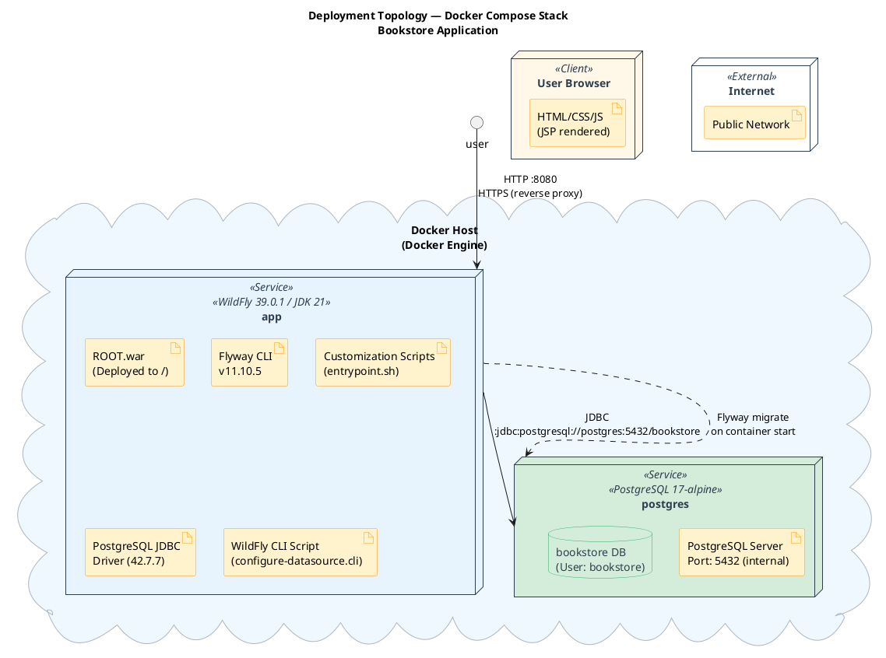
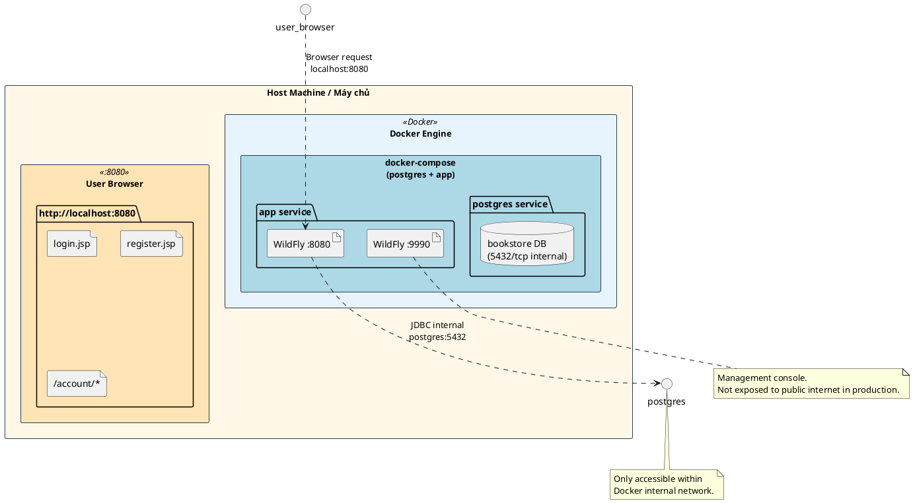
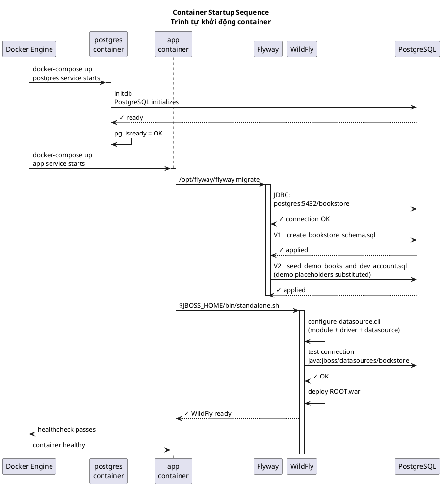
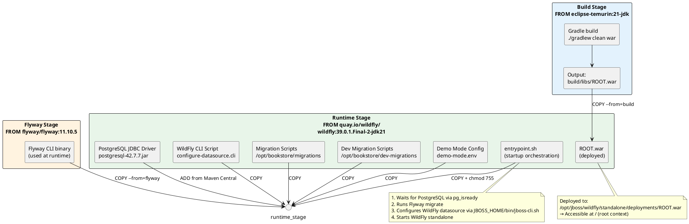
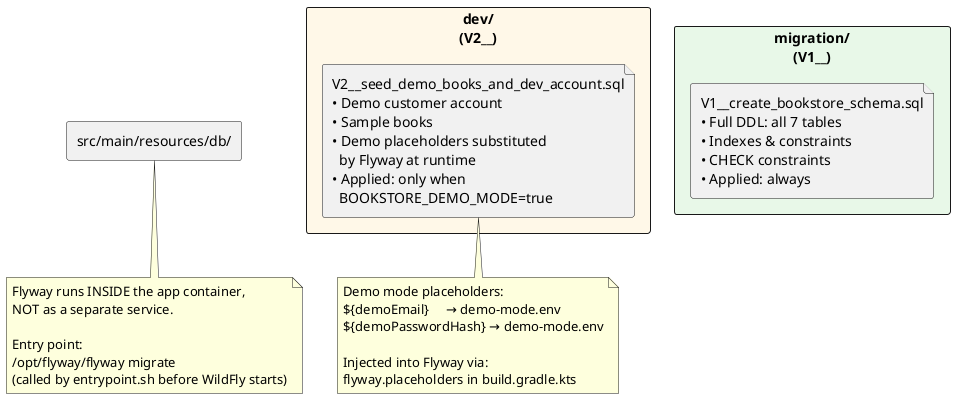

# Bookstore — Deployment Documentation
# Bookstore — Tài liệu Triển khai

> **Language / Ngôn ngữ**: Vietnamese + English (song ngữ)
> **Diagram type / Loại diagram**: Standard PlantUML Deployment Diagram
> **Last updated / Cập nhật lần cuối**: 2026-03-30

---

## 1. Deployment Topology / Tổng quan triển khai

Ứng dụng triển khai dạng **containerized stack** với Docker Compose, gồm 2 service chính: application server (WildFly) và database (PostgreSQL).


<!-- docs/images/deploy/deploy-01.svg -->


### 1.1 Network & Ports / Mạng & Cổng

| Service | Exposed Port | Protocol | Description |
|---|---|---|---|
| `app` | `8080` | HTTP | WildFly HTTP — ứng dụng web |
| `app` | `9990` | HTTP | WildFly Management Console |
| `postgres` | `5432` | PostgreSQL | Chỉ internal (không expose ra host) |


<!-- docs/images/deploy/deploy-02.svg -->


---

## 2. Docker Compose Configuration / Cấu hình Docker Compose

### 2.1 File cấu hình / `docker-compose.yml`

```yaml
services:
  postgres:
    image: postgres:17-alpine
    environment:
      POSTGRES_DB: bookstore
      POSTGRES_USER: bookstore
      POSTGRES_PASSWORD: bookstore
    healthcheck:
      test: ["CMD-SHELL", "pg_isready -U $$POSTGRES_USER -d $$POSTGRES_DB"]
      interval: 5s
      timeout: 5s
      retries: 20
      start_period: 5s
    volumes:
      - postgres-data:/var/lib/postgresql/data

  app:
    build:
      context: .
      dockerfile: Dockerfile
    depends_on:
      postgres:
        condition: service_healthy   # Chờ postgres thực sự sẵn sàng
    env_file:
      - docker/wildfly/demo-mode.env
    environment:
      DB_URL: jdbc:postgresql://postgres:5432/bookstore
      DB_USER: bookstore
      DB_PASSWORD: bookstore
      BOOKSTORE_DEMO_MODE: "true"
    ports:
      - "8080:8080"
      - "9990:9990"
    healthcheck:
      test: ["CMD-SHELL", "bash -c 'exec 3<>/dev/tcp/127.0.0.1/8080'"]
      interval: 15s
      timeout: 5s
      retries: 20
      start_period: 45s

volumes:
  postgres-data:     # Persistent volume cho database
```

### 2.2 Startup Sequence / Trình tự khởi động


<!-- docs/images/deploy/deploy-03.svg -->


---

## 3. Dockerfile — Multi-stage Build / Build nhiều tầng


<!-- docs/images/deploy/deploy-04.svg -->


---

## 4. Database — Schema Overview / Lược đồ Database

### 4.1 Entity-Relationship Summary / Tóm tắt quan hệ thực thể

```plantuml
@startuml DatabaseSchema
skinparam database {
    BackgroundColor #D4EDDA
    BorderColor #27AE60
    FontColor #2C3E50
}

title Database Schema — PostgreSQL 17\nBookstore Application

database "customers" #E8F4FD {
    column "id (PK, BIGINT)" as cust_id
    column "email (UNIQUE)" as email
    column "password_hash" as pw_hash
    column "full_name" as full_name
    column "phone" as phone
    column "status" as status
    column "version, created_at, updated_at" as cust_audit
}

database "addresses" #FCE4EC {
    column "id (PK)" as addr_id
    column "customer_id (FK)" as cust_fk
    column "recipient_name, phone" as recv_info
    column "line1, line2" as addr_line
    column "ward, district, city, province" as addr_area
    column "postal_code" as postal
    column "is_default" as is_default
    column "version, created_at, updated_at" as addr_audit
}

database "books" #FFF8E8 {
    column "id (PK)" as book_id
    column "isbn (UNIQUE)" as isbn
    column "title, author, description" as book_info
    column "img_url" as img_url
    column "price" as price
    column "stock_quantity" as stock
    column "active" as active
    column "version, created_at, updated_at" as book_audit
}

database "carts" #E3F2FD {
    column "id (PK)" as cart_id
    column "customer_id (FK, UNIQUE)" as cart_cust_fk
    column "version, created_at, updated_at" as cart_audit
}

database "cart_items" #E3F2FD {
    column "id (PK)" as cart_item_id
    column "cart_id (FK)" as cart_fk
    column "book_id (FK)" as cart_book_fk
    column "quantity" as qty
    column "unit_price_snapshot" as snapshot_price
    column "version, created_at, updated_at" as ci_audit
}

database "orders" #FFF3E0 {
    column "id (PK)" as order_id
    column "customer_id (FK)" as order_cust_fk
    column "status" as order_status
    column "total_amount" as total
    column "shipping_* (10 cols)" as ship_addr
    column "placed_at, cancelled_at" as order_time
    column "version, created_at, updated_at" as order_audit
}

database "order_items" #FFF3E0 {
    column "id (PK)" as order_item_id
    column "order_id (FK)" as order_fk
    column "book_id (FK)" as order_book_fk
    column "book_title_snapshot" as book_title_snap
    column "book_isbn_snapshot" as book_isbn_snap
    column "unit_price_snapshot" as op_snap_price
    column "quantity" as op_qty
    column "line_total" as line_total
    column "created_at" as oi_created
}

' Relationships
cust_id -- addresses : "1:N"
cust_id -- carts : "1:1"
cust_id -- orders : "1:N"
book_id -- cart_items : "1:N"
cart_id -- cart_items : "1:N"
order_id -- order_items : "1:N"
book_id -- order_items : "1:N"

note right of cart_items
  price snapshot: ghi giá tại\nthời điểm thêm vào giỏ.\nChống thay đổi giá sau này.
end note

note right of order_items
  All fields are SNAPSHOT:
  title, isbn, price đều được
  lưu tại thời điểm đặt hàng.
end note

note right of carts
  1 cart duy nhất mỗi customer.\nTạo on-demand khi thêm\nsản phẩm đầu tiên.
end note

note right of orders.status
  PENDING → PLACED → CANCELLED
  (định nghĩa trong OrderStatus VO)
end note

@enduml
```
<!-- docs/images/deploy/deploy-05.svg -->


### 4.2 Flyway Migration Strategy / Chiến lược Migration


<!-- docs/images/deploy/deploy-06.svg -->


---

## 5. Environment Configuration / Cấu hình môi trường

### 5.1 Environment Variables / Biến môi trường

| Variable | Default | Description |
|---|---|---|
| `DB_URL` | `jdbc:postgresql://postgres:5432/bookstore` | JDBC connection string |
| `DB_USER` | `bookstore` | PostgreSQL username |
| `DB_PASSWORD` | `bookstore` | PostgreSQL password |
| `BOOKSTORE_DEMO_MODE` | `false` | Kích hoạt seed data (`true` / `false`) |
| `BOOKSTORE_DEMO_EMAIL` | *(from demo-mode.env)* | Demo account email |
| `BOOKSTORE_DEMO_PASSWORD_HASH` | *(from demo-mode.env)* | BCrypt hash của demo password |

### 5.2 Demo Mode / Chế độ Demo

Chế độ demo cho phép truy cập ứng dụng với tài khoản pre-seeded mà không cần đăng ký.

```
┌─────────────────────────────────────────────────────┐
│               DEMO MODE FLOW                         │
├─────────────────────────────────────────────────────┤
│                                                      │
│  docker/wildfly/demo-mode.env                        │
│       │                                              │
│       ├── BOOKSTORE_DEMO_EMAIL=...                  │
│       ├── BOOKSTORE_DEMO_PASSWORD_HASH=...  ← BCrypt│
│       └── BOOKSTORE_DEMO_MODE=true                   │
│                                                      │
│  entrypoint.sh                                       │
│       │                                              │
│       ├── pg_isready → chờ postgres OK              │
│       ├── flyway migrate                            │
│       │     ├── V1__create_schema.sql (always)       │
│       │     └── V2__seed_demo.sql (demo placeholders│
│       │           substituted from env)              │
│       └── $JBOSS_HOME/bin/standalone.sh             │
│                                                      │
│  WildFly DataSource                                  │
│       java:jboss/datasources/bookstore               │
│       → JDBC:postgresql://postgres:5432/bookstore    │
│                                                      │
└─────────────────────────────────────────────────────┘
```

### 5.3 Development vs Production / Phát triển vs Sản xuất

| Aspect | Development | Production |
|---|---|---|
| **Database** | PostgreSQL (Docker) | PostgreSQL (managed/VM) |
| **Demo Mode** | `true` (seeded) | `false` (no seed) |
| **DB URL** | `postgres:5432` (Docker DNS) | External host |
| **Migration** | `migration` + `dev` | `migration` only |
| **Management Console** | Port `9990` exposed | Port `9990` internal/protected |
| **Health Check** | `pg_isready` + TCP socket | Same |
| **SSL/TLS** | Not required | Required (reverse proxy) |

---

## 6. Build & Run / Xây dựng & Chạy

### 6.1 Build WAR (local, no Docker)

```bash
# Native build (requires Java 21 + Gradle)
./gradlew clean war

# Output: build/libs/bookstore-1.0-SNAPSHOT.war
# Deploy to: $WILDFLY_HOME/standalone/deployments/
```

### 6.2 Build & Run với Docker Compose

```bash
# Build image + start all services
docker-compose up --build

# Run in background
docker-compose up --build -d

# View logs
docker-compose logs -f app

# Stop all services
docker-compose down

# Stop + remove volumes (reset database)
docker-compose down -v
```

### 6.3 Database Migration (standalone Flyway)

```bash
# Run Flyway manually (from app container)
docker-compose exec app /opt/flyway/flyway migrate \
  -url=jdbc:postgresql://postgres:5432/bookstore \
  -user=bookstore \
  -password=bookstore

# Info (show migration status)
docker-compose exec app /opt/flyway/flyway info \
  -url=jdbc:postgresql://postgres:5432/bookstore \
  -user=bookstore \
  -password=bookstore
```

### 6.4 Rebuild chỉ WAR (fast rebuild without full Docker)

```bash
# Chỉ rebuild WAR, không rebuild PostgreSQL
docker-compose build app
docker-compose up -d app
```

---

## 7. Access Points / Điểm truy cập

| URL | Description |
|---|---|
| `http://localhost:8080/` | Trang chủ / Catalog |
| `http://localhost:8080/auth/login.jsp` | Đăng nhập |
| `http://localhost:8080/auth/register.jsp` | Đăng ký |
| `http://localhost:8080/account/cart.jsp` | Giỏ hàng (yêu cầu đăng nhập) |
| `http://localhost:8080/account/checkout.jsp` | Thanh toán (yêu cầu đăng nhập) |
| `http://localhost:8080/account/orders.jsp` | Lịch sử đơn hàng (yêu cầu đăng nhập) |
| `http://localhost:8080/account/order-detail.jsp?id=<id>` | Chi tiết đơn hàng |
| `http://localhost:9990/` | WildFly Management Console |

---

## 8. Glossary / Bảng thuật ngữ

| Term / Thuật ngữ | Description / Mô tả |
|---|---|
| **Docker Compose** | Công cụ định nghĩa và chạy multi-container Docker application |
| **Flyway** | Database migration tool, quản lý phiên bản schema qua SQL scripts |
| **Healthcheck** | Docker directive kiểm tra service có healthy hay không |
| **Multi-stage Dockerfile** | Build process tách thành nhiều stage để tối ưu image size |
| **Datasource** | Resource adapter kết nối WildFly → PostgreSQL (JNDI lookup) |
| **entrypoint.sh** | Script orchestration chạy Flyway trước khi khởi động WildFly |
| **Price Snapshot** | Lưu giá tại thời điểm thêm vào giỏ / đặt hàng, không cập nhật theo giá hiện tại |
| **Demo Mode** | Chế độ dev với account pre-seeded, kích hoạt qua env + Flyway placeholder |
| **JBOSS_HOME** | Thư mục cài đặt WildFly, chứa `bin/`, `standalone/deployments/` |
