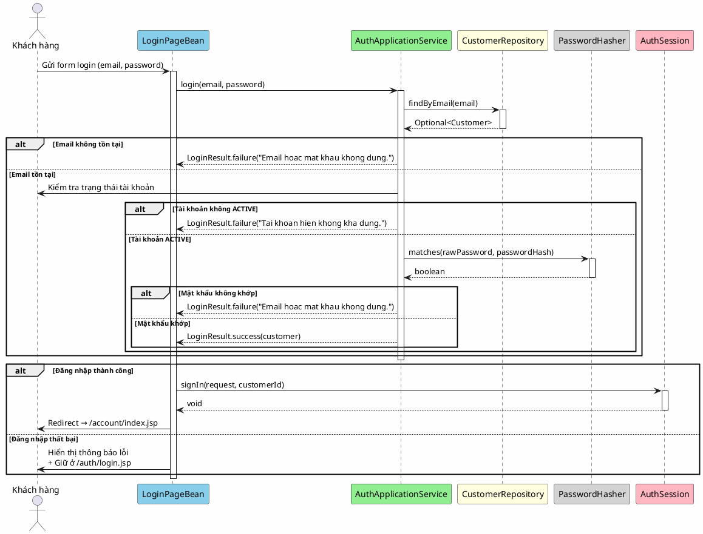

# 1. Đăng nhập

## Mô tả

Người dùng nhập email và mật khẩu để xác thực danh tính với hệ thống. Nếu thông tin hợp lệ và tài khoản đang ở trạng thái hoạt động, hệ thống sẽ tạo phiên đăng nhập và chuyển hướng người dùng đến trang chủ tài khoản. Nếu thông tin sai hoặc tài khoản bị khóa, hệ thống sẽ hiển thị thông báo lỗi tương ứng và giữ người dùng ở trang đăng nhập.

## Bảng mô tả use case

| Thuộc tính        | Nội dung                                                                          |
|-------------------|-----------------------------------------------------------------------------------|
| Mã                | UC-01                                                                             |
| Tên               | Đăng nhập                                                                         |
| Tác nhân         | Khách hàng (Customer)                                                             |
| Mô tả            | Khách hàng xác thực danh tính bằng email và mật khẩu để truy cập tài khoản cá nhân |
| Điều kiện tiên   | Người dùng chưa đăng nhập (chưa có session hợp lệ)                               |
| Kết quả           | Người dùng đăng nhập thành công và được chuyển đến trang chủ tài khoản            |

## Sequence Diagram

<!-- docs/images/usecase/uc-01.svg -->

## Exception Flows

| Exception                                | Thông báo cho người dùng                   | Hành vi hệ thống                |
|------------------------------------------|---------------------------------------------|-----------------------------------|
| Email không tồn tại trong hệ thống      | "Email hoac mat khau khong dung."          | Giữ ở trang login, hiển thị lỗi |
| Mật khẩu không đúng                     | "Email hoac mat khau khong dung."          | Giữ ở trang login, hiển thị lỗi |
| Tài khoản không ở trạng thái ACTIVE     | "Tai khoan hien khong kha dung."           | Giữ ở trang login, hiển thị lỗi |
| Lỗi hệ thống (RuntimeException)        | "Dang nhap that bai. Vui long thu lai sau." | Giữ ở trang login, hiển thị lỗi |
| Email không hợp lệ (IllegalArgumentException) | Thông báo lỗi validation từ Email value object | Giữ ở trang login, hiển thị lỗi |
