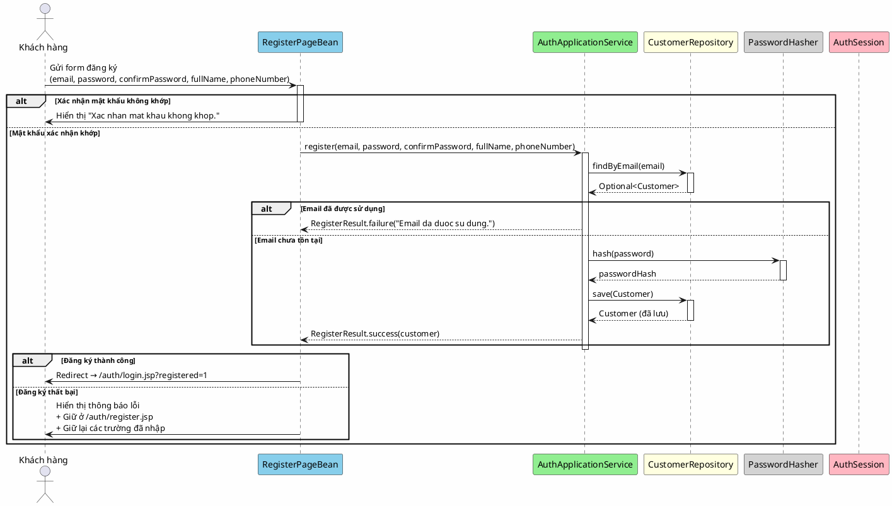

# 2. Đăng ký

## Mô tả

Người dùng điền đầy đủ thông tin đăng ký gồm email, mật khẩu (kèm xác nhận), họ tên và số điện thoại để tạo tài khoản khách hàng mới. Hệ thống kiểm tra email chưa được sử dụng và mật khẩu xác nhận khớp với mật khẩu gốc. Nếu hợp lệ, tài khoản được tạo ở trạng thái ACTIVE và người dùng được chuyển hướng đến trang đăng nhập kèm thông báo thành công.

## Bảng mô tả use case

| Thuộc tính        | Nội dung                                                                          |
|-------------------|-----------------------------------------------------------------------------------|
| Mã                | UC-02                                                                             |
| Tên               | Đăng ký                                                                           |
| Tác nhân         | Khách hàng (Customer)                                                             |
| Mô tả            | Khách hàng cung cấp thông tin cá nhân để tạo tài khoản mới trong hệ thống        |
| Điều kiện tiên   | Người dùng chưa đăng nhập (chưa có session hợp lệ)                              |
| Kết quả           | Tài khoản mới được tạo, người dùng được chuyển đến trang đăng nhập                |

## Sequence Diagram

<!-- docs/images/usecase/uc-02.svg -->

## Exception Flows

| Exception                                | Thông báo cho người dùng                   | Hành vi hệ thống                |
|------------------------------------------|---------------------------------------------|-----------------------------------|
| Mật khẩu xác nhận không khớp             | "Xac nhan mat khau khong khop."            | Giữ ở trang đăng ký, hiển thị lỗi |
| Email đã được sử dụng                  | "Email da duoc su dung."                   | Giữ ở trang đăng ký, hiển thị lỗi |
| Email không hợp lệ (IllegalArgumentException) | Thông báo lỗi validation từ Email value object | Giữ ở trang đăng ký, hiển thị lỗi |
| Lỗi hệ thống (RuntimeException)        | "Dang ky that bai. Vui long thu lai sau." | Giữ ở trang đăng ký, hiển thị lỗi |
