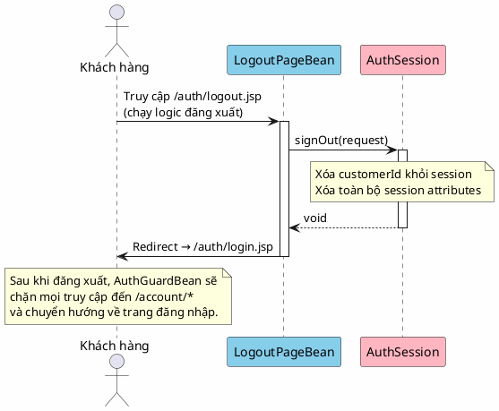

# 3. Đăng xuất

## Mô tả

Người dùng đã đăng nhập chọn chức năng đăng xuất để kết thúc phiên làm việc hiện tại. Hệ thống hủy session, xóa toàn bộ thông tin tài khoản khỏi ngữ cảnh yêu cầu, rồi chuyển hướng người dùng đến trang đăng nhập. Người dùng sau khi đăng xuất sẽ không thể truy cập các trang tài khoản cá nhân nếu không đăng nhập lại.

## Bảng mô tả use case

| Thuộc tính        | Nội dung                                                          |
|-------------------|-------------------------------------------------------------------|
| Mã                | UC-03                                                             |
| Tên               | Đăng xuất                                                         |
| Tác nhân         | Khách hàng (Customer)                                             |
| Mô tả            | Khách hàng kết thúc phiên đăng nhập và thoát khỏi tài khoản      |
| Điều kiện tiên   | Người dùng đã đăng nhập (có session hợp lệ)                     |
| Kết quả           | Session bị hủy, người dùng được chuyển đến trang đăng nhập      |

## Sequence Diagram

<!-- docs/images/usecase/uc-03.svg -->

## Exception Flows

| Exception                    | Thông báo cho người dùng        | Hành vi hệ thống              |
|------------------------------|----------------------------------|-------------------------------|
| Không có session để hủy     | Không hiển thị gì               | Chuyển thẳng đến trang login  |
| Lỗi khi hủy session         | Không hiển thị gì               | Chuyển đến trang login anyway |