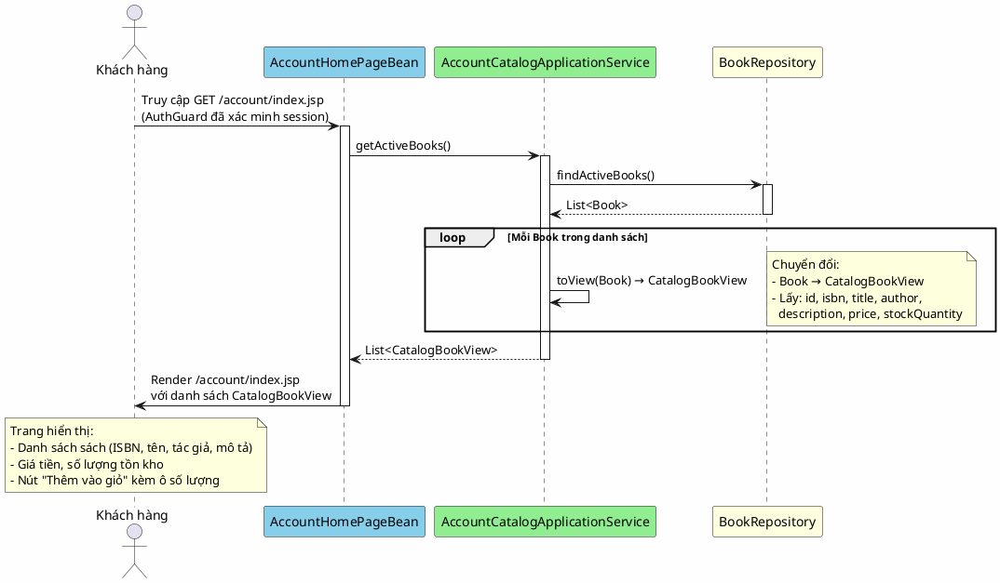

# 4. Xem danh mục sách

## Mô tả

Khách hàng đã đăng nhập truy cập trang chủ tài khoản để xem toàn bộ danh mục sách đang được bày bán. Hệ thống truy vấn các sách có trạng thái hoạt động từ cơ sở dữ liệu, chuyển đổi thành view object và trả về trang hiển thị danh sách kèm thông tin giá, tồn kho và các nút hành động. Mỗi cuốn sách hiển thị đều sẵn sàng để thêm vào giỏ hàng.

## Bảng mô tả use case

| Thuộc tính        | Nội dung                                                                          |
|-------------------|-----------------------------------------------------------------------------------|
| Mã                | UC-04                                                                             |
| Tên               | Xem danh mục sách                                                                 |
| Tác nhân         | Khách hàng (Customer)                                                             |
| Mô tả            | Khách hàng xem danh sách các sách đang được bày bán kèm thông tin chi tiết         |
| Điều kiện tiên   | Khách hàng đã đăng nhập (có session hợp lệ, đã qua AuthGuard)                    |
| Kết quả           | Trang hiển thị danh sách sách hoạt động với đầy đủ thông tin, sẵn sàng thêm giỏ   |

## Sequence Diagram

<!-- docs/images/usecase/uc-04.svg -->

## Exception Flows

| Exception                                  | Thông báo cho người dùng          | Hành vi hệ thống            |
|--------------------------------------------|-----------------------------------|------------------------------|
| Không có sách hoạt động nào               | Trang trống (empty state)         | Hiển thị trang không có sản phẩm |
| Lỗi khi truy vấn cơ sở dữ liệu          | "Đã xảy ra lỗi khi tải danh mục." | Hiển thị thông báo lỗi chung |