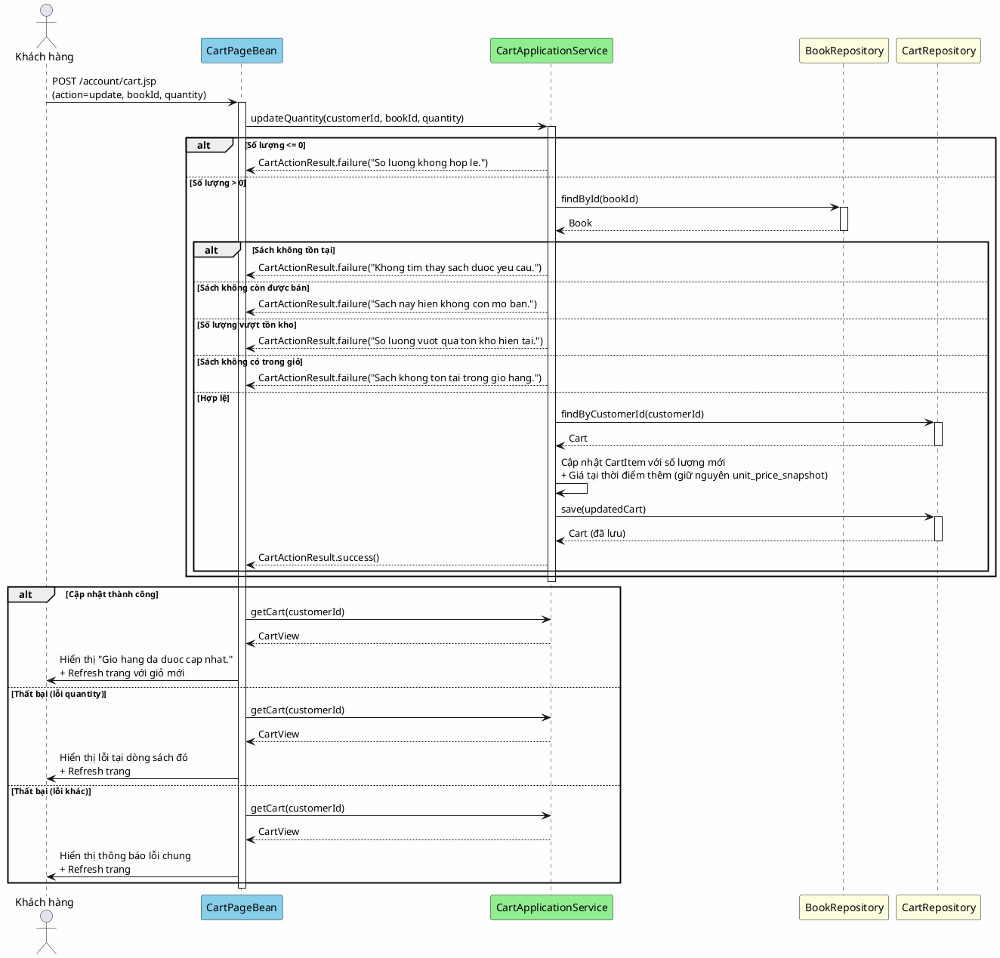

# 7. Cập nhật số lượng

## Mô tả

Khách hàng đang xem giỏ hàng thay đổi số lượng của một cuốn sách cụ thể. Hệ thống kiểm tra sách vẫn còn được bán, số lượng hợp lệ và không vượt quá tồn kho hiện tại. Giỏ hàng được cập nhật với số lượng mới và trang làm mới để hiển thị kết quả. Nếu số lượng mới bằng 0, hệ thống sẽ xóa dòng sách đó khỏi giỏ.

## Bảng mô tả use case

| Thuộc tính        | Nội dung                                                                    |
|-------------------|-----------------------------------------------------------------------------|
| Mã                | UC-07                                                                       |
| Tên               | Cập nhật số lượng                                                           |
| Tác nhân         | Khách hàng (Customer)                                                       |
| Mô tả            | Khách hàng thay đổi số lượng của một cuốn sách trong giỏ hàng               |
| Điều kiện tiên   | Khách hàng đã đăng nhập, đang ở trang giỏ hàng                              |
| Kết quả           | Số lượng sách được cập nhật, trang giỏ hàng làm mới hiển thị kết quả      |

## Sequence Diagram

<!-- docs/images/usecase/uc-07.svg -->

## Exception Flows

| Exception                                | Thông báo cho người dùng                        | Hành vi hệ thống                     |
|------------------------------------------|-------------------------------------------------|--------------------------------------|
| Số lượng <= 0 hoặc không phải số        | "So luong khong hop le."                   | Hiển thị lỗi tại trường số lượng của dòng sách |
| Sách không tồn tại                       | "Khong tim thay sach duoc yeu cau."           | Hiển thị lỗi ở đầu trang           |
| Sách không còn được bán                  | "Sach nay hien khong con mo ban."             | Hiển thị lỗi ở đầu trang           |
| Sách không có trong giỏ hàng            | "Sach khong ton tai trong gio hang."          | Hiển thị lỗi ở đầu trang           |
| Số lượng vượt tồn kho                    | "So luong vuot qua ton kho hien tai."        | Hiển thị lỗi tại trường số lượng   |

## Chi tiết giá giỏ hàng

Khi cập nhật số lượng, **giá sách (unit_price_snapshot) không thay đổi** — nó được giữ nguyên từ thời điểm sách được thêm vào giỏ. Điều này đảm bảo giá hiển thị trong giỏ hàng luôn nhất quán với thời điểm người dùng thêm sản phẩm vào.