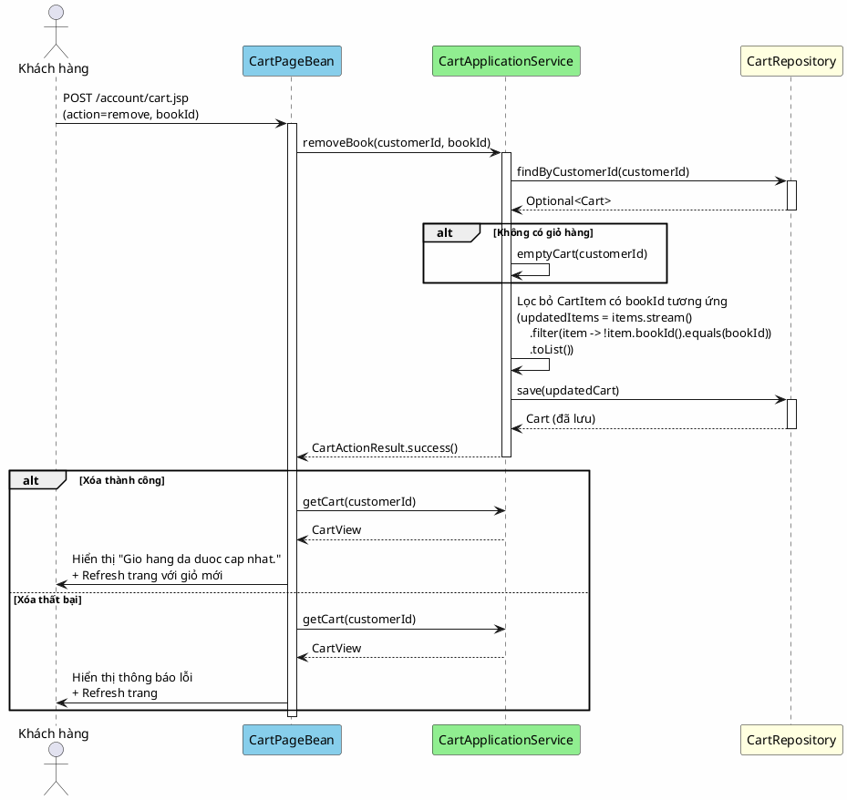

# 8. Xóa sách khỏi giỏ

## Mô tả

Khách hàng đang xem giỏ hàng chọn xóa một cuốn sách khỏi giỏ. Hệ thống tìm giỏ hàng của khách hàng, lọc bỏ dòng có `bookId` tương ứng, rồi lưu lại giỏ hàng đã cập nhật. Trang làm mới để hiển thị kết quả — dòng sách đã chọn không còn xuất hiện trong giỏ.

## Bảng mô tả use case

| Thuộc tính        | Nội dung                                                                    |
|-------------------|-----------------------------------------------------------------------------|
| Mã                | UC-08                                                                       |
| Tên               | Xóa sách khỏi giỏ                                                           |
| Tác nhân         | Khách hàng (Customer)                                                       |
| Mô tả            | Khách hàng xóa một cuốn sách ra khỏi giỏ hàng cá nhân                      |
| Điều kiện tiên   | Khách hàng đã đăng nhập, đang ở trang giỏ hàng                              |
| Kết quả           | Sách được xóa khỏi giỏ hàng, trang làm mới hiển thị kết quả                |

## Sequence Diagram

<!-- docs/images/usecase/uc-08.svg -->

## Exception Flows

| Exception                                  | Thông báo cho người dùng              | Hành vi hệ thống              |
|--------------------------------------------|---------------------------------------|-------------------------------|
| bookId không hợp lệ (không phải số)        | "Ma sach khong hop le."             | Hiển thị lỗi ở đầu trang     |
| Sách không có trong giỏ hàng               | Không hiển thị lỗi                 | Xóa thành công (no-op hợp lệ) |
| Giỏ hàng không tồn tại                     | Không hiển thị lỗi                 | Tạo giỏ rỗng, lưu (no-op)    |

## Chi tiết hành vi no-op

Nếu người dùng gửi yêu cầu xóa một cuốn sách không tồn tại trong giỏ, hệ thống vẫn coi đây là hành động **thành công** — vì kết quả cuối cùng (sách không còn trong giỏ) đúng như mong đợi. Không có thông báo lỗi hiển thị cho trường hợp này.