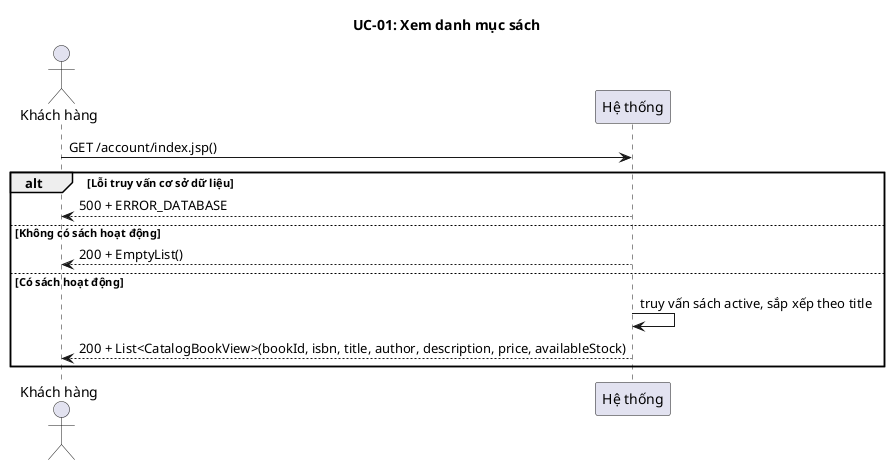
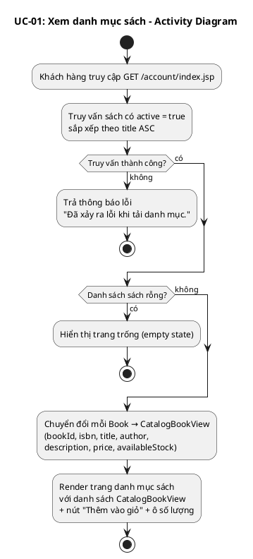
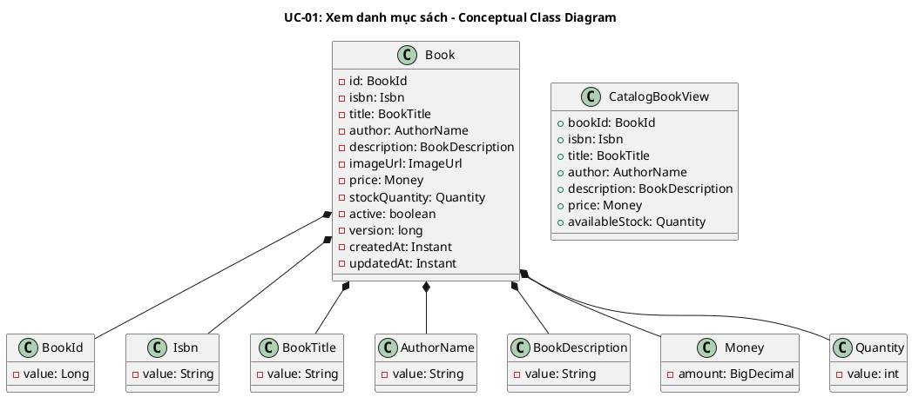
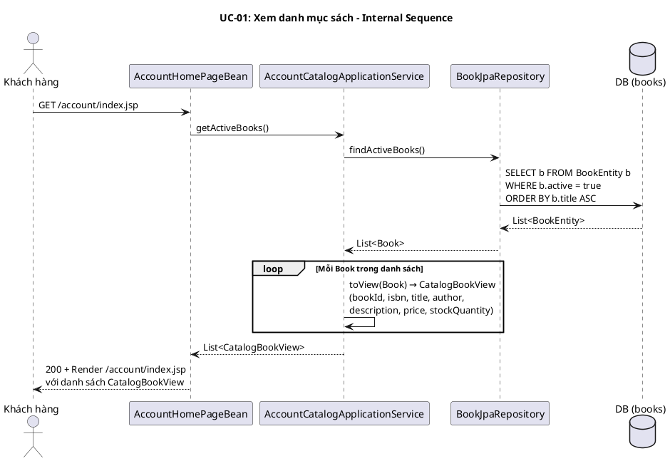

# UC-01: Xem danh mục sách

## 1. Mô tả use case

| Mục                            | Nội dung                                                                                                                                                                                                                                                                                                                                                                                                               |
| ------------------------------ | ---------------------------------------------------------------------------------------------------------------------------------------------------------------------------------------------------------------------------------------------------------------------------------------------------------------------------------------------------------------------------------------------------------------------- |
| Phụ thuộc                      | Không                                                                                                                                                                                                                                                                                                                                                                                                                  |
| Mục đích                       | Khách hàng cần xem toàn bộ sách đang bày bán để lựa chọn sản phẩm. PM giúp truy vấn và hiển thị danh mục sách hoạt động kèm thông tin giá, tồn kho, sẵn sàng thêm vào giỏ hàng.                                                                                                                                                                                                                                        |
| Mô tả                          | Khách hàng truy cập trang chủ tài khoản để xem danh sách các sách đang được bày bán cùng thông tin chi tiết (ISBN, tên, tác giả, mô tả, giá, tồn kho).                                                                                                                                                                                                                                                                 |
| Actor chính                    | Khách hàng (Customer)                                                                                                                                                                                                                                                                                                                                                                                                  |
| Actor liên quan                | Không                                                                                                                                                                                                                                                                                                                                                                                                                  |
| Tiền điều kiện                 | Khách hàng đã truy cập vào hệ thống (có session hợp lệ).                                                                                                                                                                                                                                                                                                                                                               |
| Dãy lệnh thực hiện bình thường | 1. Khách hàng truy cập trang chủ tài khoản (GET /account/index.jsp).   2. Hệ thống truy vấn danh sách sách có trạng thái `active = true`, sắp xếp theo `title` tăng dần.   3. Hệ thống chuyển đổi mỗi `Book` thành `CatalogBookView` (bookId, isbn, title, author, description, price, availableStock).   4. Hệ thống trả về trang hiển thị danh sách sách kèm nút "Thêm vào giỏ" và ô số lượng cho mỗi cuốn. |
| Hậu điều kiện (thành công)     | Trang hiển thị danh sách sách hoạt động với đầy đủ thông tin. Mỗi cuốn sách có nút thêm vào giỏ hàng sẵn sàng sử dụng.                                                                                                                                                                                                                                                                                                 |
| Hậu điều kiện (thất bại)       | Không có thay đổi trạng thái hệ thống. Trang hiển thị thông báo lỗi chung hoặc trạng thái trống (empty state) nếu không có sách nào.                                                                                                                                                                                                                                                                                   |
| Xử lý ngoại lệ                 | Không có sách hoạt động → Hiển thị trang trống (empty state)   Lỗi truy vấn cơ sở dữ liệu → Hiển thị thông báo "Đã xảy ra lỗi khi tải danh mục."                                                                                                                                                                                                                                                                    |

## 2. Lược đồ tuần tự

<!-- Lược đồ cấp 1: Actor ↔ PM (hệ thống là hộp đen).
     Mọi thông điệp đi đến PM PHẢI có tham số dữ liệu để định nghĩa chức năng cho PM.
     Lược đồ cấp 2 (nội bộ PM) nằm ở mục 6. -->

## 3. Lược đồ hoạt động

<!-- Dùng để đối chiếu với lược đồ tuần tự (mục 2), kiểm tra độ phủ kịch bản
     và xác định thêm luồng ngoại lệ nếu thiếu. -->

<!-- UC này không có thay đổi trạng thái → bỏ mục 4 (Lược đồ trạng thái) -->

## 5. Lược đồ lớp ý niệm

<!-- Các domain entity, value object, DTO tham gia vào use case.
     Thuộc tính và phương thức ở mức ý niệm (conceptual), lấy từ thực tế.
     Tên lớp phải nhất quán với các lược đồ khác trong cùng UC. -->

## 6. Phân rã thành phần PM

<!-- Xem PM là một hệ thống. Phân rã các thành phần xử lý UC này
     theo kiến trúc Clean Architecture + DDD:
     Controller (lớp biên) → UseCase (lớp xử lý) → Repository (lớp thực thể) → DB
     Mô tả nhiệm vụ, API, inputs/outputs cho từng thành phần. -->

### 6.1 Controller: `AccountHomePageBean`

- **Nhiệm vụ**: Nhận HTTP GET request từ khách hàng, ủy thác cho UseCase lấy
  danh sách sách, trả về model để render trang.
- **Endpoint**: `GET /account/index.jsp`
- **Input**: Không có tham số đầu vào (chỉ cần session hợp lệ).
- **Output thành công**: `200` +
  `AccountHomePageResult(RENDER, AccountHomePageModel)` — model chứa
  `List<CatalogBookView>`.
- **Output lỗi**: `500` + Hiển thị thông báo lỗi chung trên trang.

### 6.2 UseCase: `AccountCatalogApplicationService`

- **Nhiệm vụ**: Truy vấn danh sách sách hoạt động và chuyển đổi thành view
  object.
- **Input**: Không có tham số.
- **Output**: `List<CatalogBookView>`
- **Gọi đến**:
    - `BookRepository.findActiveBooks()` — lấy danh sách sách có
      `active = true`, sắp xếp theo `title` ASC.
- **Phát sinh sự kiện**: Không.

### 6.3 Repository: `BookRepository` (impl: `BookJpaRepository`)

- **Nhiệm vụ**: Truy xuất domain entity `Book` từ cơ sở dữ liệu.
- **Phương thức liên quan đến UC**:
    - `findActiveBooks(): List<Book>` — truy vấn
      `SELECT b FROM BookEntity b WHERE b.active = true ORDER BY b.title ASC`,
      map sang domain `Book` qua `BookEntityMapper.toDomain()`.
- **Table**: `books`

### 6.5 Lược đồ tuần tự nội bộ PM

<!-- Lược đồ cấp 2: phân rã tương tác nội bộ hệ thống.
     Diễn tả cách các thành phần PM phối hợp xử lý UC. -->

## 7. Bảng tham chiếu dò vết

<!-- Dùng để dò vết, đối chiếu, sửa và kiểm thử.
     Mỗi dòng map từ UC → Controller endpoint → UseCase → Repository method → DB table.
     Giúp đảm bảo không có chức năng bị bỏ sót khi hiện thực. -->

| Use Case | Controller          | Endpoint                 | UseCase                                           | Repository                          | Table |
| -------- | ------------------- | ------------------------ | ------------------------------------------------- | ----------------------------------- | ----- |
| UC-01    | AccountHomePageBean | `GET /account/index.jsp` | AccountCatalogApplicationService.getActiveBooks() | BookJpaRepository.findActiveBooks() | books |

## 8. Tiêu chí kiểm thử

<!-- Tiêu chí kiểm thử ở mức phân tích (mục III trong spec).
     Các tiêu chí mức thiết kế và hiện thực sẽ bổ sung sau. -->

| Tiêu chí             | Phép thử                                                                   | Kết quả mong đợi                                                            | Ghi chú                                                  |
| -------------------- | -------------------------------------------------------------------------- | --------------------------------------------------------------------------- | -------------------------------------------------------- |
| Toàn diện (coverage) | Đối chiếu Activity Diagram ↔ Sequence Diagram: mọi luồng đều được thể hiện | Không bỏ sót luồng chính (có sách) lẫn ngoại lệ (DB lỗi, danh sách rỗng)    | Rà soát chéo giữa mục 2 và mục 3                         |
| Nhất quán            | Rà soát tên lớp, API giữa các lược đồ trong cùng UC                        | CatalogBookView, BookRepository, AccountCatalogApplicationService nhất quán | Đặc biệt kiểm tra tên trong mục 5–6                      |
| Truy vết             | Đối chiếu bảng tham chiếu (mục 7) với lược đồ tuần tự nội bộ (mục 6.5)     | Mọi tương tác trong sequence đều có entry trong bảng                        | Kiểm tra không thiếu endpoint/method                     |
| Chỉ sách active      | Gọi getActiveBooks() khi DB có cả sách active và inactive                  | Chỉ trả về sách có `active = true`                                          | Test: AccountCatalogApplicationServiceTest               |
| Danh sách rỗng       | Gọi getActiveBooks() khi không có sách active nào                          | Trả về danh sách rỗng, trang hiển thị empty state                           | Test: getActiveBooksReturnsEmptyListWhenNoBooksAreActive |
| Sách hết hàng        | Gọi getActiveBooks() khi có sách active nhưng stock = 0                    | Sách vẫn xuất hiện trong danh sách (active = true, stock = 0 vẫn hiển thị)  | Test: getActiveBooksIncludesOutOfStockBooks              |
