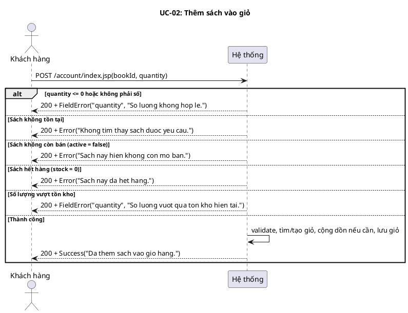
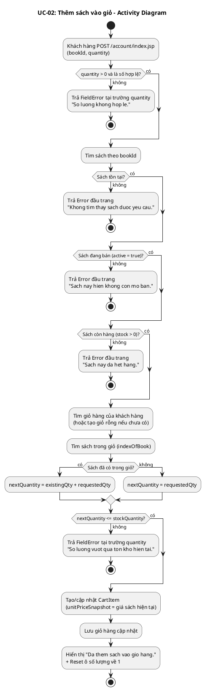
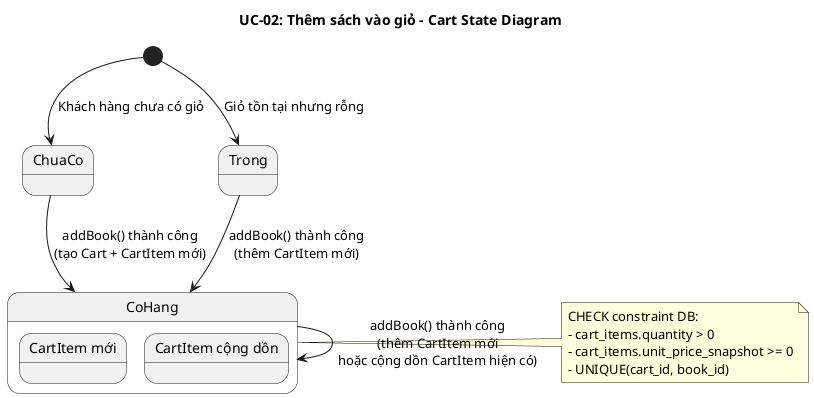
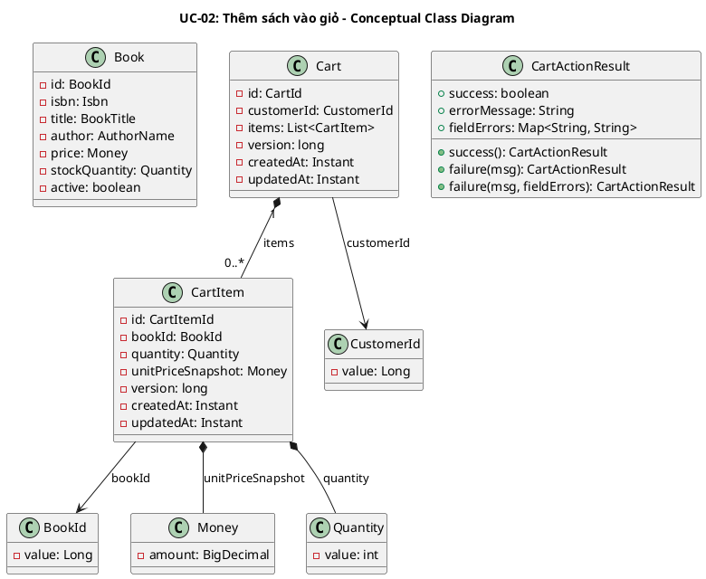
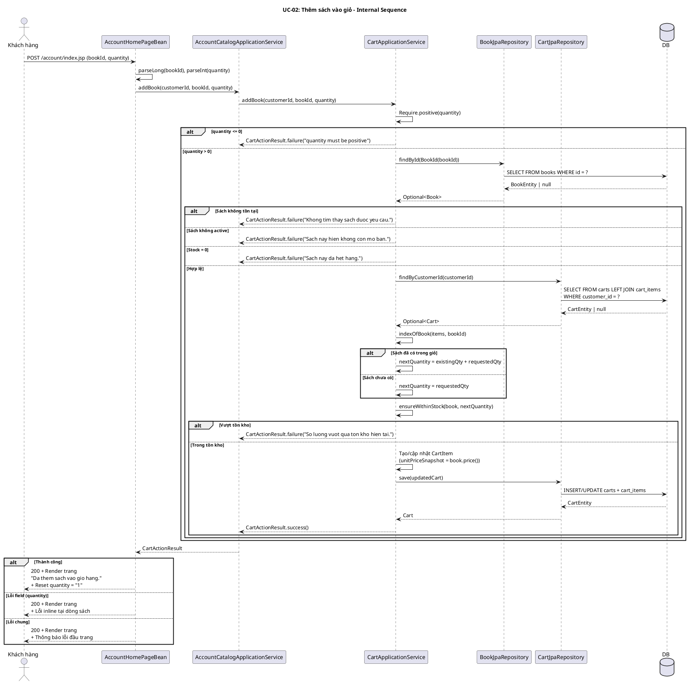

# UC-02: Thêm sách vào giỏ

## 1. Mô tả use case

| Mục                            | Nội dung                                                                                                                                                                                                                                                                                                                                                                                                                                                                                                                                                                                                                                                                                                          |
| ------------------------------ | ----------------------------------------------------------------------------------------------------------------------------------------------------------------------------------------------------------------------------------------------------------------------------------------------------------------------------------------------------------------------------------------------------------------------------------------------------------------------------------------------------------------------------------------------------------------------------------------------------------------------------------------------------------------------------------------------------------------- |
| Phụ thuộc                      | UC-01 (Xem danh mục sách) — khách hàng phải đang ở trang danh mục để thực hiện thêm sách.                                                                                                                                                                                                                                                                                                                                                                                                                                                                                                                                                                                                                         |
| Mục đích                       | Khách hàng muốn chọn mua một cuốn sách với số lượng mong muốn. PM giúp kiểm tra tính hợp lệ (sách tồn tại, đang bán, đủ tồn kho), xử lý cộng dồn nếu sách đã có trong giỏ, và lưu giỏ hàng cập nhật.                                                                                                                                                                                                                                                                                                                                                                                                                                                                                                              |
| Mô tả                          | Khách hàng chọn một cuốn sách cùng số lượng và nhấn nút thêm vào giỏ. Hệ thống validate, cộng dồn nếu cần, và phản hồi ngay trên trang danh mục.                                                                                                                                                                                                                                                                                                                                                                                                                                                                                                                                                                  |
| Actor chính                    | Khách hàng (Customer)                                                                                                                                                                                                                                                                                                                                                                                                                                                                                                                                                                                                                                                                                             |
| Actor liên quan                | Không                                                                                                                                                                                                                                                                                                                                                                                                                                                                                                                                                                                                                                                                                                             |
| Tiền điều kiện                 | Khách hàng đã truy cập vào hệ thống (có session hợp lệ), đang ở trang danh mục sách.                                                                                                                                                                                                                                                                                                                                                                                                                                                                                                                                                                                                                              |
| Dãy lệnh thực hiện bình thường | 1. Khách hàng nhập số lượng và nhấn "Thêm vào giỏ" cho một cuốn sách (POST /account/index.jsp với bookId, quantity).   2. Hệ thống kiểm tra quantity > 0.   3. Hệ thống tìm sách theo bookId, kiểm tra active = true và stockQuantity > 0.   4. Hệ thống tìm giỏ hàng của khách hàng (hoặc tạo giỏ rỗng nếu chưa có).   5. Nếu sách đã có trong giỏ: cộng dồn số lượng (existingQty + requestedQty), kiểm tra tổng không vượt tồn kho.   6. Nếu sách chưa có: tạo CartItem mới với unitPriceSnapshot = giá sách hiện tại, kiểm tra quantity không vượt tồn kho.   7. Hệ thống lưu giỏ hàng cập nhật.   8. Hệ thống hiển thị thông báo "Da them sach vao gio hang." và reset ô số lượng về 1. |
| Hậu điều kiện (thành công)     | CartItem mới được tạo hoặc CartItem hiện có được cộng dồn số lượng. Giỏ hàng đã lưu trong DB. unitPriceSnapshot được snapshot tại thời điểm thêm.                                                                                                                                                                                                                                                                                                                                                                                                                                                                                                                                                                 |
| Hậu điều kiện (thất bại)       | Giỏ hàng không thay đổi. Không có CartItem nào được tạo hoặc cập nhật. Trang hiển thị lỗi tương ứng (inline hoặc đầu trang).                                                                                                                                                                                                                                                                                                                                                                                                                                                                                                                                                                                      |
| Xử lý ngoại lệ                 | quantity <= 0 hoặc không phải số → "So luong khong hop le." (lỗi tại trường quantity)   Sách không tồn tại → "Khong tim thay sach duoc yeu cau." (lỗi đầu trang)   Sách không còn bán (active = false) → "Sach nay hien khong con mo ban." (lỗi đầu trang)   Sách hết hàng (stock = 0) → "Sach nay da het hang." (lỗi đầu trang)   Số lượng vượt tồn kho → "So luong vuot qua ton kho hien tai." (lỗi tại trường quantity)                                                                                                                                                                                                                                                                            |

## 2. Lược đồ tuần tự

<!-- Lược đồ cấp 1: Actor ↔ PM (hệ thống là hộp đen).
     Mọi thông điệp đi đến PM PHẢI có tham số dữ liệu để định nghĩa chức năng cho PM.
     Lược đồ cấp 2 (nội bộ PM) nằm ở mục 6. -->

## 3. Lược đồ hoạt động

<!-- Dùng để đối chiếu với lược đồ tuần tự (mục 2), kiểm tra độ phủ kịch bản
     và xác định thêm luồng ngoại lệ nếu thiếu. -->

## 4. Lược đồ trạng thái

<!-- Ràng buộc chuyển trạng thái sẽ thành CHECK constraint trong DB
     và business rule trong lớp UseCase. -->

## 5. Lược đồ lớp ý niệm

<!-- Các domain entity, value object, DTO tham gia vào use case.
     Thuộc tính và phương thức ở mức ý niệm (conceptual), lấy từ thực tế.
     Tên lớp phải nhất quán với các lược đồ khác trong cùng UC. -->

## 6. Phân rã thành phần PM

<!-- Xem PM là một hệ thống. Phân rã các thành phần xử lý UC này
     theo kiến trúc Clean Architecture + DDD:
     Controller (lớp biên) → UseCase (lớp xử lý) → Repository (lớp thực thể) → DB
     Mô tả nhiệm vụ, API, inputs/outputs cho từng thành phần. -->

### 6.1 Controller: `AccountHomePageBean`

- **Nhiệm vụ**: Nhận HTTP POST request từ khách hàng (bookId, quantity), parse
  tham số, ủy thác cho UseCase, xử lý kết quả (thành công/lỗi inline/lỗi chung).
- **Endpoint**: `POST /account/index.jsp`
- **Input**: `AccountHomePageRequest` —
  `{ method: "POST", bookId: String, quantity: String }`
- **Output thành công**: `200` +
  `AccountHomePageResult(RENDER, AccountHomePageModel)` — model chứa infoMessage
  "Da them sach vao gio hang.", danh sách CatalogBookView, reset quantity về
  "1".
- **Output lỗi**: `200` + `AccountHomePageResult(RENDER, AccountHomePageModel)`
  — model chứa errorMessage hoặc lineQuantityError tại dòng sách tương ứng.

### 6.2 UseCase: `AccountCatalogApplicationService` (delegate) + `CartApplicationService`

- **Nhiệm vụ**: AccountCatalogApplicationService nhận request và delegate sang
  CartApplicationService.addBook() để orchestrate nghiệp vụ thêm sách vào giỏ.
- **Input**: `CustomerId`, `bookIdValue: long`, `quantityValue: int`
- **Output**: `CartActionResult`
- **Gọi đến**:
    - `Require.positive(quantityValue)` — validate quantity > 0
    - `BookRepository.findById(bookId)` — tìm sách, kiểm tra tồn tại + active +
      stock > 0
    - `CartRepository.findByCustomerId(customerId)` — tìm giỏ hàng (hoặc tạo giỏ

        rỗng)

    - `indexOfBook(items, bookId)` — tìm sách đã có trong giỏ chưa
    - `ensureWithinStock(book, nextQuantity)` — kiểm tra tổng quantity không
      vượt tồn kho
    - `CartRepository.save(updatedCart)` — lưu giỏ hàng cập nhật

- **Phát sinh sự kiện**: Không.

### 6.3 Repository: `BookRepository` + `CartRepository`

**BookRepository** (impl: `BookJpaRepository`):

- **Nhiệm vụ**: Truy xuất domain entity `Book`.
- **Phương thức liên quan đến UC**:
    - `findById(BookId): Optional<Book>` — tìm sách theo ID để kiểm tra tồn tại,
      active, stock.
- **Table**: `books`

**CartRepository** (impl: `CartJpaRepository`):

- **Nhiệm vụ**: Truy xuất/lưu trữ domain entity `Cart` kèm `CartItem`.
- **Phương thức liên quan đến UC**:
    - `findByCustomerId(CustomerId): Optional<Cart>` — tìm giỏ hàng của khách
      hàng (LEFT JOIN FETCH items).
    - `save(Cart): Cart` — lưu giỏ hàng (persist nếu mới, merge nếu đã tồn tại).
- **Tables**: `carts`, `cart_items`

### 6.5 Lược đồ tuần tự nội bộ PM

<!-- Lược đồ cấp 2: phân rã tương tác nội bộ hệ thống.
     Diễn tả cách các thành phần PM phối hợp xử lý UC. -->

## 7. Bảng tham chiếu dò vết

<!-- Dùng để dò vết, đối chiếu, sửa và kiểm thử.
     Mỗi dòng map từ UC → Controller endpoint → UseCase → Repository method → DB table.
     Giúp đảm bảo không có chức năng bị bỏ sót khi hiện thực. -->

| Use Case | Controller          | Endpoint                  | UseCase                                    | Repository                           | Table             |
| -------- | ------------------- | ------------------------- | ------------------------------------------ | ------------------------------------ | ----------------- |
| UC-02    | AccountHomePageBean | `POST /account/index.jsp` | AccountCatalogApplicationService.addBook() | —                                    | —                 |
|          |                     |                           | CartApplicationService.addBook()           | BookJpaRepository.findById()         | books             |
|          |                     |                           |                                            | CartJpaRepository.findByCustomerId() | carts, cart_items |
|          |                     |                           |                                            | CartJpaRepository.save()             | carts, cart_items |

## 8. Tiêu chí kiểm thử

<!-- Tiêu chí kiểm thử ở mức phân tích (mục III trong spec).
     Các tiêu chí mức thiết kế và hiện thực sẽ bổ sung sau. -->

| Tiêu chí              | Phép thử                                                                   | Kết quả mong đợi                                                   | Ghi chú                                                     |
| --------------------- | -------------------------------------------------------------------------- | ------------------------------------------------------------------ | ----------------------------------------------------------- |
| Toàn diện (coverage)  | Đối chiếu Activity Diagram ↔ Sequence Diagram: mọi luồng đều được thể hiện | Không bỏ sót luồng chính lẫn 5 ngoại lệ                            | Rà soát chéo giữa mục 2 và mục 3                            |
| Nhất quán             | Rà soát tên lớp, API giữa các lược đồ trong cùng UC                        | CartApplicationService, CartActionResult, BookRepository nhất quán | Đặc biệt kiểm tra tên trong mục 5-6                         |
| Truy vết              | Đối chiếu bảng tham chiếu (mục 7) với lược đồ tuần tự nội bộ (mục 6.5)     | Mọi tương tác trong sequence đều có entry trong bảng               | Kiểm tra không thiếu endpoint/method                        |
| Thêm mới vào giỏ rỗng | addBook() khi chưa có giỏ hàng, sách hợp lệ                                | Giỏ mới được tạo, CartItem có unitPriceSnapshot = giá hiện tại     | Test: addBookToEmptyCartCreatesCartItemWithSnapshot         |
| Cộng dồn              | addBook() khi sách đã có trong giỏ                                         | quantity = existingQty + requestedQty, không tạo dòng mới          | Test: addExistingBookIncrementsQuantityInsteadOfDuplicating |
| Từ chối vượt tồn kho  | addBook() với quantity > stock                                             | CartActionResult.failure, giỏ không thay đổi                       | Test: rejectsQuantityThatExceedsStock                       |
| Từ chối sách inactive | addBook() với sách có active = false                                       | CartActionResult.failure("Sach nay hien khong con mo ban.")        | Test: rejectsAddingInactiveBook                             |
| Từ chối sách hết hàng | addBook() với sách có stock = 0                                            | CartActionResult.failure("Sach nay da het hang.")                  | Test: rejectsAddingBookWithZeroStock                        |
| Từ chối quantity <= 0 | addBook() với quantity = 0                                                 | CartActionResult.failure("quantity must be positive")              | Test: rejectsZeroQuantityWhenAddingBook                     |
