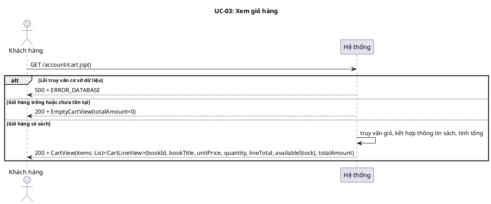
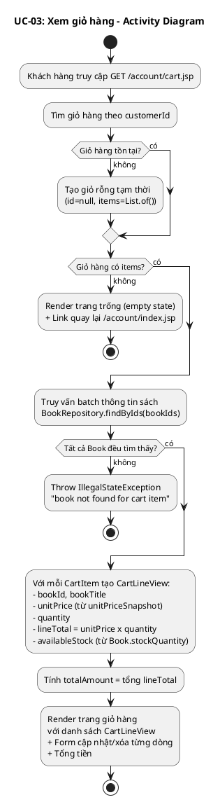
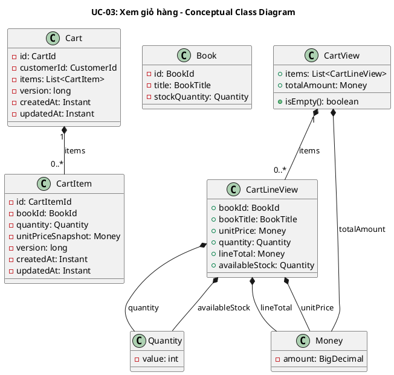
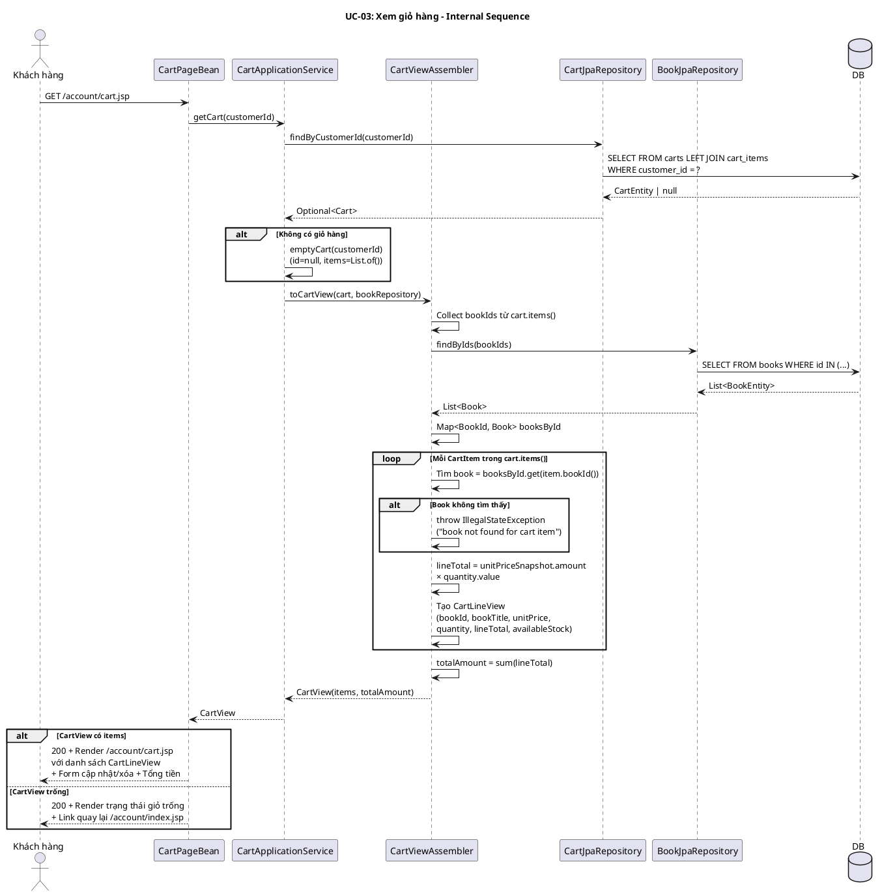

# UC-03: Xem giỏ hàng

## 1. Mô tả use case

| Mục                            | Nội dung                                                                                                                                                                                                                                                                                                                                                                                                                                                                                                                                                                                                  |
| ------------------------------ | --------------------------------------------------------------------------------------------------------------------------------------------------------------------------------------------------------------------------------------------------------------------------------------------------------------------------------------------------------------------------------------------------------------------------------------------------------------------------------------------------------------------------------------------------------------------------------------------------------- |
| Phụ thuộc                      | UC-02 (Thêm sách vào giỏ) — giỏ hàng phải có ít nhất một lần thêm sách trước đó để có nội dung hiển thị.                                                                                                                                                                                                                                                                                                                                                                                                                                                                                                  |
| Mục đích                       | Khách hàng cần xem lại các sách đã chọn mua, kiểm tra số lượng và tổng tiền trước khi quyết định thanh toán. PM giúp truy vấn giỏ hàng, kết hợp thông tin sách hiện tại, và hiển thị đầy đủ thông tin mỗi dòng.                                                                                                                                                                                                                                                                                                                                                                                           |
| Mô tả                          | Khách hàng truy cập trang giỏ hàng để xem toàn bộ sách đã thêm vào kèm thông tin: tên sách, đơn giá (snapshot), số lượng, tổng dòng, tồn kho khả dụng thời gian thực, và tổng tiền toàn giỏ.                                                                                                                                                                                                                                                                                                                                                                                                              |
| Actor chính                    | Khách hàng (Customer)                                                                                                                                                                                                                                                                                                                                                                                                                                                                                                                                                                                     |
| Actor liên quan                | Không                                                                                                                                                                                                                                                                                                                                                                                                                                                                                                                                                                                                     |
| Tiền điều kiện                 | Khách hàng đã truy cập vào hệ thống (có session hợp lệ).                                                                                                                                                                                                                                                                                                                                                                                                                                                                                                                                                  |
| Dãy lệnh thực hiện bình thường | 1. Khách hàng truy cập trang giỏ hàng (GET /account/cart.jsp).   2. Hệ thống tìm giỏ hàng theo customerId (hoặc tạo giỏ rỗng tạm thời nếu chưa có).   3. Hệ thống truy vấn batch thông tin sách cho tất cả CartItem (BookRepository.findByIds).   4. Với mỗi CartItem, hệ thống tạo CartLineView gồm: bookId, bookTitle, unitPrice (từ unitPriceSnapshot), quantity, lineTotal (unitPrice x quantity), availableStock (từ Book.stockQuantity thời gian thực).   5. Hệ thống tính totalAmount = tổng tất cả lineTotal.   6. Hệ thống trả về CartView (items + totalAmount) để render trang. |
| Hậu điều kiện (thành công)     | Trang hiển thị danh sách sách trong giỏ với đầy đủ thông tin và form cập nhật/xóa từng dòng. Hoặc hiển thị trạng thái giỏ trống kèm link quay lại danh mục.                                                                                                                                                                                                                                                                                                                                                                                                                                               |
| Hậu điều kiện (thất bại)       | Không có thay đổi trạng thái hệ thống. Trang hiển thị thông báo lỗi chung.                                                                                                                                                                                                                                                                                                                                                                                                                                                                                                                                |
| Xử lý ngoại lệ                 | Giỏ hàng trống hoặc chưa tồn tại → Hiển thị trang trống (empty state) + link quay lại /account/index.jsp   Lỗi truy vấn cơ sở dữ liệu → Hiển thị thông báo "Đã xảy ra lỗi khi tải giỏ hàng."   Book không tìm thấy cho CartItem → Throw IllegalStateException("book not found for cart item")                                                                                                                                                                                                                                                                                                       |

## 2. Lược đồ tuần tự

<!-- Lược đồ cấp 1: Actor ↔ PM (hệ thống là hộp đen).
     Mọi thông điệp đi đến PM PHẢI có tham số dữ liệu để định nghĩa chức năng cho PM.
     Lược đồ cấp 2 (nội bộ PM) nằm ở mục 6. -->

## 3. Lược đồ hoạt động

<!-- Dùng để đối chiếu với lược đồ tuần tự (mục 2), kiểm tra độ phủ kịch bản
     và xác định thêm luồng ngoại lệ nếu thiếu. -->

<!-- UC này không có thay đổi trạng thái → bỏ mục 4 (Lược đồ trạng thái) -->

## 5. Lược đồ lớp ý niệm

<!-- Các domain entity, value object, DTO tham gia vào use case.
     Thuộc tính và phương thức ở mức ý niệm (conceptual), lấy từ thực tế.
     Tên lớp phải nhất quán với các lược đồ khác trong cùng UC. -->

## 6. Phân rã thành phần PM

<!-- Xem PM là một hệ thống. Phân rã các thành phần xử lý UC này
     theo kiến trúc Clean Architecture + DDD:
     Controller (lớp biên) → UseCase (lớp xử lý) → Repository (lớp thực thể) → DB
     Mô tả nhiệm vụ, API, inputs/outputs cho từng thành phần. -->

### 6.1 Controller: `CartPageBean`

- **Nhiệm vụ**: Nhận HTTP GET request từ khách hàng, ủy thác cho UseCase lấy
  CartView, trả về model để render trang giỏ hàng.
- **Endpoint**: `GET /account/cart.jsp`
- **Input**: `CartPageRequest` —
  `{ method: "GET", infoParam: String (nullable) }`. Nếu infoParam =
  "emptyCheckout", hiển thị thông báo "Gio hang dang trong. Vui long them sach
  truoc khi thanh toan."
- **Output thành công**: `200` + `CartPageResult(RENDER, CartPageModel)` — model
  chứa CartView.
- **Output lỗi**: `200` + `CartPageResult(RENDER, CartPageModel)` — model chứa
  errorMessage.

### 6.2 UseCase: `CartApplicationService` + `CartViewAssembler`

- **Nhiệm vụ**: CartApplicationService.getCart() truy vấn giỏ hàng, sau đó ủy
  thác cho CartViewAssembler.toCartView() để kết hợp thông tin sách và tạo
  CartView.
- **Input**: `CustomerId`
- **Output**: `CartView`

- **Gọi đến**:
    - `CartRepository.findByCustomerId(customerId)` — tìm giỏ hàng (hoặc tạo giỏ
      rỗng).
    - `BookRepository.findByIds(bookIds)` — truy vấn batch thông tin sách cho
      tất cả CartItem.
- **Phát sinh sự kiện**: Không.

### 6.3 Repository: `CartRepository` + `BookRepository`

**CartRepository** (impl: `CartJpaRepository`):

- **Nhiệm vụ**: Truy xuất domain entity `Cart` kèm `CartItem`.
- **Phương thức liên quan đến UC**:
    - `findByCustomerId(CustomerId): Optional<Cart>` — tìm giỏ hàng của khách
      hàng (LEFT JOIN FETCH items).
- **Tables**: `carts`, `cart_items`

**BookRepository** (impl: `BookJpaRepository`):

- **Nhiệm vụ**: Truy xuất batch domain entity `Book` để kết hợp với CartItem.
- **Phương thức liên quan đến UC**:
    - `findByIds(Set<BookId>): List<Book>` — truy vấn batch sách theo danh sách
      ID để lấy title và stockQuantity thời gian thực.
- **Table**: `books`

### 6.5 Lược đồ tuần tự nội bộ PM

<!-- Lược đồ cấp 2: phân rã tương tác nội bộ hệ thống.
     Diễn tả cách các thành phần PM phối hợp xử lý UC. -->

## 7. Bảng tham chiếu dò vết

<!-- Dùng để dò vết, đối chiếu, sửa và kiểm thử.
     Mỗi dòng map từ UC → Controller endpoint → UseCase → Repository method → DB table.
     Giúp đảm bảo không có chức năng bị bỏ sót khi hiện thực. -->

| Use Case | Controller   | Endpoint                | UseCase                          | Repository                           | Table             |
| -------- | ------------ | ----------------------- | -------------------------------- | ------------------------------------ | ----------------- |
| UC-03    | CartPageBean | `GET /account/cart.jsp` | CartApplicationService.getCart() | CartJpaRepository.findByCustomerId() | carts, cart_items |
|          |              |                         | CartViewAssembler.toCartView()   | BookJpaRepository.findByIds()        | books             |

## 8. Tiêu chí kiểm thử

<!-- Tiêu chí kiểm thử ở mức phân tích (mục III trong spec).
     Các tiêu chí mức thiết kế và hiện thực sẽ bổ sung sau. -->

| Tiêu chí               | Phép thử                                                                        | Kết quả mong đợi                                                                  | Ghi chú                                        |
| ---------------------- | ------------------------------------------------------------------------------- | --------------------------------------------------------------------------------- | ---------------------------------------------- |
| Toàn diện (coverage)   | Đối chiếu Activity Diagram ↔ Sequence Diagram: mọi luồng đều được thể hiện      | Không bỏ sót luồng chính (có sách) lẫn ngoại lệ (giỏ trống, DB lỗi, book missing) | Rà soát chéo giữa mục 2 và mục 3               |
| Nhất quán              | Rà soát tên lớp, API giữa các lược đồ trong cùng UC                             | CartView, CartLineView, CartViewAssembler, CartApplicationService nhất quán       | Đặc biệt kiểm tra tên trong mục 5-6            |
| Truy vết               | Đối chiếu bảng tham chiếu (mục 7) với lược đồ tuần tự nội bộ (mục 6.5)          | Mọi tương tác trong sequence đều có entry trong bảng                              | Kiểm tra không thiếu endpoint/method           |
| Giỏ rỗng cho khách mới | getCart() cho khách hàng chưa có giỏ                                            | Trả CartView rỗng (isEmpty = true), totalAmount = 0.00                            | Test: getCartReturnsEmptyCartForNewCustomer    |
| Giỏ rỗng hiển thị đúng | Render khi CartView.isEmpty() = true                                            | Hiển thị empty state + link quay lại danh mục                                     | Kiểm tra UI flow                               |
| Tính tổng đúng         | getCart() khi có CartItem (book 11L, qty=2, price=12.50)                        | totalAmount = 25.00, lineTotal = 25.00                                            | Test: toCartViewCalculatesTotalsFromItems      |
| Book missing throws    | toCartView() khi CartItem có bookId không tồn tại trong BookRepository          | Throw IllegalStateException("book not found for cart item")                       | Test: toCartViewThrowsWhenBookCannotBeResolved |
| Đơn giá là snapshot    | CartLineView.unitPrice lấy từ CartItem.unitPriceSnapshot, không phải Book.price | unitPrice = giá tại thời điểm thêm (snapshot), không phải giá hiện tại            | Kiểm tra data source consistency               |
| Tồn kho thời gian thực | CartLineView.availableStock lấy từ Book.stockQuantity hiện tại                  | availableStock phản ánh tồn kho DB hiện tại, không phải snapshot                  | Kiểm tra real-time stock display               |
