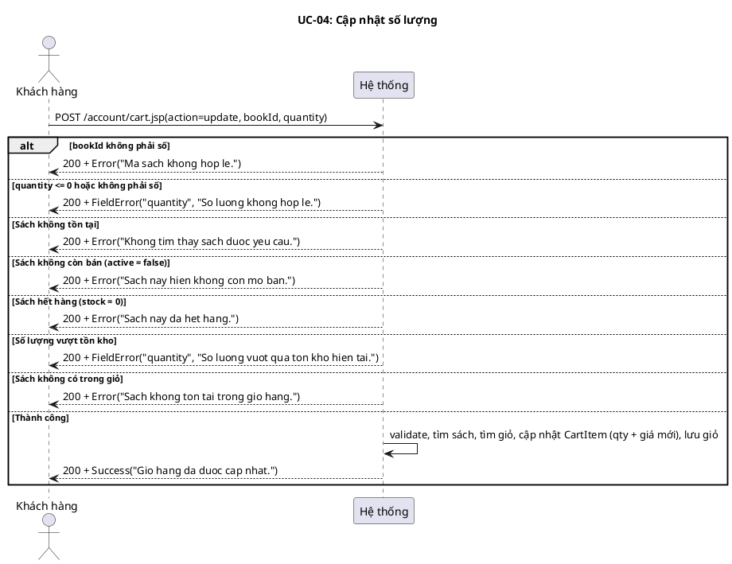
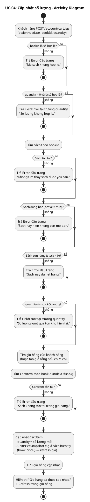
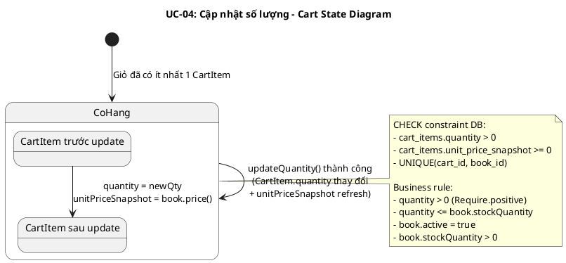
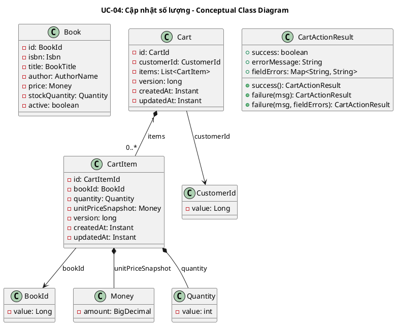
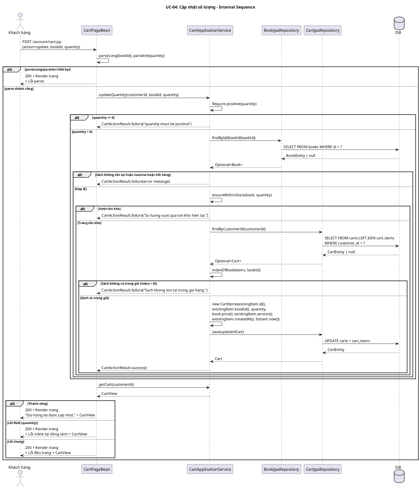

# UC-04: Cập nhật số lượng

## 1. Mô tả use case

| Mục                            | Nội dung                                                                                                                                                                                                                                                                                                                                                                                                                                                                                                                                                                                                                                        |
| ------------------------------ | ----------------------------------------------------------------------------------------------------------------------------------------------------------------------------------------------------------------------------------------------------------------------------------------------------------------------------------------------------------------------------------------------------------------------------------------------------------------------------------------------------------------------------------------------------------------------------------------------------------------------------------------------- |
| Phụ thuộc                      | UC-03 (Xem giỏ hàng) — khách hàng phải đang ở trang giỏ hàng để thực hiện cập nhật số lượng.                                                                                                                                                                                                                                                                                                                                                                                                                                                                                                                                                    |
| Mục đích                       | Khách hàng muốn thay đổi số lượng một cuốn sách đã có trong giỏ. PM giúp kiểm tra tính hợp lệ (sách tồn tại, đang bán, đủ tồn kho), cập nhật số lượng mới cùng giá hiện tại, và lưu giỏ hàng.                                                                                                                                                                                                                                                                                                                                                                                                                                                   |
| Mô tả                          | Khách hàng thay đổi số lượng của một cuốn sách trong giỏ hàng. Hệ thống kiểm tra sách vẫn còn được bán, số lượng hợp lệ (> 0) và không vượt tồn kho hiện tại, sau đó cập nhật CartItem với số lượng mới và giá sách hiện tại.                                                                                                                                                                                                                                                                                                                                                                                                                   |
| Actor chính                    | Khách hàng (Customer)                                                                                                                                                                                                                                                                                                                                                                                                                                                                                                                                                                                                                           |
| Actor liên quan                | Không                                                                                                                                                                                                                                                                                                                                                                                                                                                                                                                                                                                                                                           |
| Tiền điều kiện                 | Khách hàng đã truy cập vào hệ thống (có session hợp lệ), đang ở trang giỏ hàng, giỏ có ít nhất một sách.                                                                                                                                                                                                                                                                                                                                                                                                                                                                                                                                        |
| Dãy lệnh thực hiện bình thường | 1. Khách hàng nhập số lượng mới và nhấn nút cập nhật cho một cuốn sách (POST /account/cart.jsp với action=update, bookId, quantity).   2. Hệ thống kiểm tra quantity > 0.   3. Hệ thống tìm sách theo bookId, kiểm tra active = true và stockQuantity > 0.   4. Hệ thống kiểm tra quantity không vượt tồn kho.   5. Hệ thống tìm giỏ hàng của khách hàng, tìm CartItem theo bookId.   6. Hệ thống cập nhật CartItem với quantity mới và unitPriceSnapshot = giá sách hiện tại (refresh giá).   7. Hệ thống lưu giỏ hàng cập nhật.   8. Hệ thống hiển thị thông báo "Gio hang da duoc cap nhat." và refresh trang giỏ hàng. |
| Hậu điều kiện (thành công)     | CartItem được cập nhật với số lượng mới và giá sách hiện tại (unitPriceSnapshot refresh). Giỏ hàng đã lưu trong DB.                                                                                                                                                                                                                                                                                                                                                                                                                                                                                                                             |
| Hậu điều kiện (thất bại)       | Giỏ hàng không thay đổi. Không có CartItem nào được cập nhật. Trang hiển thị lỗi tương ứng (inline tại trường quantity hoặc lỗi chung đầu trang).                                                                                                                                                                                                                                                                                                                                                                                                                                                                                               |
| Xử lý ngoại lệ                 | quantity <= 0 hoặc không phải số → "So luong khong hop le." (lỗi inline tại trường quantity)   bookId không phải số → "Ma sach khong hop le." (lỗi đầu trang)   Sách không tồn tại → "Khong tim thay sach duoc yeu cau." (lỗi đầu trang)   Sách không còn bán (active = false) → "Sach nay hien khong con mo ban." (lỗi đầu trang)   Sách hết hàng (stock = 0) → "Sach nay da het hang." (lỗi đầu trang)   Số lượng vượt tồn kho → "So luong vuot qua ton kho hien tai." (lỗi inline tại trường quantity)   Sách không có trong giỏ hàng → "Sach khong ton tai trong gio hang." (lỗi đầu trang)                               |

## 2. Lược đồ tuần tự

<!-- Lược đồ cấp 1: Actor ↔ PM (hệ thống là hộp đen). -->

## 3. Lược đồ hoạt động

## 4. Lược đồ trạng thái

## 5. Lược đồ lớp ý niệm

## 6. Phân rã thành phần PM

### 6.1 Controller: `CartPageBean`

- **Nhiệm vụ**: Nhận HTTP POST request từ khách hàng (action=update, bookId,
  quantity), parse tham số, ủy thác cho UseCase, xử lý kết quả (thành công/lỗi
  inline/lỗi chung), sau đó gọi getCart() để refresh trang.
- **Endpoint**: `POST /account/cart.jsp`
- **Input**: `CartPageRequest` —
  `{ method: "POST", action: "update", bookId: String, quantity: String, infoParam: null }`
- **Output thành công**: `200` + `CartPageResult(RENDER, CartPageModel)` — model
  chứa CartView mới + infoMessage "Gio hang da duoc cap nhat."
- **Output lỗi**: `200` + `CartPageResult(RENDER, CartPageModel)` — model chứa
  CartView + errorMessage hoặc lineQuantityError tại dòng sách (lineErrorBookId
  = submittedBookId).

### 6.2 UseCase: `CartApplicationService`

- **Nhiệm vụ**: Orchestrate nghiệp vụ cập nhật số lượng sách trong giỏ.
- **Input**: `CustomerId`, `bookIdValue: long`, `quantityValue: int`
- **Output**: `CartActionResult`
- **Gọi đến**:
    - `Require.positive(quantityValue)` — validate quantity > 0
    - `BookRepository.findById(bookId)` — tìm sách, kiểm tra tồn tại + active +
      stock > 0
    - `ensureWithinStock(book, quantity)` — kiểm tra quantity không vượt tồn kho
    - `CartRepository.findByCustomerId(customerId)` — tìm giỏ hàng (hoặc tạo giỏ

        rỗng)

    - `indexOfBook(items, bookId)` — tìm sách trong giỏ
    - `CartRepository.save(updatedCart)` — lưu giỏ hàng cập nhật

- **Phát sinh sự kiện**: Không.

### 6.3 Repository: `BookRepository` + `CartRepository`

**BookRepository** (impl: `BookJpaRepository`):

- **Nhiệm vụ**: Truy xuất domain entity `Book`.
- **Phương thức liên quan đến UC**:
    - `findById(BookId): Optional<Book>` — tìm sách theo ID để kiểm tra tồn tại,
      active, stock.
- **Table**: `books`

**CartRepository** (impl: `CartJpaRepository`):

- **Nhiệm vụ**: Truy xuất/lưu trữ domain entity `Cart` kèm `CartItem`.
- **Phương thức liên quan đến UC**:
    - `findByCustomerId(CustomerId): Optional<Cart>` — tìm giỏ hàng của khách
      hàng (LEFT JOIN FETCH items).
    - `save(Cart): Cart` — lưu giỏ hàng (persist nếu mới, merge nếu đã tồn tại).
- **Tables**: `carts`, `cart_items`

### 6.5 Lược đồ tuần tự nội bộ PM

## 7. Bảng tham chiếu dò vết

| Use Case | Controller   | Endpoint                                 | UseCase                                 | Repository                           | Table             |
| -------- | ------------ | ---------------------------------------- | --------------------------------------- | ------------------------------------ | ----------------- |
| UC-04    | CartPageBean | `POST /account/cart.jsp` (action=update) | CartApplicationService.updateQuantity() | BookJpaRepository.findById()         | books             |
|          |              |                                          |                                         | CartJpaRepository.findByCustomerId() | carts, cart_items |
|          |              |                                          |                                         | CartJpaRepository.save()             | carts, cart_items |
|          |              |                                          | CartApplicationService.getCart()        | CartJpaRepository.findByCustomerId() | carts, cart_items |
|          |              |                                          | CartViewAssembler.toCartView()          | BookJpaRepository.findByIds()        | books             |

## 8. Tiêu chí kiểm thử

| Tiêu chí                     | Phép thử                                                               | Kết quả mong đợi                                                   | Ghi chú                                             |
| ---------------------------- | ---------------------------------------------------------------------- | ------------------------------------------------------------------ | --------------------------------------------------- |
| Toàn diện (coverage)         | Đối chiếu Activity ↔ Sequence: mọi luồng đều được thể hiện             | Không bỏ sót luồng chính lẫn 7 ngoại lệ                            | Rà soát chéo mục 2 và mục 3                         |
| Nhất quán                    | Rà soát tên lớp, API giữa các lược đồ trong cùng UC                    | CartApplicationService, CartActionResult, BookRepository nhất quán | Kiểm tra tên trong mục 5–6                          |
| Truy vết                     | Đối chiếu bảng tham chiếu (mục 7) với lược đồ tuần tự nội bộ (mục 6.5) | Mọi tương tác trong sequence đều có entry trong bảng               | Kiểm tra không thiếu endpoint/method                |
| Cập nhật thành công          | updateQuantity() khi sách hợp lệ, trong giỏ, qty hợp lệ                | CartActionResult.success(), quantity = newQty                      | Test: updateQuantityPersistsNewQuantity             |
| Giá được refresh             | updateQuantity() kiểm tra unitPriceSnapshot sau cập nhật               | unitPriceSnapshot = book.price() hiện tại, không phải snapshot cũ  | Code: CartApplicationService.java:99                |
| Từ chối vượt tồn kho         | updateQuantity() với quantity > stock                                  | CartActionResult.failure, giỏ không thay đổi                       | Test: rejectsUpdateQuantityThatExceedsStock         |
| Từ chối sách hết hàng        | updateQuantity() với sách có stock = 0                                 | CartActionResult.failure("Sach nay da het hang.")                  | Test: rejectsUpdateQuantityOnZeroStockBook          |
| Từ chối quantity <= 0        | updateQuantity() với quantity = -5                                     | CartActionResult.failure("quantity must be positive")              | Test: rejectsNegativeQuantityWhenUpdatingBook       |
| Từ chối sách không trong giỏ | updateQuantity() với bookId không có trong giỏ                         | CartActionResult.failure("Sach khong ton tai trong gio hang.")     | Code: CartApplicationService.java:91                |
| Parse bookId lỗi             | POST với bookId = "abc"                                                | FieldValidationException("bookId", "Ma sach khong hop le.")        | Test: cartPageShowsInlineErrorForInvalidUpdateInput |
| Parse quantity lỗi           | POST với quantity = "abc"                                              | FieldValidationException("quantity", "So luong khong hop le.")     | Test: cartPageShowsInlineErrorForInvalidUpdateInput |
