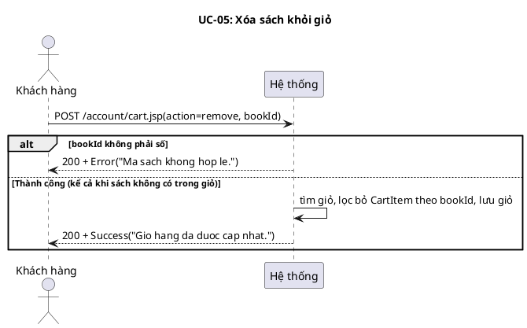
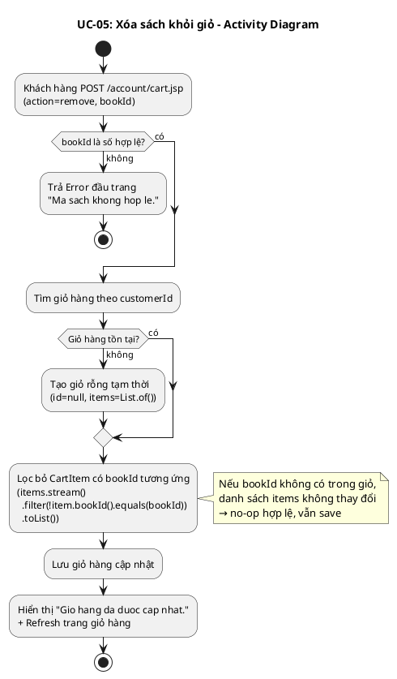
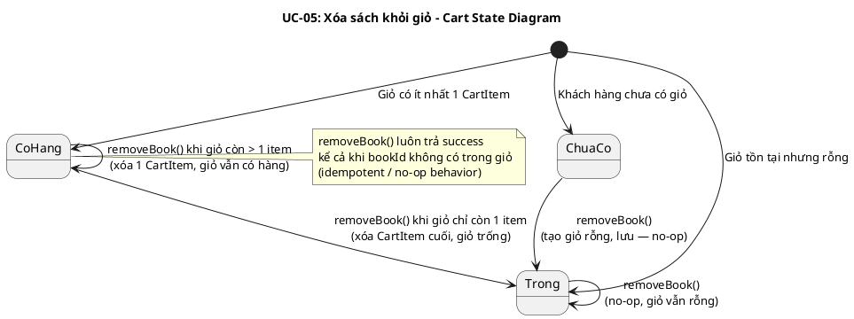
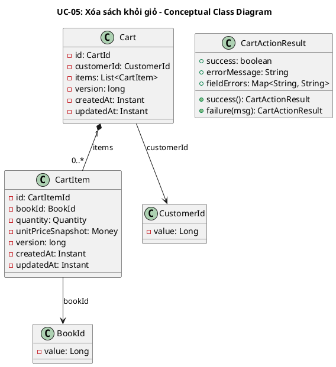
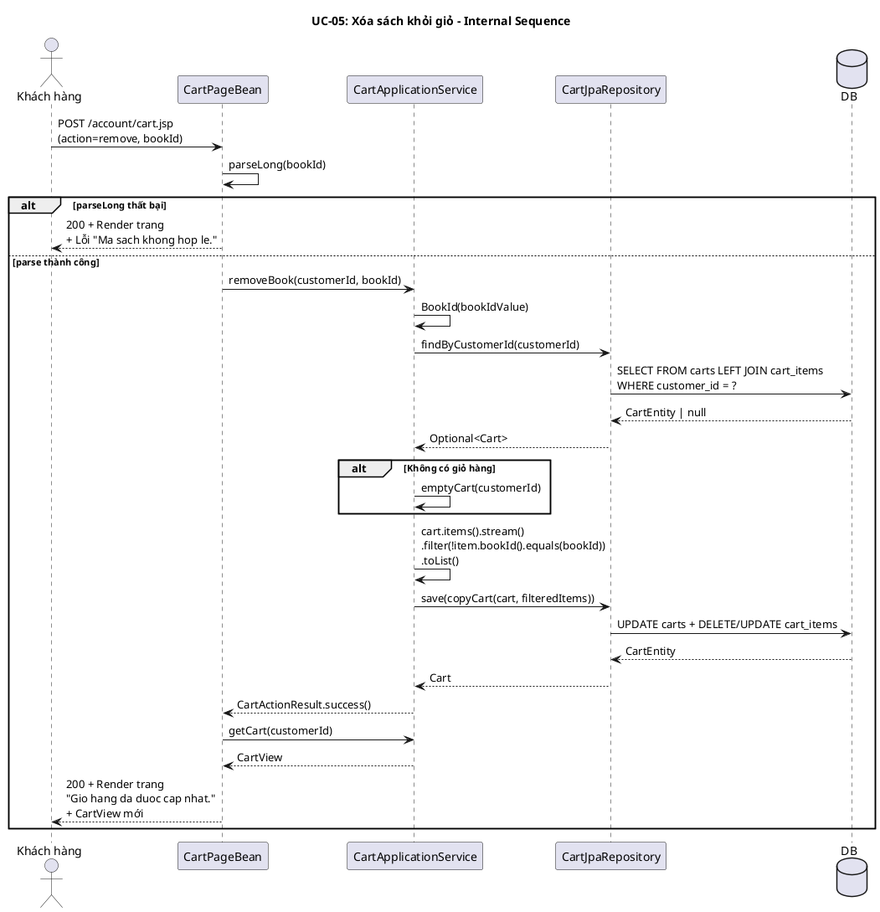

# UC-05: Xóa sách khỏi giỏ

## 1. Mô tả use case

| Mục                            | Nội dung                                                                                                                                                                                                                                                                                                                                                                                      |
| ------------------------------ | --------------------------------------------------------------------------------------------------------------------------------------------------------------------------------------------------------------------------------------------------------------------------------------------------------------------------------------------------------------------------------------------- |
| Phụ thuộc                      | UC-03 (Xem giỏ hàng) — khách hàng phải đang ở trang giỏ hàng để thực hiện xóa sách.                                                                                                                                                                                                                                                                                                           |
| Mục đích                       | Khách hàng muốn bỏ một cuốn sách không còn muốn mua ra khỏi giỏ. PM giúp lọc bỏ CartItem tương ứng và lưu giỏ hàng cập nhật. Hành vi là idempotent — xóa sách không có trong giỏ vẫn thành công.                                                                                                                                                                                              |
| Mô tả                          | Khách hàng chọn xóa một cuốn sách khỏi giỏ hàng. Hệ thống tìm giỏ hàng, lọc bỏ dòng có bookId tương ứng, rồi lưu lại giỏ hàng đã cập nhật. Trang làm mới để hiển thị kết quả.                                                                                                                                                                                                                 |
| Actor chính                    | Khách hàng (Customer)                                                                                                                                                                                                                                                                                                                                                                         |
| Actor liên quan                | Không                                                                                                                                                                                                                                                                                                                                                                                         |
| Tiền điều kiện                 | Khách hàng đã truy cập vào hệ thống (có session hợp lệ), đang ở trang giỏ hàng.                                                                                                                                                                                                                                                                                                               |
| Dãy lệnh thực hiện bình thường | 1. Khách hàng nhấn nút xóa cho một cuốn sách (POST /account/cart.jsp với action=remove, bookId).   2. Hệ thống tìm giỏ hàng của khách hàng (hoặc tạo giỏ rỗng nếu chưa có).   3. Hệ thống lọc bỏ CartItem có bookId tương ứng khỏi danh sách items.   4. Hệ thống lưu giỏ hàng cập nhật.   5. Hệ thống hiển thị thông báo "Gio hang da duoc cap nhat." và refresh trang giỏ hàng. |
| Hậu điều kiện (thành công)     | CartItem có bookId tương ứng bị loại khỏi giỏ hàng. Giỏ hàng đã lưu trong DB. Nếu sách không có trong giỏ, giỏ vẫn được lưu lại (no-op hợp lệ).                                                                                                                                                                                                                                               |
| Hậu điều kiện (thất bại)       | Giỏ hàng không thay đổi. Trang hiển thị thông báo lỗi.                                                                                                                                                                                                                                                                                                                                        |
| Xử lý ngoại lệ                 | bookId không phải số → "Ma sach khong hop le." (lỗi đầu trang)   Sách không có trong giỏ hàng → Không hiển thị lỗi, coi là thành công (no-op hợp lệ — kết quả cuối cùng đúng mong đợi)   Giỏ hàng không tồn tại → Tạo giỏ rỗng, lưu (no-op)                                                                                                                                             |

## 2. Lược đồ tuần tự

<!-- Lược đồ cấp 1: Actor ↔ PM (hệ thống là hộp đen). -->

## 3. Lược đồ hoạt động

## 4. Lược đồ trạng thái

## 5. Lược đồ lớp ý niệm

## 6. Phân rã thành phần PM

### 6.1 Controller: `CartPageBean`

- **Nhiệm vụ**: Nhận HTTP POST request từ khách hàng (action=remove, bookId),
  parse bookId, ủy thác cho UseCase, xử lý kết quả, sau đó gọi getCart() để
  refresh trang.
- **Endpoint**: `POST /account/cart.jsp`
- **Input**: `CartPageRequest` —
  `{ method: "POST", action: "remove", bookId: String, quantity: null, infoParam: null }`
- **Output thành công**: `200` + `CartPageResult(RENDER, CartPageModel)` — model
  chứa CartView mới + infoMessage "Gio hang da duoc cap nhat."
- **Output lỗi**: `200` + `CartPageResult(RENDER, CartPageModel)` — model chứa
  CartView + errorMessage.

### 6.2 UseCase: `CartApplicationService`

- **Nhiệm vụ**: Orchestrate nghiệp vụ xóa sách khỏi giỏ hàng.
- **Input**: `CustomerId`, `bookIdValue: long`
- **Output**: `CartActionResult`
- **Gọi đến**:
    - `CartRepository.findByCustomerId(customerId)` — tìm giỏ hàng (hoặc tạo giỏ
      rỗng)
    - `cart.items().stream().filter(...)` — lọc bỏ CartItem theo bookId
    - `CartRepository.save(updatedCart)` — lưu giỏ hàng cập nhật

- **Phát sinh sự kiện**: Không.
- **Lưu ý**: Không gọi BookRepository — không cần kiểm tra sách tồn tại, active,
  hay stock.

### 6.3 Repository: `CartRepository`

**CartRepository** (impl: `CartJpaRepository`):

- **Nhiệm vụ**: Truy xuất/lưu trữ domain entity `Cart` kèm `CartItem`.
- **Phương thức liên quan đến UC**:
    - `findByCustomerId(CustomerId): Optional<Cart>` — tìm giỏ hàng của khách
      hàng (LEFT JOIN FETCH items).
    - `save(Cart): Cart` — lưu giỏ hàng (persist nếu mới, merge nếu đã tồn tại).
- **Tables**: `carts`, `cart_items`

### 6.5 Lược đồ tuần tự nội bộ PM

## 7. Bảng tham chiếu dò vết

| Use Case | Controller   | Endpoint                                 | UseCase                             | Repository                           | Table             |
| -------- | ------------ | ---------------------------------------- | ----------------------------------- | ------------------------------------ | ----------------- |
| UC-05    | CartPageBean | `POST /account/cart.jsp` (action=remove) | CartApplicationService.removeBook() | CartJpaRepository.findByCustomerId() | carts, cart_items |
|          |              |                                          |                                     | CartJpaRepository.save()             | carts, cart_items |
|          |              |                                          | CartApplicationService.getCart()    | CartJpaRepository.findByCustomerId() | carts, cart_items |
|          |              |                                          | CartViewAssembler.toCartView()      | BookJpaRepository.findByIds()        | books             |

## 8. Tiêu chí kiểm thử

| Tiêu chí                 | Phép thử                                                               | Kết quả mong đợi                                            | Ghi chú                                            |
| ------------------------ | ---------------------------------------------------------------------- | ----------------------------------------------------------- | -------------------------------------------------- |
| Toàn diện (coverage)     | Đối chiếu Activity ↔ Sequence: mọi luồng đều được thể hiện             | Không bỏ sót luồng chính lẫn ngoại lệ (parse lỗi, no-op)    | Rà soát chéo mục 2 và mục 3                        |
| Nhất quán                | Rà soát tên lớp, API giữa các lược đồ trong cùng UC                    | CartApplicationService, CartActionResult nhất quán          | Kiểm tra tên trong mục 5–6                         |
| Truy vết                 | Đối chiếu bảng tham chiếu (mục 7) với lược đồ tuần tự nội bộ (mục 6.5) | Mọi tương tác trong sequence đều có entry trong bảng        | Kiểm tra không thiếu endpoint/method               |
| Xóa thành công           | removeBook() khi sách có trong giỏ                                     | CartActionResult.success(), giỏ không còn CartItem đó       | Test: removeBookDeletesItemFromCart                |
| No-op khi sách không có  | removeBook() với bookId không có trong giỏ                             | CartActionResult.success(), giỏ giữ nguyên                  | Test: removeMissingBookBehavesAsNoOp               |
| Parse bookId lỗi         | POST với bookId = "abc"                                                | FieldValidationException("bookId", "Ma sach khong hop le.") | Code: CartPageBean.parseLong()                     |
| Không gọi BookRepository | removeBook() không truy vấn bảng books                                 | Không có SELECT trên bảng books trong luồng remove          | Kiểm tra code: CartApplicationService.removeBook() |
| Hành vi idempotent       | Gọi removeBook() 2 lần liên tiếp cùng bookId                           | Lần 1: xóa CartItem. Lần 2: no-op, vẫn success              | Đảm bảo idempotent behavior                        |
