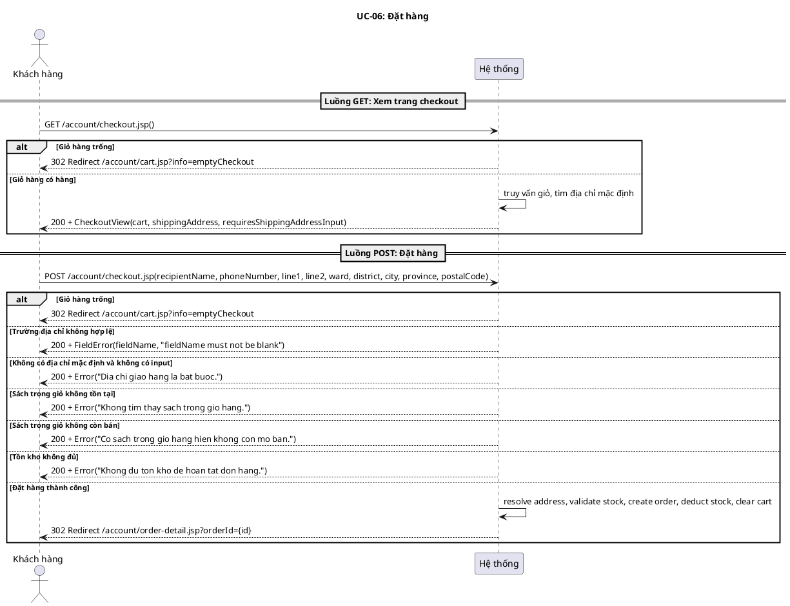
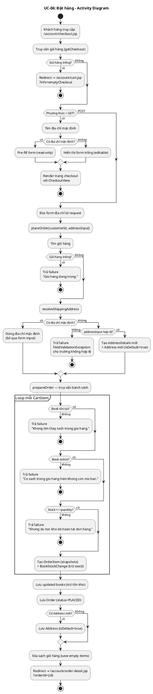
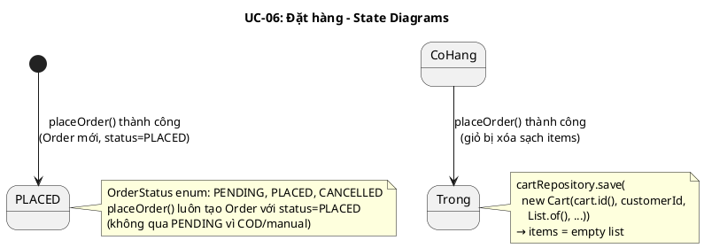
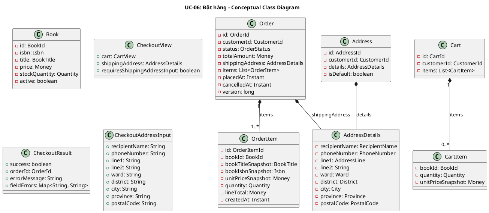
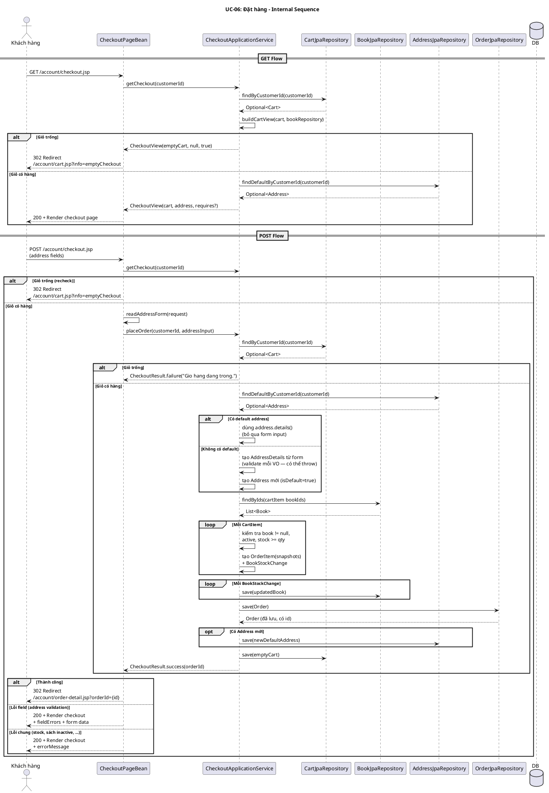

# UC-06: Đặt hàng

## 1. Mô tả use case

| Mục                            | Nội dung                                                                                                                                                                                                                                                                                                                                                                                                                                                                                                                                                                                                                                                                                                                                                                                                                                                                                                                                                                                                                                                                                                                                                                |
| ------------------------------ | ----------------------------------------------------------------------------------------------------------------------------------------------------------------------------------------------------------------------------------------------------------------------------------------------------------------------------------------------------------------------------------------------------------------------------------------------------------------------------------------------------------------------------------------------------------------------------------------------------------------------------------------------------------------------------------------------------------------------------------------------------------------------------------------------------------------------------------------------------------------------------------------------------------------------------------------------------------------------------------------------------------------------------------------------------------------------------------------------------------------------------------------------------------------------- |
| Phụ thuộc                      | UC-03 (Xem giỏ hàng) — khách hàng phải có sách trong giỏ để truy cập checkout.                                                                                                                                                                                                                                                                                                                                                                                                                                                                                                                                                                                                                                                                                                                                                                                                                                                                                                                                                                                                                                                                                          |
| Mục đích                       | Khách hàng muốn hoàn tất mua hàng từ giỏ. PM giúp xem lại giỏ hàng trên trang thanh toán, giải quyết địa chỉ giao hàng, kiểm tra tồn kho lần cuối, tạo đơn hàng với snapshot đầy đủ, trừ tồn kho, xóa giỏ và chuyển đến trang chi tiết đơn.                                                                                                                                                                                                                                                                                                                                                                                                                                                                                                                                                                                                                                                                                                                                                                                                                                                                                                                             |
| Mô tả                          | UC này bao gồm 2 luồng: (1) GET — xem trang thanh toán với giỏ hàng và địa chỉ giao hàng; (2) POST — xác nhận đặt hàng. Hệ thống dùng COD/manual payment, không có cổng thanh toán online.                                                                                                                                                                                                                                                                                                                                                                                                                                                                                                                                                                                                                                                                                                                                                                                                                                                                                                                                                                              |
| Actor chính                    | Khách hàng (Customer)                                                                                                                                                                                                                                                                                                                                                                                                                                                                                                                                                                                                                                                                                                                                                                                                                                                                                                                                                                                                                                                                                                                                                   |
| Actor liên quan                | Không (COD — không có actor thanh toán bên ngoài)                                                                                                                                                                                                                                                                                                                                                                                                                                                                                                                                                                                                                                                                                                                                                                                                                                                                                                                                                                                                                                                                                                                       |
| Tiền điều kiện                 | Khách hàng đã truy cập vào hệ thống (có session hợp lệ), có ít nhất một sách trong giỏ.                                                                                                                                                                                                                                                                                                                                                                                                                                                                                                                                                                                                                                                                                                                                                                                                                                                                                                                                                                                                                                                                                 |
| Dãy lệnh thực hiện bình thường | **Luồng GET (xem trang checkout):**   1. Khách hàng truy cập trang thanh toán (GET /account/checkout.jsp).   2. Hệ thống kiểm tra giỏ hàng — nếu trống, redirect về /account/cart.jsp?info=emptyCheckout.   3. Hệ thống tìm địa chỉ mặc định của khách hàng.   4. Nếu có địa chỉ mặc định: pre-fill form (read-only). Nếu không: hiển thị form trống (editable).   5. Hệ thống render trang checkout với CheckoutView (cart, shippingAddress, requiresShippingAddressInput).   **Luồng POST (đặt hàng):**   6. Khách hàng nhấn nút đặt hàng (POST /account/checkout.jsp với các trường địa chỉ).   7. Hệ thống giải quyết địa chỉ giao hàng: dùng địa chỉ mặc định nếu có (bỏ qua form input), hoặc tạo AddressDetails mới từ form.   8. Hệ thống kiểm tra từng sách trong giỏ: tồn tại, active, đủ tồn kho.   9. Hệ thống tạo OrderItem với snapshot (bookTitleSnapshot, bookIsbnSnapshot, unitPriceSnapshot, lineTotal).   10. Hệ thống trừ tồn kho từng cuốn sách.   11. Hệ thống lưu Order (status=PLACED), lưu Address mới (nếu có), xóa sạch giỏ hàng.   12. Hệ thống redirect đến /account/order-detail.jsp?orderId={id}. |
| Hậu điều kiện (thành công)     | Order mới được tạo (status=PLACED) với đầy đủ snapshot. Tồn kho đã trừ. Giỏ hàng đã xóa sạch. Địa chỉ mới được lưu làm default (nếu chưa có). Khách hàng ở trang chi tiết đơn hàng.                                                                                                                                                                                                                                                                                                                                                                                                                                                                                                                                                                                                                                                                                                                                                                                                                                                                                                                                                                                     |
| Hậu điều kiện (thất bại)       | Không có Order nào được tạo. Tồn kho không thay đổi. Giỏ hàng giữ nguyên. Địa chỉ không được lưu. Trang checkout hiển thị lỗi (inline hoặc chung).                                                                                                                                                                                                                                                                                                                                                                                                                                                                                                                                                                                                                                                                                                                                                                                                                                                                                                                                                                                                                      |
| Xử lý ngoại lệ                 | Giỏ hàng trống → Redirect về /account/cart.jsp?info=emptyCheckout   Không có địa chỉ mặc định và addressInput = null → "Dia chi giao hang la bat buoc."   Trường địa chỉ không hợp lệ (recipientName, phoneNumber, line1, ward, district, city, province, postalCode blank) → FieldValidationException cho trường tương ứng (vd: "recipientName must not be blank")   Sách trong giỏ không tồn tại → "Khong tim thay sach trong gio hang."   Sách trong giỏ không còn bán → "Co sach trong gio hang hien khong con mo ban."   Tồn kho không đủ → "Khong du ton kho de hoan tat don hang."                                                                                                                                                                                                                                                                                                                                                                                                                                                                                                                                                                |

## 2. Lược đồ tuần tự

<!-- Lược đồ cấp 1: Actor ↔ PM (hệ thống là hộp đen). -->

## 3. Lược đồ hoạt động

## 4. Lược đồ trạng thái

## 5. Lược đồ lớp ý niệm

## 6. Phân rã thành phần PM

### 6.1 Controller: `CheckoutPageBean`

- **Nhiệm vụ**: Xử lý cả GET (xem checkout) và POST (đặt hàng). GET: gọi
  getCheckout(), redirect nếu giỏ trống, render checkout page. POST: đọc form
  địa chỉ, gọi placeOrder(), redirect nếu thành công, render lỗi nếu thất bại.
- **Endpoint**: `GET /account/checkout.jsp` và `POST /account/checkout.jsp`
- **Input GET**: `CheckoutPageRequest` — `{ method: "GET", ... }` (các trường
  địa chỉ không dùng)
- **Input POST**: `CheckoutPageRequest` —
  `{ method: "POST", recipientName, phoneNumber, line1, line2, ward, district, city, province, postalCode }`
- **Output GET thành công**: `200` +
  `CheckoutPageResult(RENDER, CheckoutPageModel)` — model chứa CartView,
  AddressFormData, requiresShippingAddressInput.
- **Output GET giỏ trống**: `302` +
  `CheckoutPageResult(REDIRECT, "/account/cart.jsp?info=emptyCheckout", model)`
- **Output POST thành công**: `302` +
  `CheckoutPageResult(REDIRECT, "/account/order-detail.jsp?orderId={id}", model)`
- **Output POST lỗi**: `200` + `CheckoutPageResult(RENDER, CheckoutPageModel)` —
  model chứa errorMessage hoặc fieldErrors + form data giữ nguyên.

### 6.2 UseCase: `CheckoutApplicationService`

- **Nhiệm vụ**: Orchestrate toàn bộ nghiệp vụ checkout và đặt hàng.
- **Phương thức**:
    - `getCheckout(CustomerId): CheckoutView` — truy vấn giỏ hàng + địa chỉ mặc
      định cho GET flow.
    - `placeOrder(CustomerId, CheckoutAddressInput): CheckoutResult` —
      orchestrate đặt hàng cho POST flow.
- **placeOrder gọi đến**:
    - `CartRepository.findByCustomerId(customerId)` — tìm giỏ hàng
    - `resolveShippingAddress(customerId, addressInput)` — giải quyết địa chỉ
      giao hàng

    - `AddressRepository.findDefaultByCustomerId(customerId)` — tìm địa chỉ mặc
      định
    - `prepareOrder(cart, shippingAddress)` — chuẩn bị Order + kiểm tra stock
    - `BookRepository.findByIds(bookIds)` — truy vấn batch sách
    - `BookRepository.save(updatedBook)` — trừ tồn kho từng cuốn
    - `OrderRepository.save(order)` — lưu đơn hàng

    - `AddressRepository.save(newAddress)` — lưu địa chỉ mới (nếu có)
    - `CartRepository.save(emptyCart)` — xóa sạch giỏ hàng

- **Phát sinh sự kiện**: Không.

### 6.3 Repository: `CartRepository` + `BookRepository` + `AddressRepository` + `OrderRepository`

**CartRepository** (impl: `CartJpaRepository`):

- **Phương thức liên quan đến UC**:
    - `findByCustomerId(CustomerId): Optional<Cart>` — tìm giỏ hàng.
    - `save(Cart): Cart` — xóa sạch giỏ (save với items = List.of()).
- **Tables**: `carts`, `cart_items`

**BookRepository** (impl: `BookJpaRepository`):

- **Phương thức liên quan đến UC**:
    - `findByIds(Set<BookId>): List<Book>` — truy vấn batch sách để kiểm tra
      stock.
    - `save(Book): Book` — trừ tồn kho.
- **Table**: `books`

**AddressRepository** (impl: `AddressJpaRepository`):

- **Phương thức liên quan đến UC**:
    - `findDefaultByCustomerId(CustomerId): Optional<Address>` — tìm địa chỉ mặc
      định.
    - `save(Address): Address` — lưu địa chỉ mới (isDefault=true, unset default
      cũ).
- **Table**: `addresses`

**OrderRepository** (impl: `OrderJpaRepository`):

- **Phương thức liên quan đến UC**:
    - `save(Order): Order` — lưu đơn hàng mới.
- **Tables**: `orders`, `order_items`

### 6.5 Lược đồ tuần tự nội bộ PM

## 7. Bảng tham chiếu dò vết

| Use Case | Controller       | Endpoint                     | UseCase                                  | Repository                                     | Table               |
| -------- | ---------------- | ---------------------------- | ---------------------------------------- | ---------------------------------------------- | ------------------- |
| UC-06    | CheckoutPageBean | `GET /account/checkout.jsp`  | CheckoutApplicationService.getCheckout() | CartJpaRepository.findByCustomerId()           | carts, cart_items   |
|          |                  |                              |                                          | BookJpaRepository.findByIds()                  | books               |
|          |                  |                              |                                          | AddressJpaRepository.findDefaultByCustomerId() | addresses           |
|          | CheckoutPageBean | `POST /account/checkout.jsp` | CheckoutApplicationService.placeOrder()  | CartJpaRepository.findByCustomerId()           | carts, cart_items   |
|          |                  |                              |                                          | AddressJpaRepository.findDefaultByCustomerId() | addresses           |
|          |                  |                              |                                          | BookJpaRepository.findByIds()                  | books               |
|          |                  |                              |                                          | BookJpaRepository.save()                       | books               |
|          |                  |                              |                                          | OrderJpaRepository.save()                      | orders, order_items |
|          |                  |                              |                                          | AddressJpaRepository.save()                    | addresses           |
|          |                  |                              |                                          | CartJpaRepository.save()                       | carts, cart_items   |

## 8. Tiêu chí kiểm thử

| Tiêu chí                    | Phép thử                                                               | Kết quả mong đợi                                                                 | Ghi chú                                             |
| --------------------------- | ---------------------------------------------------------------------- | -------------------------------------------------------------------------------- | --------------------------------------------------- |
| Toàn diện (coverage)        | Đối chiếu Activity ↔ Sequence: mọi luồng đều được thể hiện             | Không bỏ sót luồng GET + POST + 6 ngoại lệ                                       | Rà soát chéo mục 2 và mục 3                         |
| Nhất quán                   | Rà soát tên lớp, API giữa các lược đồ trong cùng UC                    | CheckoutApplicationService, CheckoutResult, CheckoutView nhất quán               | Kiểm tra tên trong mục 5–6                          |
| Truy vết                    | Đối chiếu bảng tham chiếu (mục 7) với lược đồ tuần tự nội bộ (mục 6.5) | Mọi tương tác trong sequence đều có entry trong bảng                             | Kiểm tra không thiếu endpoint/method                |
| GET với giỏ trống           | GET checkout khi giỏ trống                                             | Redirect → /account/cart.jsp?info=emptyCheckout                                  | Test: checkoutPageRedirectsEmptyCartBackToCart      |
| GET với default address     | getCheckout() khi có địa chỉ mặc định                                  | CheckoutView.requiresShippingAddressInput = false, shippingAddress có dữ liệu    | Test: getCheckoutShowsDefaultAddress                |
| GET không có address        | getCheckout() khi không có địa chỉ mặc định                            | CheckoutView.requiresShippingAddressInput = true, shippingAddress = null         | Test: getCheckoutRequiresAddressInputWhenNoDefault  |
| Đặt hàng thành công         | placeOrder() với giỏ hợp lệ, đủ stock, có default address              | CheckoutResult.success(orderId), stock trừ, giỏ xóa, order tạo                   | Test: placeOrderSucceedsAndClearsCart               |
| Snapshot đúng               | Kiểm tra OrderItem sau placeOrder()                                    | bookTitleSnapshot, bookIsbnSnapshot, unitPriceSnapshot đều từ thời điểm đặt      | Test: placeOrderStoresSnapshots                     |
| Redirect sau thành công     | POST checkout thành công                                               | 302 → /account/order-detail.jsp?orderId={id}                                     | Test: checkoutPageRedirectsToOrderDetailOnSuccess   |
| Giỏ trống khi POST          | placeOrder() khi giỏ trống                                             | CheckoutResult.failure("Gio hang dang trong.")                                   | Test: rejectsPlaceOrderOnEmptyCart                  |
| Sách inactive               | placeOrder() khi có sách inactive trong giỏ                            | CheckoutResult.failure("Co sach trong gio hang hien khong con mo ban.")          | Test: rejectsPlaceOrderWithInactiveBook             |
| Tồn kho không đủ            | placeOrder() khi stock < qty                                           | CheckoutResult.failure("Khong du ton kho de hoan tat don hang."), giỏ giữ nguyên | Test: rejectsPlaceOrderWhenStockInsufficient        |
| Sách không tìm thấy         | placeOrder() khi bookId trong giỏ không có trong DB                    | CheckoutResult.failure("Khong tim thay sach trong gio hang.")                    | Test: rejectsPlaceOrderWithMissingBook              |
| Address field validation    | placeOrder() với recipientName blank                                   | CheckoutResult.failure("recipientName must not be blank") + fieldError           | Test: rejectsPlaceOrderWithBlankRecipientName       |
| Bỏ qua form khi có default  | placeOrder() khi đã có default address, form gửi address khác          | Dùng default address, bỏ qua form input                                          | Test: placeOrderIgnoresFormWhenDefaultAddressExists |
| Tạo address mới làm default | placeOrder() khi không có default, form hợp lệ                         | Address mới được lưu với isDefault=true                                          | Test: placeOrderCreatesNewDefaultAddress            |
| Tổng tiền đúng              | placeOrder() với nhiều CartItem                                        | Order.totalAmount = sum(lineTotal), lineTotal = unitPriceSnapshot x qty          | Test: placeOrderCalculatesTotalCorrectly            |
