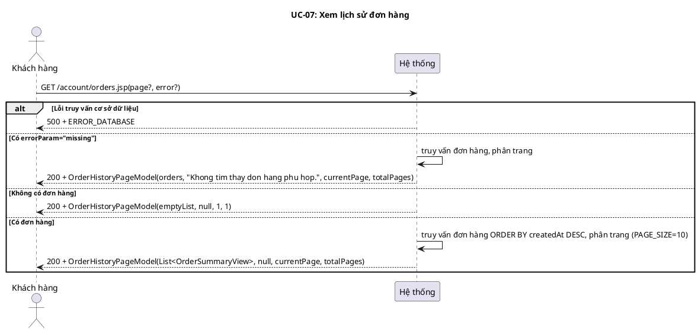
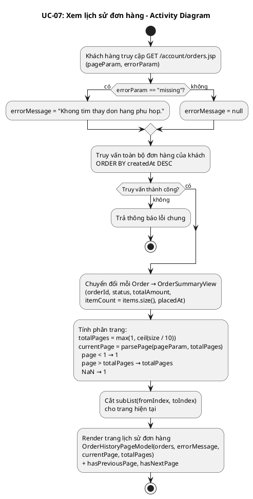
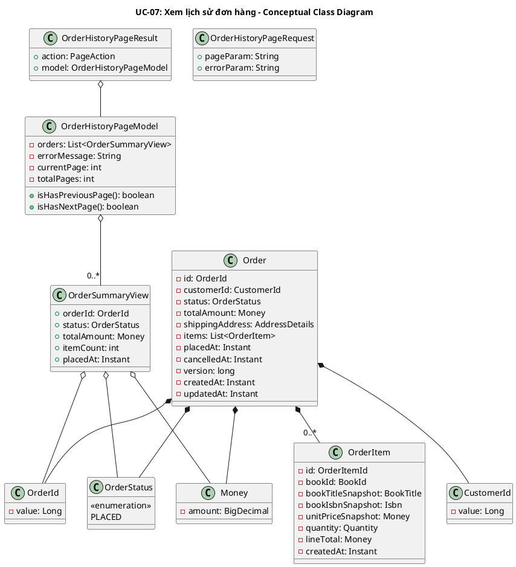
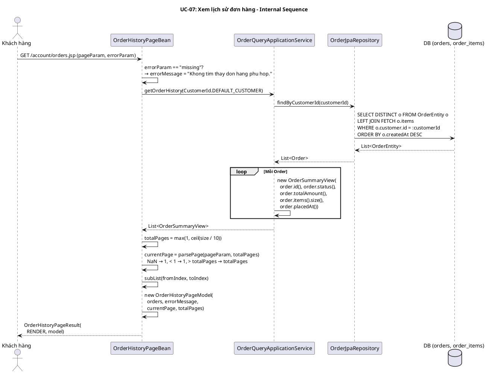

# UC-07: Xem lịch sử đơn hàng

## 1. Mô tả use case

| Mục                            | Nội dung                                                                                                                                                                                                                                                                                                                                                                                                                                                                                                                                                                                                                                                                                                                             |
| ------------------------------ | ------------------------------------------------------------------------------------------------------------------------------------------------------------------------------------------------------------------------------------------------------------------------------------------------------------------------------------------------------------------------------------------------------------------------------------------------------------------------------------------------------------------------------------------------------------------------------------------------------------------------------------------------------------------------------------------------------------------------------------ |
| Phụ thuộc                      | UC-06 (Đặt hàng) — khách hàng phải đã đặt ít nhất một đơn hàng để danh sách không rỗng.                                                                                                                                                                                                                                                                                                                                                                                                                                                                                                                                                                                                                                              |
| Mục đích                       | Khách hàng muốn xem lại toàn bộ đơn hàng đã đặt để theo dõi trạng thái. PM giúp truy vấn danh sách đơn hàng, sắp xếp theo thời gian mới nhất, phân trang, và hiển thị tóm tắt mỗi đơn.                                                                                                                                                                                                                                                                                                                                                                                                                                                                                                                                               |
| Mô tả                          | Khách hàng truy cập trang lịch sử đơn hàng. Hệ thống truy vấn toàn bộ đơn hàng của khách, sắp xếp theo createdAt giảm dần, phân trang in-memory (10 đơn/trang), và hiển thị dạng tóm tắt gồm mã đơn, trạng thái, tổng tiền, số loại sách, thời gian đặt.                                                                                                                                                                                                                                                                                                                                                                                                                                                                             |
| Actor chính                    | Khách hàng (Customer)                                                                                                                                                                                                                                                                                                                                                                                                                                                                                                                                                                                                                                                                                                                |
| Actor liên quan                | Không                                                                                                                                                                                                                                                                                                                                                                                                                                                                                                                                                                                                                                                                                                                                |
| Tiền điều kiện                 | Khách hàng đã truy cập vào hệ thống (có session hợp lệ).                                                                                                                                                                                                                                                                                                                                                                                                                                                                                                                                                                                                                                                                             |
| Dãy lệnh thực hiện bình thường | 1. Khách hàng truy cập GET /account/orders.jsp (có thể kèm ?page=N).   2. Hệ thống kiểm tra errorParam: nếu errorParam="missing" → set errorMessage = "Khong tim thay don hang phu hop."   3. Hệ thống truy vấn toàn bộ đơn hàng của khách, sắp xếp theo createdAt DESC.   4. Hệ thống chuyển đổi mỗi Order → OrderSummaryView (orderId, status, totalAmount, itemCount, placedAt).   5. Hệ thống tính phân trang: totalPages = ceil(size / 10), parsePage clamp pageParam vào [1, totalPages].   6. Hệ thống cắt subList(fromIndex, toIndex) cho trang hiện tại.   7. Hệ thống render trang lịch sử với danh sách OrderSummaryView, errorMessage (nếu có), currentPage, totalPages, hasPreviousPage, hasNextPage. |
| Hậu điều kiện (thành công)     | Trang hiển thị danh sách đơn hàng tóm tắt (trang hiện tại), có nút phân trang nếu nhiều hơn 1 trang.                                                                                                                                                                                                                                                                                                                                                                                                                                                                                                                                                                                                                                 |
| Hậu điều kiện (thất bại)       | Không áp dụng — UC này luôn RENDER (không REDIRECT). Nếu không có đơn hàng, hiển thị trang trống (empty state). Nếu lỗi DB, hiển thị thông báo lỗi chung.                                                                                                                                                                                                                                                                                                                                                                                                                                                                                                                                                                            |
| Xử lý ngoại lệ                 | errorParam="missing" (từ UC-08 redirect) → hiển thị thông báo "Khong tim thay don hang phu hop." cùng danh sách đơn   Không có đơn hàng nào → trang trống (empty state)   pageParam không hợp lệ (NaN, < 1, > totalPages) → clamp về trang 1 hoặc trang cuối   Lỗi truy vấn cơ sở dữ liệu → thông báo lỗi chung                                                                                                                                                                                                                                                                                                                                                                                                             |

## 2. Lược đồ tuần tự

<!-- Lược đồ cấp 1: Actor ↔ PM (hệ thống là hộp đen). -->

## 3. Lược đồ hoạt động

## 5. Lược đồ lớp ý niệm

## 6. Phân rã thành phần PM

### 6.1 Controller: `OrderHistoryPageBean`

- **Nhiệm vụ**: Nhận request từ JSP, xử lý errorParam, ủy thác truy vấn cho
  UseCase, thực hiện phân trang in-memory, trả về model để render.
- **Endpoint**: `GET /account/orders.jsp`
- **Input**: `OrderHistoryPageRequest` —
  `{ pageParam: String, errorParam: String }`
- **Output**: `OrderHistoryPageResult` —
  `{ action: PageAction.RENDER, model: OrderHistoryPageModel }`
- **Lưu ý**: Controller luôn trả RENDER, không bao giờ REDIRECT. Phân trang thực
  hiện tại controller (in-memory subList), không tại DB.

### 6.2 UseCase: `OrderQueryApplicationService.getOrderHistory()`

- **Nhiệm vụ**: Truy vấn toàn bộ đơn hàng của khách hàng, chuyển đổi sang
  OrderSummaryView.
- **Input**: `CustomerId`
- **Output**: `List<OrderSummaryView>`
- **Gọi đến**:
    - `OrderRepository.findByCustomerId(customerId)` — truy vấn đơn hàng theo
      khách, sắp xếp createdAt DESC
- **Logic**: map mỗi Order → OrderSummaryView(orderId, status, totalAmount,
  items.size(), placedAt).

### 6.3 Repository: `OrderJpaRepository`

- **Nhiệm vụ**: Truy vấn Order từ DB.
- **Phương thức liên quan đến UC**:
    - `findByCustomerId(customerId): List<Order>` — JPQL:
      `SELECT DISTINCT o FROM OrderEntity o LEFT JOIN FETCH o.items WHERE o.customer.id = :customerId ORDER BY o.createdAt DESC`
- **Table**: `orders`, `order_items`

### 6.5 Lược đồ tuần tự nội bộ PM

## 7. Bảng tham chiếu dò vết

| Use Case | Controller           | Endpoint                  | UseCase                                        | Repository                            | Table               |
| -------- | -------------------- | ------------------------- | ---------------------------------------------- | ------------------------------------- | ------------------- |
| UC-07    | OrderHistoryPageBean | `GET /account/orders.jsp` | OrderQueryApplicationService.getOrderHistory() | OrderJpaRepository.findByCustomerId() | orders, order_items |

## 8. Tiêu chí kiểm thử

| Tiêu chí                       | Phép thử                                                                   | Kết quả mong đợi                                                                                                                                | Ghi chú                                                                            |
| ------------------------------ | -------------------------------------------------------------------------- | ----------------------------------------------------------------------------------------------------------------------------------------------- | ---------------------------------------------------------------------------------- |
| Toàn diện (coverage)           | Đối chiếu Activity Diagram ↔ Sequence Diagram: mọi luồng đều được thể hiện | Không bỏ sót luồng chính lẫn ngoại lệ                                                                                                           | Rà soát chéo giữa mục 2 và mục 3                                                   |
| Nhất quán                      | Rà soát tên lớp, DTO, API giữa các lược đồ trong cùng UC                   | Không mâu thuẫn giữa các mục 2–6                                                                                                                | Đặc biệt kiểm tra tên trong mục 5–6                                                |
| Truy vết                       | Đối chiếu bảng tham chiếu (mục 7) với lược đồ tuần tự nội bộ (mục 6.5)     | Mọi tương tác trong sequence đều có entry                                                                                                       | Kiểm tra không thiếu endpoint/method                                               |
| errorParam mapping             | Gọi handle(new OrderHistoryPageRequest(null, "missing"))                   | model.getErrorMessage() == "Khong tim thay don hang phu hop." VÀ orders vẫn hiển thị                                                            | Test: PurchasePageBeansTest.orderHistoryPageMapsMissingErrorParam                  |
| Danh sách rỗng                 | getOrderHistory khi không có đơn nào                                       | Trả List rỗng, trang hiển thị empty state, totalPages = 1, currentPage = 1                                                                      |                                                                                    |
| Phân trang — trang hợp lệ      | 25 đơn hàng, page=2                                                        | Hiển thị đơn 11-20, currentPage=2, totalPages=3, hasPreviousPage=true, hasNextPage=true                                                         |                                                                                    |
| Phân trang — page < 1          | page=0 hoặc page=-1                                                        | Clamp về currentPage=1                                                                                                                          | parsePage logic                                                                    |
| Phân trang — page > totalPages | 5 đơn (1 trang), page=99                                                   | Clamp về currentPage=1 (= totalPages)                                                                                                           | parsePage logic                                                                    |
| Phân trang — page NaN          | page="abc"                                                                 | Clamp về currentPage=1                                                                                                                          | parsePage NumberFormatException                                                    |
| Phân trang — page null         | Không truyền page                                                          | currentPage=1 (default)                                                                                                                         | parsePage("1")                                                                     |
| Sắp xếp                        | Nhiều đơn hàng với createdAt khác nhau                                     | Đơn mới nhất hiển thị trước (createdAt DESC)                                                                                                    | Xác minh ORDER BY trong JPQL                                                       |
| Chỉ đơn của khách              | Khách A có 2 đơn, khách B có 1 đơn                                         | getOrderHistory(A) trả 2, getOrderHistory(B) trả 1                                                                                              | Test: OrderQueryApplicationServiceTest.getOrderHistoryReturnsOnlyOrdersForCustomer |
| OrderSummaryView fields        | Kiểm tra mapping Order → OrderSummaryView                                  | orderId = order.id(), status = order.status(), totalAmount = order.totalAmount(), itemCount = order.items().size(), placedAt = order.placedAt() | Kiểm tra trong OrderQueryApplicationService                                        |
