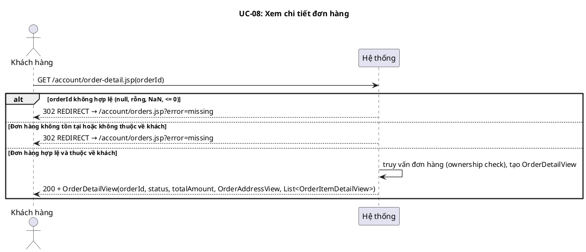
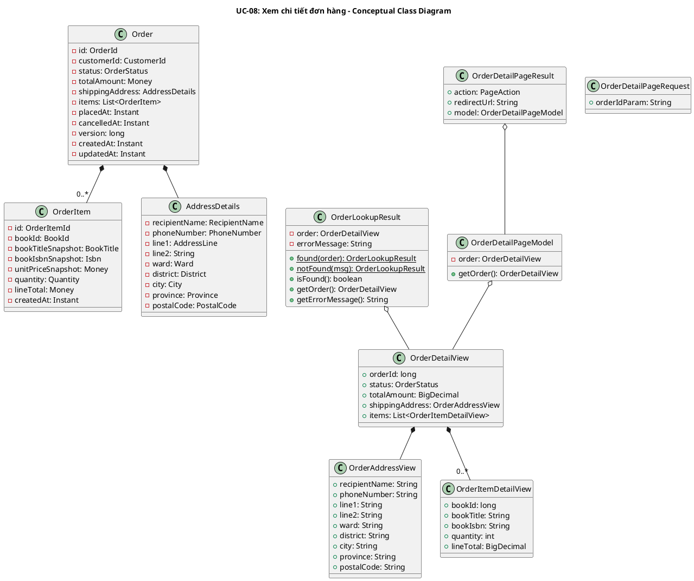
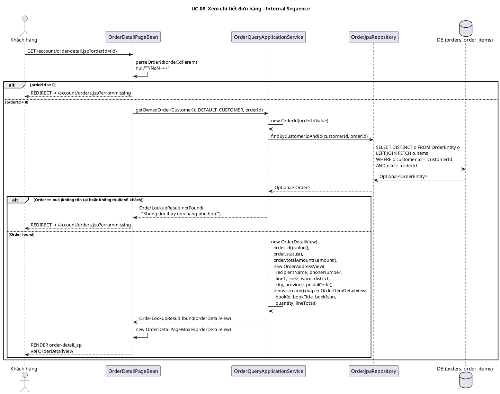

# UC-08: Xem chi tiết đơn hàng

## 1. Mô tả use case

| Mục                            | Nội dung                                                                                                                                                                                                                                                                                                                                                                                                                                                                                                                                                                           |
| ------------------------------ | ---------------------------------------------------------------------------------------------------------------------------------------------------------------------------------------------------------------------------------------------------------------------------------------------------------------------------------------------------------------------------------------------------------------------------------------------------------------------------------------------------------------------------------------------------------------------------------- |
| Phụ thuộc                      | UC-06 (Đặt hàng) — phải có đơn hàng đã đặt. UC-07 (Lịch sử đơn hàng) — khách thường truy cập chi tiết từ trang lịch sử.                                                                                                                                                                                                                                                                                                                                                                                                                                                            |
| Mục đích                       | Khách hàng muốn xem đầy đủ thông tin một đơn hàng cụ thể (trạng thái, địa chỉ giao hàng, danh sách sản phẩm). PM giúp kiểm tra quyền sở hữu đơn hàng (ownership check) và hiển thị chi tiết nếu hợp lệ.                                                                                                                                                                                                                                                                                                                                                                            |
| Mô tả                          | Khách hàng truy cập trang chi tiết đơn hàng kèm mã đơn. Hệ thống parse orderId, kiểm tra đơn hàng tồn tại VÀ thuộc về khách hàng hiện tại (ownership check qua findByCustomerIdAndId). Nếu hợp lệ, hiển thị chi tiết gồm trạng thái, tổng tiền, địa chỉ giao hàng (snapshot), danh sách sản phẩm (snapshot). Nếu không hợp lệ, redirect về trang lịch sử.                                                                                                                                                                                                                          |
| Actor chính                    | Khách hàng (Customer)                                                                                                                                                                                                                                                                                                                                                                                                                                                                                                                                                              |
| Actor liên quan                | Không                                                                                                                                                                                                                                                                                                                                                                                                                                                                                                                                                                              |
| Tiền điều kiện                 | Khách hàng đã truy cập vào hệ thống (có session hợp lệ).                                                                                                                                                                                                                                                                                                                                                                                                                                                                                                                           |
| Dãy lệnh thực hiện bình thường | 1. Khách hàng truy cập GET /account/order-detail.jsp?orderId={id}. <br> 2. Hệ thống parse orderId: nếu null, rỗng, không phải số → orderId = -1. <br> 3. Hệ thống kiểm tra orderId > 0. <br> 4. Hệ thống gọi getOwnedOrder(customerId, orderId): tạo OrderId VO, truy vấn findByCustomerIdAndId(customerId, orderId) — kiểm tra đồng thời tồn tại + sở hữu. <br> 5. Hệ thống chuyển đổi Order → OrderDetailView (orderId, status, totalAmount, shippingAddress: OrderAddressView, items: List\<OrderItemDetailView\>). <br> 6. Hệ thống render trang chi tiết với OrderDetailView. |
| Hậu điều kiện (thành công)     | Trang hiển thị đầy đủ chi tiết đơn hàng: trạng thái, tổng tiền, địa chỉ giao hàng (snapshot), danh sách sản phẩm với bookTitle, bookIsbn, quantity, lineTotal (tất cả là snapshot tại thời điểm đặt).                                                                                                                                                                                                                                                                                                                                                                              |
| Hậu điều kiện (thất bại)       | Redirect về /account/orders.jsp?error=missing. Không có thay đổi dữ liệu.                                                                                                                                                                                                                                                                                                                                                                                                                                                                                                          |
| Xử lý ngoại lệ                 | orderId null, rỗng, hoặc không phải số → parseOrderId trả -1 → REDIRECT /account/orders.jsp?error=missing <br> orderId <= 0 → REDIRECT /account/orders.jsp?error=missing <br> Đơn hàng không tồn tại trong DB → OrderLookupResult.notFound → REDIRECT /account/orders.jsp?error=missing <br> Đơn hàng tồn tại nhưng không thuộc về khách hàng hiện tại (ownership check fail) → findByCustomerIdAndId trả empty → OrderLookupResult.notFound → REDIRECT /account/orders.jsp?error=missing                                                                                          |

## 2. Lược đồ tuần tự

<!-- Lược đồ cấp 1: Actor ↔ PM (hệ thống là hộp đen). -->



## 3. Lược đồ hoạt động

```plantuml
@startuml UC-08-activity
title UC-08: Xem chi tiết đơn hàng - Activity Diagram

start

:Khách hàng truy cập
GET /account/order-detail.jsp?orderId={id};

:parseOrderId(orderIdParam):
null/""/NaN → -1
hợp lệ → long value;

if (orderId <= 0?) then (có)
  :REDIRECT → /account/orders.jsp?error=missing;
  stop
else (không)
endif

:getOwnedOrder(customerId, orderId):
tạo OrderId VO, truy vấn
findByCustomerIdAndId(customerId, orderId);

if (Tìm thấy đơn hàng?) then (không)
  :REDIRECT → /account/orders.jsp?error=missing;
  stop
else (có)
endif

:Chuyển đổi Order → OrderDetailView:
orderId (long), status (OrderStatus),
totalAmount (BigDecimal),
OrderAddressView (9 fields),
List<OrderItemDetailView>
(bookId, bookTitle, bookIsbn,
quantity, lineTotal);

:RENDER trang chi tiết đơn hàng
với OrderDetailView;

stop
@enduml
```

## 5. Lược đồ lớp ý niệm



## 6. Phân rã thành phần PM

### 6.1 Controller: `OrderDetailPageBean`

- **Nhiệm vụ**: Nhận request từ JSP, parse orderId, ủy thác cho UseCase, trả
  RENDER hoặc REDIRECT.
- **Endpoint**: `GET /account/order-detail.jsp`
- **Input**: `OrderDetailPageRequest` — `{ orderIdParam: String }`
- **Output thành công**: `OrderDetailPageResult` —
  `{ action: RENDER, redirectUrl: null, model: OrderDetailPageModel }`
- **Output lỗi**: `OrderDetailPageResult` —
  `{ action: REDIRECT, redirectUrl: "/account/orders.jsp?error=missing", model: null }`
- **Logic parse**: parseOrderId(value): null/""/NaN → -1, hợp lệ → long. Nếu
  orderId <= 0 → REDIRECT ngay (không gọi UseCase).

### 6.2 UseCase: `OrderQueryApplicationService.getOwnedOrder()`

- **Nhiệm vụ**: Truy vấn đơn hàng theo orderId, kiểm tra ownership (đơn thuộc về
  customerId), chuyển đổi sang OrderDetailView.
- **Input**: `CustomerId`, `long orderIdValue`
- **Output**: `OrderLookupResult` — found(OrderDetailView) hoặc
  notFound(errorMessage)
- **Gọi đến**:
    - `OrderRepository.findByCustomerIdAndId(customerId, orderId)` — truy vấn
      đơn hàng với điều kiện customer_id AND order_id đồng thời (ownership
      check)
- **Logic**:
    1. Tạo OrderId VO từ orderIdValue (có thể throw nếu <= 0 — caught trong
       try-catch).
    2. findByCustomerIdAndId → Optional\<Order\>.
    3. null → OrderLookupResult.notFound("Khong tim thay don hang phu hop.")
    4. found → OrderLookupResult.found(new OrderDetailView(...)) với:
        - orderId = order.id().value() (unwrap sang long)
        - status = order.status()
        - totalAmount = order.totalAmount().amount() (unwrap sang BigDecimal)
        - shippingAddress = new OrderAddressView(9 fields unwrapped từ
          AddressDetails VOs)
        - items = order.items().stream().map →
          OrderItemDetailView(bookId.value(), bookTitleSnapshot.value(),
          bookIsbnSnapshot.value(), quantity.value(), lineTotal.amount())

### 6.3 Repository: `OrderJpaRepository`

- **Nhiệm vụ**: Truy vấn Order từ DB.
- **Phương thức liên quan đến UC**:
    - `findByCustomerIdAndId(customerId, orderId): Optional<Order>` — JPQL:
      `SELECT DISTINCT o FROM OrderEntity o LEFT JOIN FETCH o.items WHERE o.customer.id = :customerId AND o.id = :orderId`
- **Table**: `orders`, `order_items`

### 6.5 Lược đồ tuần tự nội bộ PM



## 7. Bảng tham chiếu dò vết

| Use Case | Controller          | Endpoint                        | UseCase                                      | Repository                                 | Table               |
| -------- | ------------------- | ------------------------------- | -------------------------------------------- | ------------------------------------------ | ------------------- |
| UC-08    | OrderDetailPageBean | `GET /account/order-detail.jsp` | OrderQueryApplicationService.getOwnedOrder() | OrderJpaRepository.findByCustomerIdAndId() | orders, order_items |

## 8. Tiêu chí kiểm thử

| Tiêu chí                             | Phép thử                                                                   | Kết quả mong đợi                                                                                                                                                                                    | Ghi chú                                                                                                                                                       |
| ------------------------------------ | -------------------------------------------------------------------------- | --------------------------------------------------------------------------------------------------------------------------------------------------------------------------------------------------- | ------------------------------------------------------------------------------------------------------------------------------------------------------------- |
| Toàn diện (coverage)                 | Đối chiếu Activity Diagram ↔ Sequence Diagram: mọi luồng đều được thể hiện | Không bỏ sót luồng chính lẫn ngoại lệ                                                                                                                                                               | Rà soát chéo giữa mục 2 và mục 3                                                                                                                              |
| Nhất quán                            | Rà soát tên lớp, DTO, API giữa các lược đồ trong cùng UC                   | Không mâu thuẫn giữa các mục 2–6                                                                                                                                                                    | Đặc biệt kiểm tra tên trong mục 5–6                                                                                                                           |
| Truy vết                             | Đối chiếu bảng tham chiếu (mục 7) với lược đồ tuần tự nội bộ (mục 6.5)     | Mọi tương tác trong sequence đều có entry                                                                                                                                                           | Kiểm tra không thiếu endpoint/method                                                                                                                          |
| orderId null                         | handle(new OrderDetailPageRequest(null))                                   | REDIRECT /account/orders.jsp?error=missing, model == null                                                                                                                                           | parseOrderId(null) → -1 → orderId <= 0                                                                                                                        |
| orderId rỗng                         | handle(new OrderDetailPageRequest(""))                                     | REDIRECT /account/orders.jsp?error=missing                                                                                                                                                          | parseOrderId("") → NumberFormatException → -1                                                                                                                 |
| orderId NaN                          | handle(new OrderDetailPageRequest("abc"))                                  | REDIRECT /account/orders.jsp?error=missing                                                                                                                                                          | parseOrderId("abc") → NumberFormatException → -1                                                                                                              |
| orderId <= 0                         | handle(new OrderDetailPageRequest("0")) hoặc "-1"                          | REDIRECT /account/orders.jsp?error=missing                                                                                                                                                          | orderId <= 0L check tại PageBean                                                                                                                              |
| Đơn không tồn tại                    | orderId hợp lệ nhưng không có trong DB                                     | REDIRECT /account/orders.jsp?error=missing                                                                                                                                                          | Test: PurchasePageBeansTest.orderDetailPageRedirectsWhenOrderIsMissing                                                                                        |
| Ownership check — đơn của người khác | Khách A truy cập đơn của khách B                                           | OrderLookupResult.notFound → REDIRECT                                                                                                                                                               | findByCustomerIdAndId trả empty vì customer_id không khớp. Test: OrderQueryApplicationServiceTest.getOwnedOrderReturnsFoundForOwnerAndNotFoundForForeignOrder |
| Ownership check — đơn của mình       | Khách A truy cập đơn của chính mình                                        | RENDER với OrderDetailView đầy đủ                                                                                                                                                                   | Test: PurchasePageBeansTest.orderDetailPageReturnsOwnedOrderWhenFound                                                                                         |
| OrderDetailView fields               | Kiểm tra mapping Order → OrderDetailView                                   | orderId = order.id().value(), status = order.status(), totalAmount = order.totalAmount().amount(), shippingAddress = OrderAddressView(9 fields unwrapped), items = List<OrderItemDetailView>        | Kiểm tra unwrap VO → primitive/BigDecimal                                                                                                                     |
| OrderAddressView fields              | Kiểm tra 9 fields của OrderAddressView                                     | recipientName, phoneNumber, line1, line2, ward, district, city, province, postalCode — tất cả unwrapped từ AddressDetails VOs                                                                       |                                                                                                                                                               |
| OrderItemDetailView fields           | Kiểm tra mapping OrderItem → OrderItemDetailView                           | bookId = item.bookId().value(), bookTitle = item.bookTitleSnapshot().value(), bookIsbn = item.bookIsbnSnapshot().value(), quantity = item.quantity().value(), lineTotal = item.lineTotal().amount() | Lưu ý: unitPriceSnapshot KHÔNG có trong view — chỉ lineTotal                                                                                                  |
| Snapshot integrity                   | Thay đổi giá sách sau khi đặt hàng, xem lại chi tiết                       | lineTotal và bookTitle/bookIsbn vẫn giữ giá trị tại thời điểm đặt                                                                                                                                   | Snapshot pattern — dữ liệu trong order_items là bất biến                                                                                                      |
| OrderLookupResult.found              | OrderLookupResult.found(orderDetailView)                                   | isFound() == true, getOrder() == orderDetailView, getErrorMessage() == null                                                                                                                         | Test: OrderLookupResultTest.foundResultCarriesOrder                                                                                                           |
| OrderLookupResult.notFound           | OrderLookupResult.notFound("missing")                                      | isFound() == false, getOrder() == null, getErrorMessage() == "missing"                                                                                                                              | Test: OrderLookupResultTest.notFoundResultCarriesMessage                                                                                                      |
